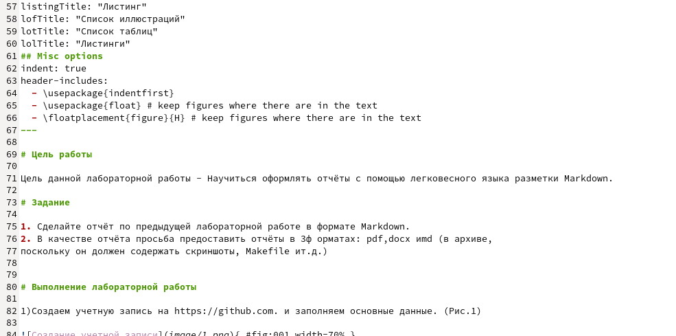
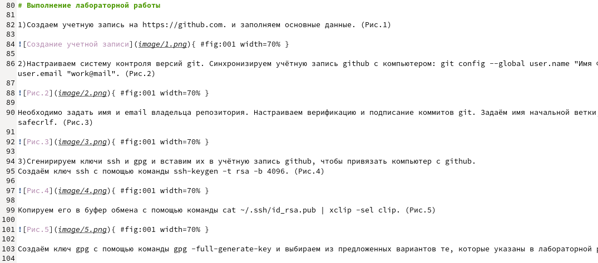
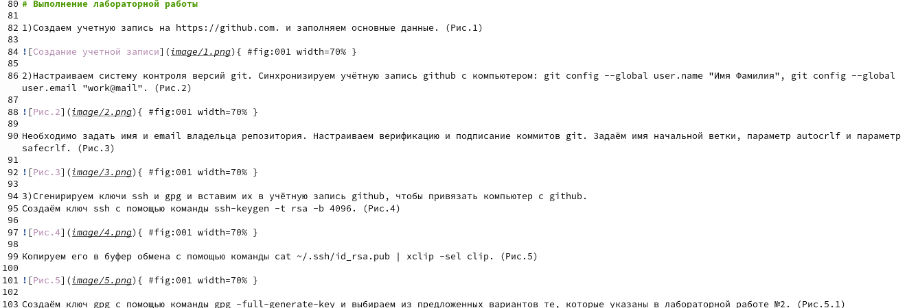
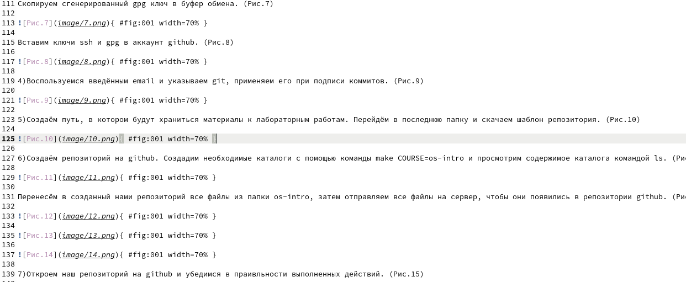
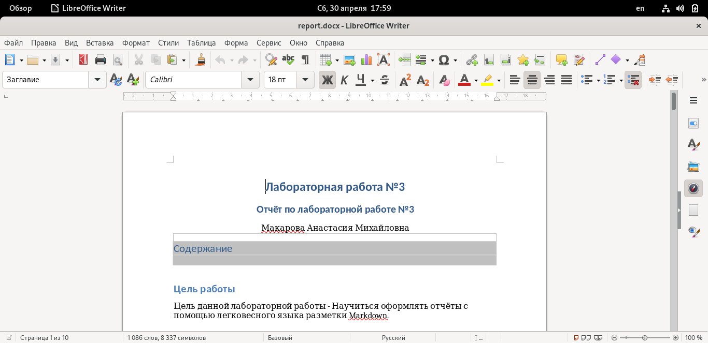
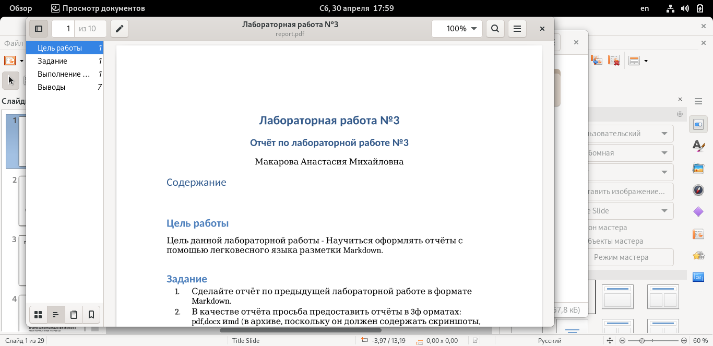

---
## Front matter
lang: ru-RU
title: Отёт по лабораторной работе №3
author: Макарова Анастасия Михайловна
institute: РУДН, Москва, Россия
date: 30 апреля 2022

## Formatting
toc: false
slide_level: 2
theme: metropolis
header-includes: 
 - \metroset{progressbar=frametitle,sectionpage=progressbar,numbering=fraction}
 - '\makeatletter'
 - '\beamer@ignorenonframefalse'
 - '\makeatother'
aspectratio: 43
section-titles: true
---

## Работа с Markdown
{ #fig:001 width=70% }

Так как данная лабораторная работа строится на Лабораторной работе №2, мы копируем основные моменты с прошлого отчёта

## Оформляем ход работы

Расписываем полностью алгоритм работы с прошлой лабораторной работы.

Оформление скриншота в Markdown: обязательно указывать полную ссылку для каждого изображения (пример оформления ссылки представлен на скриншоте).

{ #fig:001 width=70% }

## Выполнение лабораторной работы

На слеющий скриншотах представлен алгоритм выполнения лабораторной работы №2 в Markdown.

{ #fig:001 width=70% }

{ #fig:001 width=70% }

## Создание отчета в трех форматах

С помощью команды pandoke мы можем дополнительно создать два файла в формате pdf и docx. На слеющий скриншотах представлены отчеты лабораторной работы №2 в разных форматах.

{ #fig:001 width=70% }

{ #fig:001 width=70% }

## Выводы

1) научилась работать с Markdown;
2) научилась создавать pdf и docx файлы из файла Markdown (с помощью команды pandoke);
3) сделала отчёт по предыдущей лабораторной работе в формате Markdown;

# Спасибо за внимание

