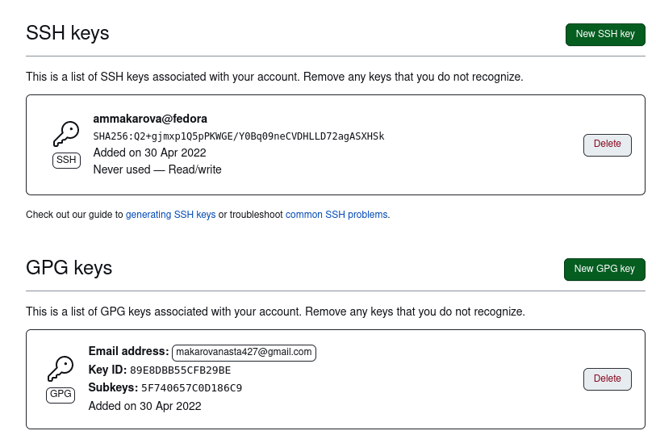

---
## Front matter
title: "Лабораторная работа №3"
subtitle: "Отчёт по лабораторной работе №3"
author: "Макарова Анастасия Михайловна"

## Generic otions
lang: ru-RU
toc-title: "Содержание"

## Bibliography
bibliography: bib/cite.bib
csl: pandoc/csl/gost-r-7-0-5-2008-numeric.csl

## Pdf output format
toc: true # Table of contents
toc-depth: 2
lof: true # List of figures
lot: true # List of tables
fontsize: 12pt
linestretch: 1.5
papersize: a4
documentclass: scrreprt
## I18n polyglossia
polyglossia-lang:
  name: russian
  options:
	- spelling=modern
	- babelshorthands=true
polyglossia-otherlangs:
  name: english
## I18n babel
babel-lang: russian
babel-otherlangs: english
## Fonts
mainfont: PT Serif
romanfont: PT Serif
sansfont: PT Sans
monofont: PT Mono
mainfontoptions: Ligatures=TeX
romanfontoptions: Ligatures=TeX
sansfontoptions: Ligatures=TeX,Scale=MatchLowercase
monofontoptions: Scale=MatchLowercase,Scale=0.9
## Biblatex
biblatex: true
biblio-style: "gost-numeric"
biblatexoptions:
  - parentracker=true
  - backend=biber
  - hyperref=auto
  - language=auto
  - autolang=other*
  - citestyle=gost-numeric
## Pandoc-crossref LaTeX customization
figureTitle: "Рис."
tableTitle: "Таблица"
listingTitle: "Листинг"
lofTitle: "Список иллюстраций"
lotTitle: "Список таблиц"
lolTitle: "Листинги"
## Misc options
indent: true
header-includes:
  - \usepackage{indentfirst}
  - \usepackage{float} # keep figures where there are in the text
  - \floatplacement{figure}{H} # keep figures where there are in the text
---

# Цель работы

Цель данной лабораторной работы - Научиться оформлять отчёты с помощью легковесного языка разметки Markdown.

# Задание

1. Сделайте отчёт по предыдущей лабораторной работе в формате Markdown.
2. В качестве отчёта просьба предоставить отчёты в 3ф орматах: pdf,docx иmd (в архиве,
поскольку он должен содержать скриншоты, Makefile ит.д.)

# Выполнение лабораторной работы

1)Создаем учетную запись на https://github.com. и заполняем основные данные. (Рис.1)

{ #fig:001 width=70% }

2)Настраиваем систему контроля версий git. Синхронизируем учётную запись github с компьютером: git config --global user.name "Имя Фамилия", git config --global user.email "work@mail". (Рис.2)

{ #fig:001 width=70% }

Необходимо задать имя и email владельца репозитория. Настраиваем верификацию и подписание коммитов git. Задаём имя начальной ветки, параметр autocrlf и параметр safecrlf. (Рис.3)

{ #fig:001 width=70% }

3)Сгенирируем ключи ssh и gpg и вставим их в учётную запись github, чтобы привязать компьютер с github.
Создаём ключ ssh с помощью команды ssh-keygen -t rsa -b 4096. (Рис.4)

{ #fig:001 width=70% }

Копируем его в буфер обмена с помощью команды cat ~/.ssh/id_rsa.pub | xclip -sel clip. (Рис.5)

{ #fig:001 width=70% }

Создаём ключ gpg с помощью команды gpg -full-generate-key и выбираем из предложенных вариантов те, которые указаны в лабораторной работе №2. (Рис.5.1)

{ #fig:001 width=70% }

Выводим список ключей, чтобы скопировать отпечаток приватного ключа. (Рис.6)

{ #fig:001 width=70% }

Скопируем сгенерированный gpg ключ в буфер обмена. (Рис.7)

{ #fig:001 width=70% }

Вставим ключи ssh и gpg в аккаунт github. (Рис.8)

{ #fig:001 width=70% }

4)Воспользуемся введённым email и указываем git, применяем его при подписи коммитов. (Рис.9)

{ #fig:001 width=70% }

5)Создаём путь, в котором будут храниться материалы к лабораторным работам. Перейдём в последнюю папку и скачаем шаблон репозитория. (Рис.10)

{ #fig:001 width=70% }

6)Создаём репозиторий на github. Создадим необходимые каталоги с помощью команды make COURSE=os-intro и просмотрим содержимое каталога командой ls. (Рис.11)

{ #fig:001 width=70% }

Перенесём в созданный нами репозиторий все файлы из папки os-intro, затем отправляем все файлы на сервер, чтобы они появились в репозитории github. (Рис.12, 13, 14)

{ #fig:001 width=70% }

{ #fig:001 width=70% }

{ #fig:001 width=70% }

7)Откроем наш репозиторий на github и убедимся в праивльности выполненных действий. (Рис.15)

{ #fig:001 width=70% }

# Выводы

В данной лабораторной работе я научилась оформлять отчёты с помощью легковесного языка разметки Markdown.

Ответы на контрольные вопросы.

1. Система контроля версий Git представляет собой набор программ командной строки. Доступ к ним можно получить из терминала посредством ввода команды git с различными опциями.
Системы контроля версий (Version Control System, VCS) применяются при работе нескольких человек над одним проектом. Обычно основное дерево проекта хранится в локальном или удалённом репозитории, к которому настроен доступ для участников проекта. При внесении изменений в содержание проекта система контроля версий позволяет их фиксировать, совмещать изменения, произведённые разными участниками проекта, производить откат к любой более ранней версии проекта, если это требуется.
2. В классических системах контроля версий используется централизованная модель, предполагающая наличие единого репозитория для хранения файлов. Выполнение большинства функций по управлению версиями осуществляется специальным сервером.Участник проекта (пользователь) перед началом работы посредством определённыхкоманд получает нужную ему версию файлов. После внесения изменений, пользователь размещает новую версию в хранилище. При этом предыдущие версии не удаляютсяиз центрального хранилища и к ним можно вернуться в любой момент. Сервер может сохранять неполную версию изменённых файлов, а производить так называемую дельта-компрессию—сохранять только изменения между последовательными версиями,чтопозволяет уменьшить объём хранимых данных.
Системы контроля версий также могут обеспечивать дополнительные, более гибкие функциональные возможности. Например,они могут поддерживать работу с нескольки-ми версиями одного файла,сохраняя общую историю изменений до точки ветвления версий и собственные истории изменений каждой ветви. Крометого, обычно доступна информация о том, кто из участников, когда и какие изменения вносил. Обычно такого рода информация хранится в журнале изменений, доступ к которому можно ограничить.
3. Централизованные системы — это системы, которые используют архитектуру клиент / сервер, где один или несколько клиентских узлов напрямую подключены к центральному серверу. Пример - Wikipedia.
В децентрализованных системах каждый узел принимает свое собственное решение. Конечное поведение системы является совокупностью решений отдельных узлов. Пример — Bitcoin.
4. В классических системах контроля версий используется централизованная модель, предполагающая наличие единого репозитория для хранения файлов. Выполнение большинства функций по управлению версиями осуществляется специальным сервером. Участник проекта (пользователь) перед началом работы посредством определённых команд получает нужную ему версию файлов. После внесения изменений, пользователь размещает новую версию в хранилище. При этом предыдущие версии не удаляются из центрального хранилища и к ним можно вернуться в любой момент. Сервер может сохранять не полную версию изменённых файлов, а производить так называемую дельтакомпрессию — сохранять только изменения между последовательными версиями, что позволяет уменьшить объём хранимых данных.
5. Системы контроля версий также могут обеспечивать дополнительные, более гибкие функциональные возможности. Например, они могут поддерживать работу с несколькими версиями одного файла, сохраняя общую историю изменений до точки ветвления версий и собственные истории изменений каждой ветви. Кроме того, обычно доступна информация о том, кто из участников, когда и какие изменения вносил. Обычно такого рода информация хранится в журнале изменений, доступ к которому можно ограничить.
6. У Git две основных задачи: первая — хранить информацию о всех изменениях в вашем коде, начиная с самой первой строчки, а вторая — обеспечение удобства командной работы над кодом.
7. Основные команды git:
Наиболее часто используемые команды git: – создание основного дерева репозитория :git init–получение обновлений (изменений) текущего дерева из центрального репозитория: git pull–отправка всех произведённых изменений локального дерева в центральный репозиторий:git push–просмотр списка изменённых файлов в текущей директории: git status–просмотр текущих изменения: git diff–сохранение текущих изменений:–добавить все изменённые и/или созданные файлы и/или каталоги: git add .–добавить конкретные изменённые и/или созданные файлы и/или каталоги: git add имена_файлов – удалить файл и/или каталог из индекса репозитория (при этом файл и/или каталог остаётся в локальной директории): git rm имена_файлов – сохранение добавленных изменений: – сохранить все добавленные изменения и все изменённые файлы: git commit -am 'Описание коммита'–сохранить добавленные изменения с внесением комментария через встроенный редактор: git commit–создание новой ветки, базирующейся на текущей: git checkout -b имя_ветки–переключение на некоторую ветку: git checkout имя_ветки (при переключении на ветку, которой ещё нет в локальном репозитории, она будет создана и связана с удалённой) – отправка изменений конкретной ветки в центральный репозиторий: git push origin имя_ветки–слияние ветки стекущим деревом:git merge --no-ff имя_ветки–удаление ветки: – удаление локальной уже слитой с основным деревом ветки:git branch -d имя_ветки–принудительное удаление локальной ветки: git branch -D имя_ветки–удаление ветки с центрального репозитория: git push origin :имя_ветки.
8. Использования git при работе с локальными репозиториями (добавления текстового документа в локальный репозиторий):
git add hello.txt
git commit -am 'Новый файл’
9. Проблемы, которые решают ветки git:
	нужно постоянно создавать архивы с рабочим кодом
	сложно "переключаться" между архивами
	сложно перетаскивать изменения между архивами
	легко что-то напутать или потерять
10. Во время работы над проектом так или иначе могут создаваться файлы, которые не требуется добавлять в последствии в репозиторий. Например, временные файлы, создаваемые редакторами, или объектные файлы, создаваемые компиляторами. Можно прописать шаблоны игнорируемых при добавлении в репозиторий типов файлов в файл.gitignore с помощью сервисов. 
