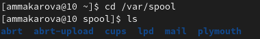

---
## Front matter
lang: ru-RU
title: Лабораторная работа №4
author: Макарова Анастасия Михайловна
institute: РУДН, Москва, Россия
date: 30 апреля 2022

## Formatting
toc: false
slide_level: 2
theme: metropolis
header-includes: 
 - \metroset{progressbar=frametitle,sectionpage=progressbar,numbering=fraction}
 - '\makeatletter'
 - '\beamer@ignorenonframefalse'
 - '\makeatother'
aspectratio: 43
section-titles: true
---

## Цель работы 

Приобретение практических навыков взаимодействия пользователя с системой посредством командной строки.

## Ход работы

Изучили работу простейших и основных команд cd, pwd, ls, mkdir, rm и др.

## Выполнение лабораторной работы

На слеющем скриншотах представлен алгоритм выполнения лабораторной работы №4

{ #fig:001 width=70% }

## Выводы

1) научилась работать с основными командами;
2) изучила работу с описанием команд

# Спасибо за внимание

