---
## Front matter
title: "Лабораторная работа №4"
subtitle: "Отчёт по лабораторной работе №4"
author: "Макарова Анастасия Михайловна"

## Generic otions
lang: ru-RU
toc-title: "Содержание"

## Bibliography
bibliography: bib/cite.bib
csl: pandoc/csl/gost-r-7-0-5-2008-numeric.csl

## Pdf output format
toc: true # Table of contents
toc-depth: 2
lof: true # List of figures
lot: true # List of tables
fontsize: 12pt
linestretch: 1.5
papersize: a4
documentclass: scrreprt
## I18n polyglossia
polyglossia-lang:
  name: russian
  options:
	- spelling=modern
	- babelshorthands=true
polyglossia-otherlangs:
  name: english
## I18n babel
babel-lang: russian
babel-otherlangs: english
## Fonts
mainfont: PT Serif
romanfont: PT Serif
sansfont: PT Sans
monofont: PT Mono
mainfontoptions: Ligatures=TeX
romanfontoptions: Ligatures=TeX
sansfontoptions: Ligatures=TeX,Scale=MatchLowercase
monofontoptions: Scale=MatchLowercase,Scale=0.9
## Biblatex
biblatex: true
biblio-style: "gost-numeric"
biblatexoptions:
  - parentracker=true
  - backend=biber
  - hyperref=auto
  - language=auto
  - autolang=other*
  - citestyle=gost-numeric
## Pandoc-crossref LaTeX customization
figureTitle: "Рис."
tableTitle: "Таблица"
listingTitle: "Листинг"
lofTitle: "Список иллюстраций"
lotTitle: "Список таблиц"
lolTitle: "Листинги"
## Misc options
indent: true
header-includes:
  - \usepackage{indentfirst}
  - \usepackage{float} # keep figures where there are in the text
  - \floatplacement{figure}{H} # keep figures where there are in the text
---

# Цель работы

Приобретение практических навыков взаимодействия пользователя с системой посредством командной строки.

# Выполнение лабораторной работы

1. Определим полное имя домашнего каталога с помощью команды cd. (Рис.8)

{ #fig:001 width=70% }

2. Выполняем действия с просмотром каталогов:
   2.1. Переходим в каталог /tmp с помощью команды cd. (Рис.9)
   
{ #fig:001 width=70% }

   2.2. С помощью команды ls просматриваем его содержимое. Затем снова просматриваем содержимое каталога командой ls, но уже с опцией -a. Разница в выводимой на экран информации в том, что во 2 случае с опцией -a мы отобразили имена скрытых файлов каталога /tmp. (Рис.10,11)
   
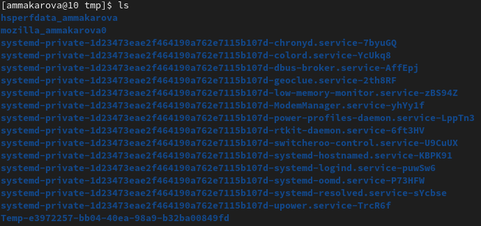{ #fig:001 width=70% }

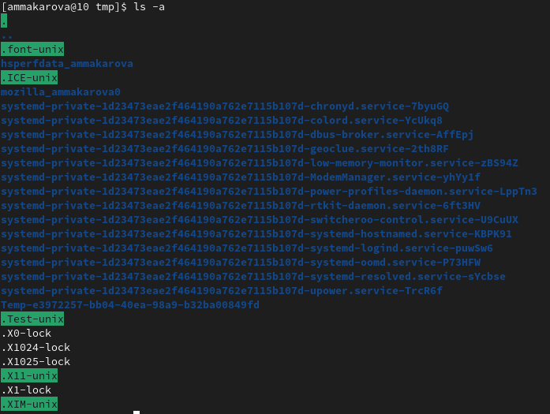{ #fig:001 width=70% }
   
   2.3. Переходим в каталог /var/spool с помощью команды cd. Командой ls просмтриваем содержимое каталога и видим, что в нем нет подкаталога с именем cron. (Рис.12)
   
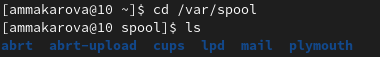{ #fig:001 width=70% }
   
   2.4. Переходим в домашний каталог командой cd. Командой ls выводим его содержимое на экран. Командой ls -alF можем посмотреть, кто является владельцем файлов и подкаталогов. (Рис.13,14)
   
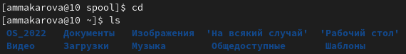{ #fig:001 width=70% }

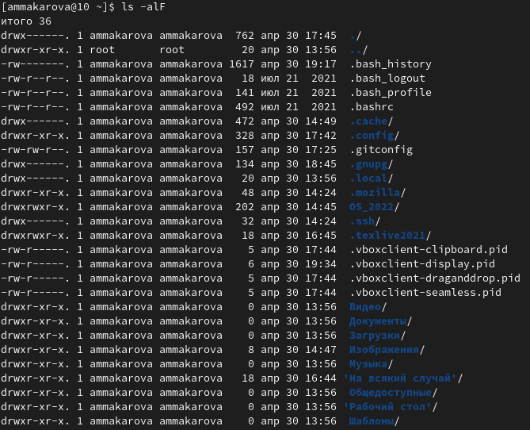{ #fig:001 width=70% }

3. Выполним действия с созданием и удалением каталогов:
   3.1. В домашнем каталоге создадим новый каталог с именем newdir с помощью команды mkdir newdir. (Рис.15)

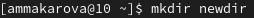{ #fig:001 width=70% }

   3.2. В каталоге ~/newdir создадим новый каталог с именем morefun. (Рис.17)
   
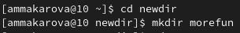{ #fig:001 width=70% }

   3.3. В домашнем каталоге создадим одной командой mkdir три новых каталога с именами letters,memos,misk. Затем удалим эти каталоги одной командой rm -r. (Рис.18,19)
   
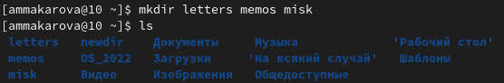{ #fig:001 width=70% }

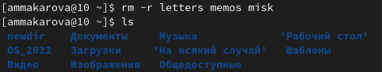{ #fig:001 width=70% } 
   
   3.4. Попробуем удалить ранее созданный каталог ~/newdir командой rm. Система оповещает нас о неудачной попытке удаления каталога. (Рис.20)
   
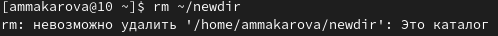{ #fig:001 width=70% }
   
   3.5. Удалим каталог ~/newdir/morefun из домашнего каталога командой rm -r. Проверим его отсутсвие командой ls. (Рис.19)
   
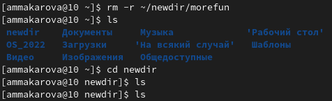{ #fig:001 width=70% }
   
   
4. С помощью команды man ls определяем, что опцию -R нужно использовать для просмотра содержимое нетолько указанного каталога,но и подкаталогов, входящих в него. (Рис.1,2.1)

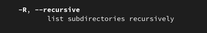{ #fig:001 width=70% }

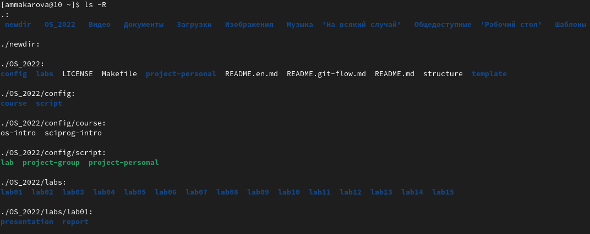{ #fig:001 width=70% }

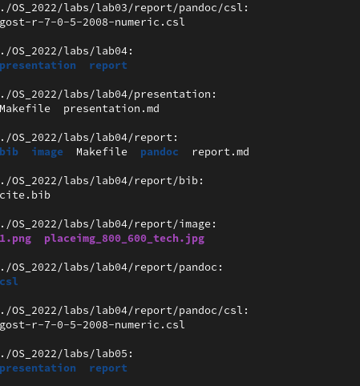{ #fig:001 width=70% }

5. Спомощью команды man ls определяем, что опция --sort=WORD позволяет отсортировать по времени последнего изменения выводимый список содержимого каталога с развёрнутым описанием файлов. (Рис.2.2)

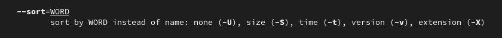{ #fig:001 width=70% }

6. Используем команду man для просмотра описания следующих команд: cd,pwd,mkdir,rmdir,rm. (Рис.3,4,5,6,7)

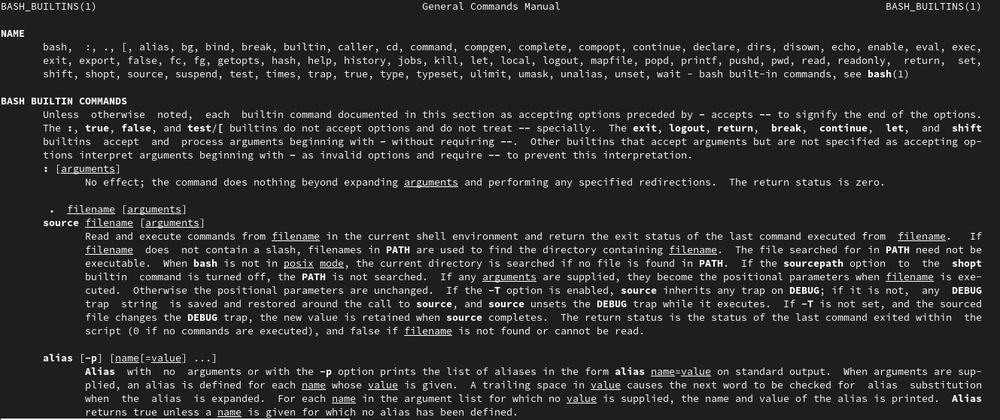{ #fig:001 width=70% }

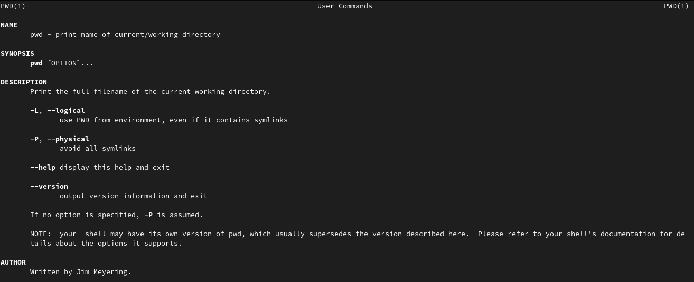{ #fig:001 width=70% }

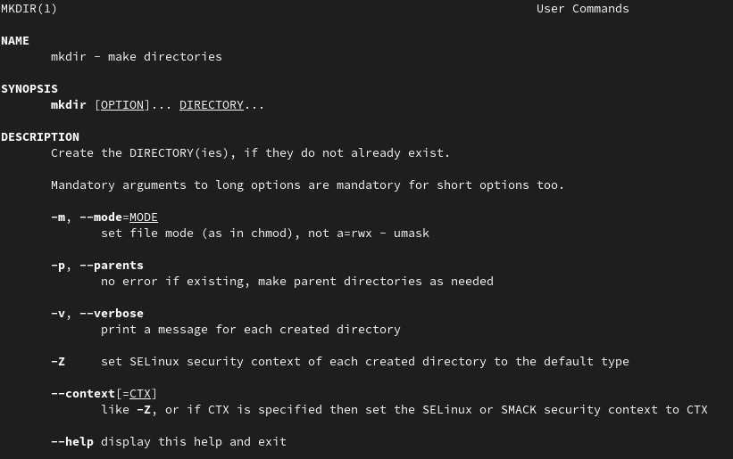{ #fig:001 width=70% }

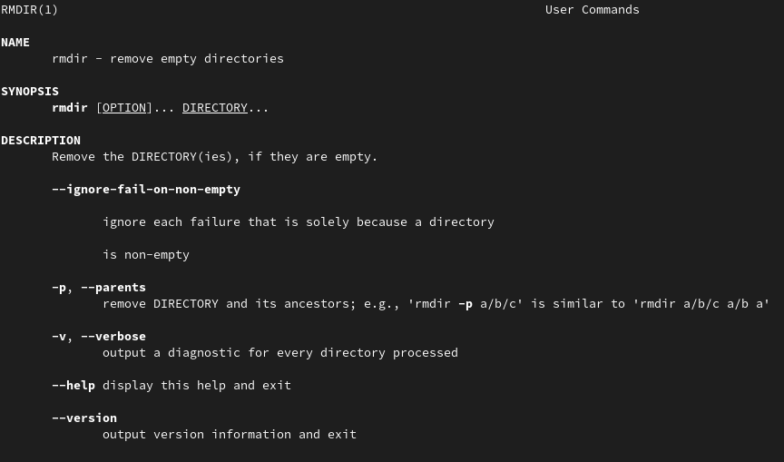{ #fig:001 width=70% }

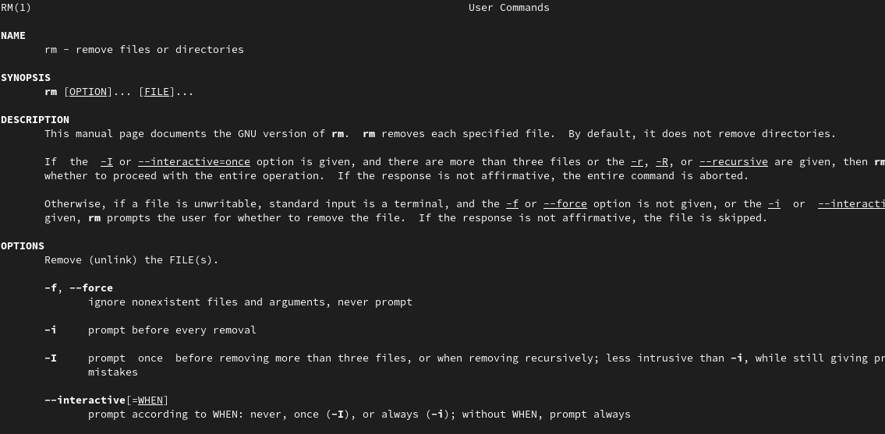{ #fig:001 width=70% }

7. Используя информацию, полученную при помощи команды history, выполним модификацию и исполнение нескольких команд из буфера команд, используя !<номер_команды>:s/<что_меняем>/<на_что_меняем>. (Рис.22,23,24,25)

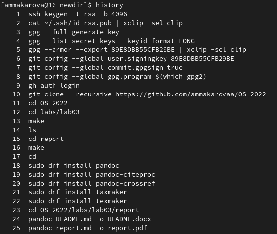{ #fig:001 width=70% }

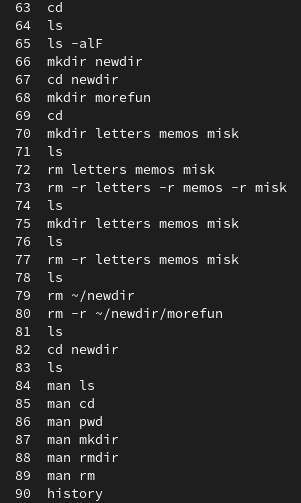{ #fig:001 width=70% }

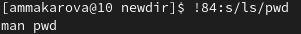{ #fig:001 width=70% }

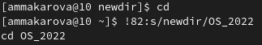{ #fig:001 width=70% }

# Вывод

В ходе выполнения данной лабораторной работы я приобрела практические навыки взаимодействия пользователя с системой посредством командной строки.

# Контрольные вопросы

1. Что такое командная строка? Специальная программа, которая позволяет управлять компьютером путем ввода текстовых команд с клавиатуры.
2. При помощи какой команды можно определить абсолютный путь текущего каталога? Для определения абсолютного пути к текущему каталогу используется
команда pwd (print working directory). 
3. При помощи какой команды и каких опций можно определить только тип файлов и их имена в текущем каталоге? Команда ls.
4. Каким образом отобразить информацию о скрытых файлах? Для того,чтобы отобразить имена скрытых файлов, необходимо использовать команду ls с опцией a.
5. При помощи каких команд можно удалить файл и каталог? Можно ли это сделать одной и той же командой? Команда rm используется для удаления файлов и/или каталогов. Чтобы удалить каталог, содержащий файлы,нужно использовать опцию r.
6. Каким образом можно вывести информацию о последних выполненных пользователем командах? работы? Командой history.
7. Как воспользоваться историей команд для их модифицированного выполнения? Выводимые на экран команды в списке нумеруются. К любой команде из выведенного на экран списка можно обратиться по её номеру в списке, воспользовавшись конструкцией ! номер_команды.
8. Приведите примеры запуска нескольких команд в одной строке.  Например, мы хотим выполнить сначала одну команду. Затем, когда она отработает (вернет управление в командную строку), нам нужно запустить вторую команду. Для этого служит символ «;». Таким образом, если набрать в терминале: $ command1; command2; command3 то сначала запустится первая команда command1, а когда управление вернется в терминал, то запустится вторая и так далее. 
9. Дайте определение и приведите примера символов экранирования. Это способ заключения в кавычки одиночного символа. 
10. Охарактеризуйте вывод информации на экран после выполнения команды ls с опцией l. Вывести список файлов по одному на строку.
11. Что такое относительный путь к файлу? Это путь к файлу относительно текущего документа.
12. Как получить информацию об интересующей вас команде? Командой man.

