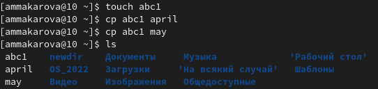
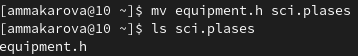
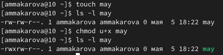

---
## Front matter
lang: ru-RU
title: Лабораторная работа №5
author: Макарова Анастасия Михайловна
institute: РУДН, Москва, Россия
date: 6 мая 2022

## Formatting
toc: false
slide_level: 2
theme: metropolis
header-includes: 
 - \metroset{progressbar=frametitle,sectionpage=progressbar,numbering=fraction}
 - '\makeatletter'
 - '\beamer@ignorenonframefalse'
 - '\makeatother'
aspectratio: 43
section-titles: true
---

## Цель работы 

Ознакомление с файловой системой Linux, её структурой, именами и содержанием
каталогов. Приобретение практических навыков по применению команд для работы
с файлами и каталогами, по управлению процессами (и работами), по проверке использования диска и обслуживанию файловой системы.

## Копирование файлов и каталогов

Команда cp [-опции] исходный_файл целевой_файл, предназначенная для копирования файлов из одного в другие каталоги (возможно, с другой файловой системой). Исходный файл остаётся неизменным, имя созданного файла может быть таким же, как у исходного, или измениться.

{ #fig:001 width=70% }

## Перемещение и переименование файлов и каталогов

Команды mv и mkdir предназначены для перемещения и переименования файлов
и каталогов. Формат команды mv: mv [-опции] старый_файл новый_файл. Использование: Если в качестве аргументов заданы имена двух файлов, то имя первого файла будет изменено на имя второго.

{ #fig:001 width=70% }

## Права доступа

Права доступа к файлу или каталогу можно изменить, воспользовавшись командой
chmod. Сделать это может владелец файла (или каталога) или пользователь с правами
администратора. Формат команды: chmod режим имя_файла.

{ #fig:001 width=70% }

## Анализ файловой системы

Файловая система в Linux состоитиз фалов и каталогов. Каждому физическому носителю соответствует своя файловая система. Существует несколько типов файловых систем. Перечислим наиболее часто встречающиеся типы:
– ext2fs (second extended filesystem);
– ext2fs (third extended file system);
– ext4 (fourth extended file system);
– ReiserFS;
– xfs;
– fat (file allocation table);
– ntfs (new technology file system).

## Выводы

1) я ознакомилась с файловой системой Linux, её структурой, именами и содержанием
каталогов;
2) я приобрела практические навыки по применению команд для работы
с файлами и каталогами.

# Спасибо за внимание

