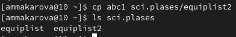

---
## Front matter
title: "Лабораторная работа №5"
subtitle: "Отчёт по лабораторной работе №5"
author: "Макарова Анастасия Михайловна"

## Generic otions
lang: ru-RU
toc-title: "Содержание"

## Bibliography
bibliography: bib/cite.bib
csl: pandoc/csl/gost-r-7-0-5-2008-numeric.csl

## Pdf output format
toc: true # Table of contents
toc-depth: 2
lof: true # List of figures
lot: true # List of tables
fontsize: 12pt
linestretch: 1.5
papersize: a4
documentclass: scrreprt
## I18n polyglossia
polyglossia-lang:
  name: russian
  options:
	- spelling=modern
	- babelshorthands=true
polyglossia-otherlangs:
  name: english
## I18n babel
babel-lang: russian
babel-otherlangs: english
## Fonts
mainfont: PT Serif
romanfont: PT Serif
sansfont: PT Sans
monofont: PT Mono
mainfontoptions: Ligatures=TeX
romanfontoptions: Ligatures=TeX
sansfontoptions: Ligatures=TeX,Scale=MatchLowercase
monofontoptions: Scale=MatchLowercase,Scale=0.9
## Biblatex
biblatex: true
biblio-style: "gost-numeric"
biblatexoptions:
  - parentracker=true
  - backend=biber
  - hyperref=auto
  - language=auto
  - autolang=other*
  - citestyle=gost-numeric
## Pandoc-crossref LaTeX customization
figureTitle: "Рис."
tableTitle: "Таблица"
listingTitle: "Листинг"
lofTitle: "Список иллюстраций"
lotTitle: "Список таблиц"
lolTitle: "Листинги"
## Misc options
indent: true
header-includes:
  - \usepackage{indentfirst}
  - \usepackage{float} # keep figures where there are in the text
  - \floatplacement{figure}{H} # keep figures where there are in the text
---

# Цель работы

Ознакомление с файловой системой Linux, её структурой, именами и содержанием
каталогов. Приобретение практических навыков по применению команд для работы
с файлами и каталогами, по управлению процессами (и работами), по проверке использования диска и обслуживанию файловой системы.

# Выполнение лабораторной работы

1. Выполним примеры, приведённые в первой части описания лабораторной работы.

   1.1. "Копирование файла в текущем каталоге. Скопировать файл ~/abc1 в файл april
       и в файл may" (Рис.1):

{ #fig:001 width=70% }

   1.2. "Копирование нескольких файлов в каталог. Скопировать файлы april и may в каталог
       monthly" (Рис.2):

{ #fig:001 width=70% }

   1.3. "Копирование файлов в произвольном каталоге. Скопировать файл monthly/may в файл с именем june" (Рис.3):
   
{ #fig:001 width=70% }

   1.4. "Копирование каталогов в текущем каталоге. Скопировать каталог monthly в каталог
       monthly.00" (Рис.4):
        
{ #fig:001 width=70% }

   1.5. "Копирование каталогов в произвольном каталоге. Скопировать каталог monthly.00
       в каталог /tmp" (Рис.5,6):
       
{ #fig:001 width=70% } 

{ #fig:001 width=70% }

   1.6. "Переименование файлов в текущем каталоге. Изменить название файла april на
       july в домашнем каталоге" (Рис.7):
       
{ #fig:001 width=70% }

   1.7. "Перемещение файлов в другой каталог. Переместить файл july в каталог monthly.00" (Рис.8):
   
{ #fig:001 width=70% }

   1.8. "Переименование каталогов в текущем каталоге. Переименовать каталог monthly.00
       в monthly.01" (Рис.9): 

{ #fig:001 width=70% }

   1.9. "Перемещение каталога в другой каталог. Переместить каталог monthly.01 в каталог
       reports" (Рис.10):

{ #fig:001 width=70% }

   1.10. "Переименование каталога, не являющегося текущим. Переименовать каталог
       reports/monthly.01 в reports/monthly" (Рис.11, 12):

{ #fig:001 width=70% }

{ #fig:001 width=70% }

   1.11. "Требуется создать файл ~/may с правом выполнения для владельца" (Рис.13):

{ #fig:001 width=70% }

   1.12. "Требуется лишить владельца файла ~/may права на выполнение:" (Рис.14, 15.1):

{ #fig:001 width=70% }

{ #fig:001 width=70% }

   1.13. "Требуется создать каталог monthly с запретом на чтение для членов группы и всех
       остальных пользователей" (Рис.15):

{ #fig:001 width=70% }

   1.14. "Требуется создать файл ~/abc1 с правом записи для членов группы" (Рис.16):

{ #fig:001 width=70% }

   
2. Выполняем следующие действия:

   2.1. Копируем файл /usr/include/sys/io.h в домашний каталог и называем его
equipment, проверяем правильность выполненных действий с помощью команды ls. (Рис.17)
   
{ #fig:001 width=70% }

   2.2. В домашнем каталоге создаём директорию ~/ski.plases. (Рис.18, 18.1)
   
{ #fig:001 width=70% }

{ #fig:001 width=70% }

   2.3. Переместим файл equipment в каталог ~/ski.plases. (Рис.19)
   
{ #fig:001 width=70% }
   
   2.4. Переименуем файл ~/ski.plases/equipment в ~/ski.plases/equiplist. (Рис.20)
   
{ #fig:001 width=70% }

   2.5. Создаём в домашнем каталоге файл abc1 и копируем его в каталог
~/ski.plases, называем его equiplist2. (Рис.21)

{ #fig:001 width=70% }

   2.6. Создаём каталог с именем equipment в каталоге ~/ski.plases. (Рис.22)
   
{ #fig:001 width=70% } 

   2.7. Переместим файлы ~/ski.plases/equiplist и equiplist2 в каталог
~/ski.plases/equipment. (Рис.23)

{ #fig:001 width=70% }

   2.8. Создадим и переместим каталог ~/newdir в каталог ~/ski.plases и назовём
его plans (так как у меня каталог уже создан, сразу перемещаю его). (Рис.24)

{ #fig:001 width=70% }

3. Определим опции команды chmod, необходимые для того, чтобы присвоить файлам и каталогам определённые права доступа, считая, что в начале таких прав
нет: 

   3.1. drwxr--r-- ... для каталога australia: chmod go-x. (Рис.25-28)

{ #fig:001 width=70% }

{ #fig:001 width=70% }

{ #fig:001 width=70% }

{ #fig:001 width=70% }

   3.2. drwx--x--x ... для каталога play: chmod go-r. (Рис.29-34)
   
{ #fig:001 width=70% }

{ #fig:001 width=70% }

{ #fig:001 width=70% }

{ #fig:001 width=70% }

{ #fig:001 width=70% }

{ #fig:001 width=70% }

   3.3. -r-xr--r-- ... для файла my_os: u-w, u+x. (Рис.35)
   
{ #fig:001 width=70% }
   
   3.4. -rw-rw-r-- ... для файла feathers: chmod g+w. (Рис.36)
   
{ #fig:001 width=70% }
    
4. Далее снова работаем с командами перtмещения, копирования и изменениями правами доступа:
  
   4.1. Просмотрим содержимое файла /etc/password. (Рис.37)
   
{ #fig:001 width=70% }

   4.2. Скопируем файл ~/feathers в файл ~/file.old. (Рис.38)

{ #fig:001 width=70% }

   4.3. Переместим файл ~/file.old в каталог ~/play. (Рис.39)

{ #fig:001 width=70% }

   4.4. Скопируем каталог ~/play в каталог ~/fun. (Рис.40)
   
{ #fig:001 width=70% }

   4.5. Переместим каталог ~/fun в каталог ~/play и назовём его games. (Рис.41)
   
{ #fig:001 width=70% } 

   4.6 - 4.8. Лишим владельца файла ~/feathers права на чтение с помощью команды chmod с опцией u-r. При попытке просмотреть файл консоль выдаёт ошибку, ту же ошибку доступа выдаёт и при попытке скопировать файл, так как у нас нет прав доступа. (Рис.42, 43)
   
{ #fig:001 width=70% } 

{ #fig:001 width=70% } 
  
   4.9. Дадим владельцу файла ~/feathers право на чтение с помощью команды chmod с опцией u+r. (Рис.44)
   
{ #fig:001 width=70% } 
   
   4.10 - 4.11. Лишим владельца каталога ~/play права на выполнение с помощью команды chmod с опцией u-x. Попробуем перейти в каталог, не получается из-за отсутствия прав доступа. (Рис.45)
   
{ #fig:001 width=70% } 
   
   4.12. Вернём в каталог ~/play право на выполнение с помощью команды chmod с опцией u+x, мы смогли перейти в каталог и выполнить в нем другую команду. (Рис.46)
   
{ #fig:001 width=70% } 

5. Используем команду man для просмотра описания следующих команд: mount, fsck, mkfs, kill.  (Рис.mount, fsck, mkfs, kill)

{ #fig:001 width=70% }

{ #fig:001 width=70% }

{ #fig:001 width=70% }

{ #fig:001 width=70% }

С помощью команды mount можно подключить сетевой диск, раздел жесткого диска или USB-накопитель. Команда fsck позволяет выполнять проверки согласованности и интерактивное исправление в одной или нескольких файловых системах Linux. Команда mkfs делает файловые системы. Команда kill посылает сигнал процессу. Обычно используется для «убийства» процесса (прерывание процесса).

# Вывод

В ходе выполнения данной лабораторной работы я ознакомилась с файловой системой Linux, её структурой, именами и содержанием, а также приобрела практические навыки по применению команд для работы с файлами и каталогами, по управлению процессами (и работами), по проверке использования диска и обслуживанию файловой системы каталогов.

# Контрольные вопросы

1. Дайте характеристику каждой файловой системе, существующей на жёстком диске компьютера, на котором вы выполняли лабораторную работу.
Чтобы узнать, какие файловые системы существуют на жёстком диске моего компьютера, использую команду «df-Th». На моем компьютере есть следующие файловые системы: dev tmpfs, tmpfs, ext4, iso9660. dev tmpfs позволяет ядру создать экземпляр tmpfs с именем devtmpfs при инициализации ядра, прежде чем регистрируется какое-либо устройство с драйверами. Каждое устройство с майором / минором будет предоставлять узел устройства в devtmpfs.devtmpfs монтируется на /dev и содержит специальные файлы устройств для всех устройств. tmpfs−временное файловое хранилище во многих Unix-подобных ОС. Предназначена для монтирования файловой системы, но размещается в ОЗУ вместо ПЗУ. Подобная конструкция является RAM диском. Данная файловая система также предназначенная для быстрого и ненадёжного хранения временных данных. Хорошо подходит для /tmp и массовой сборки пакетов/образов. Предполагает наличие достаточного объёма виртуальной памяти. Файловая система tmpfs предназначена для того, чтобы использовать часть физической памяти сервера как обычный дисковый раздел, в котором можно сохранять данные (чтение и запись). Поскольку данные размещены в памяти, то чтение или запись происходят во много раз быстрее, чем с обычного HDD диска.ext4− имеет обратную совместимость с предыдущими версиями ФС. Эта версия была выпущена в 2008 году. Является первой ФС из «семейства» Ext, использующая механизм «extentfile system», который позволяет добиться меньшей фрагментации файлов и увеличить общую производительность файловой системы. Кроме того, вExt4реализован механизм отложенной записи (delayed allocation −delalloc), который так же уменьшает фрагментацию диска и снижает нагрузку на CPU. С другой стороны, хотя механизм отложенной записи и используется во многих ФС, но в силу сложности своей реализации он повышает вероятность утери данных. Характеристики: максимальный размер файла: 16 TB; максимальный размер раздела: 16TB;максимальный размер имени файла: 255 символов. Рекомендации по использованию:наилучший выбор дляSSD; наилучшая производительность по сравнению с предыдущими Etx-системами; она так же отлично подходит в качестве файловой системы для серверов баз данных, хотя сама система и моложеExt3. ISO 9660−стандарт, выпущенный Международной организацией по стандартизации, описывающий файловую систему для дисков CD-ROM. Также известен как CDFS (Compact Disc File System). Целью стандарта является обеспечить совместимость носителей под разными операционными системами, такими, как Unix, Mac OS, Windows.

2. Приведите общую структуру файловой системы и дайте характеристику каждой директории первого уровня этой структуры.
Файловая система Linux/UNIX физически представляет собой пространство раздела диска разбитое на блоки фиксированного размера, кратные размеру сектора − 1024, 2048, 4096 или 8120 байт. Размер блока указывается при создании файловой системы. В файловой структуре Linux имеется один корневой раздел −/ (он же root, корень). Все разделы жесткого диска (если их несколько) представляют собой структуру подкаталогов, "примонтированных" к определенным каталогам.

    "/" − корень. Это главный каталог в системе Linux. По сути, это и есть файловая система Linux.
    "/BIN" – бинарные файлы пользователя. Этот каталог содержит исполняемые файлы. 
    "/SBIN" – системные исполняемые файлы. Так же как и "/bin", содержит двоичные исполняемые файлы, которые доступны на ранних этапах загрузки, когда не примонтирован каталог /usr. 
    "/ETC" – конфигурационные файлы. В этой папке содержатся конфигурационные файлы всех программ, установленных в системе.
    "/DEV" – файлы устройств. В Linux все, в том числе внешние устройства являются файлами.
    "/PROC" – информация о процессах. По сути, это псевдофайловая система, содержащая подробную информацию о каждом процессе, его Pid, имя исполняемого файла, параметры запуска, доступ к оперативной памяти и так далее.
    "/VAR" – переменные файлы. Он содержит файлы, которые часто изменяются. 
    "/TMP" – временные файлы. В этом каталоге содержатся временные файлы, созданные системой, любыми программами или пользователями. 
    "/USR" – программы пользователя. Здесь находятся исполняемые файлы, исходники программ, различные ресурсы приложений, картинки, музыку и документацию.
    "/HOME" – домашняя папка. В этой папке хранятся домашние каталоги всех пользователей. В них они могут хранить свои личные файлы, настройки программ и т.д.
    "/BOOT" – файлы загрузчика. Содержит все файлы,связанные с загрузчиком системы. Это ядро vmlinuz, образ initrd, а также файлы загрузчика, находящие в каталоге /boot/grub.
    "/LIB" – системные библиотеки. Содержит файлы системных библиотек, которые используются исполняемыми файлами в каталогах /bin и /sbin.
    "/OPT" – дополнительные программы. В эту папку устанавливаются программы, игры или драйвера. Это программы созданные в виде отдельных исполняемых файлов самими производителями.
    "/MNT" – монтирование. В этот каталог системные администраторы могут монтировать внешние или дополнительные файловые системы.
    "/MEDIA" – съемные носители. В этот каталог система монтирует все подключаемые внешние накопители –USB флешки, оптические диски и другие носители информации.
    "/SRV" – сервер. В этом каталоге содержатся файлы серверов и сервисов.
    "/RUN" - процессы. Каталог,содержащий PID файлы процессов, похожий на "/var/run", но в отличие от него, он размещен в TMPFS, а поэтому после перезагрузки все файлы теряются.

3. Какая операция должна быть выполнена, чтобы содержимое некоторой файловой системы было доступно операционной системе?
Чтобы содержимое некоторой файловой системы было доступно операционной системе необходимо воспользоваться командой mount.

4. Назовите основные причины нарушения целостности файловой системы. Как устранить повреждения файловой системы?
Чтобы устранить повреждения файловой системы необходимо использовать команду fsck.

5. Как создаётся файловая система? 
Файловую систему можно создать, используя команду mkfs. Ее краткое описание дано в пункте 5 в ходе выполнения заданий лабораторной работы.

6. Дайте характеристику командам для просмотра текстовых файлов.
Для просмотра текстовых файлов существуют следующие команды:

сat. Задача команды cat очень проста −она читает данные из файла или стандартного ввода и выводит их на экран. Синтаксис утилиты:cat [опции] файл1 файл2 ...Основные опции: -b–нумеровать только непустые строки, -E–показывать символ $ в конце каждой строки, -n–нумеровать все строки, -s–удалять пустые повторяющиеся строки, -T–отображать табуляции в виде ^I, -h–отобразить справку, -v–версия утилиты nl. Команда nl действует аналогично команде cat, но выводит еще и номера строк в столбце слева. less. Cущественно более развитая команда для пролистывания текста. При чтении данных со стандартного ввода она создает буфер, который позволяет листать текст как вперед, так и назад, а также искать как по направлению к концу, так и по направлению к началу текста. Синтаксис аналогичный синтаксису команды cat. Некоторые опции: -g –при поиске подсвечивать только текущее найденное слово (по умолчанию подсвечиваются все вхождения), -N –показывать номера строк head. Команда head выводит начальные строки (по умолчанию − 10) из одного или нескольких документов. Также она может показывать данные, которые передает на вывод другая утилита. Синтаксис аналогичный синтаксису команды cat. Основные опции: -c (--bytes) −позволяет задавать количество текста не в строках, а в байтах -n (--lines) −показывает заданное количество строк вместо 10, которые выводятся по умолчанию -q (--quiet, --silent) −выводит только текст, недобавляя к нему название файла -v (--verbose) −перед текстом выводит название файла -z (--zero-terminated) −символы перехода на новую строку заменяет символами завершения строк tail. Эта команда позволяет выводить заданное количество строк с конца файла, а также выводить новые строки в интерактивном режиме. Синтаксис аналогичный синтаксису команды cat. Основные опции: -c −выводить указанное количество байт с конца файла, -f −обновлять информацию по мере появления новых строк в файле, -n −выводить указанное количество строк из конца файла, --pid −используется с опцией -f, позволяет завершить работу утилиты, когда завершится указанный процесс, -q −не выводить имена файлов--retry− повторять попытки открыть файл, если он недоступен, -v −выводить подробную информацию о файле.

7. Приведите основные возможности команды cp в Linux.
Утилита cp позволяет полностью копировать файлы и директории. Cинтаксис: cp [опции] файл-источник файл-приемник. После выполнения команды файл-источник будет полностью перенесен в файл-приемник. Если в конце указан слэш, файл будет записан в заданную директорию с оригинальным именем. Основные опции:--attributes-only −не копировать содержимое файла, а только флаги доступа и владельца -f, --force −перезаписывать существующие файлы -i, --interactive −спрашивать, нужно ли перезаписывать существующие файлы, -L −копировать не символические ссылки, а то, на что они указывают, -n −не перезаписывать существующие файлы, -P −не следовать символическим ссылкам, -r −копировать папку Linux рекурсивно, -s −не выполнять копирование файлов в Linux, асоздавать символические ссылки, -u −скопировать файл, только если он был изменён, -x −не выходить за пределы этой файловой системы, -p −сохранять владельца, временные метки и флаги доступа при копировании, -t −считать файл-приемник директорией и копировать файл-источник в эту директорию.

8. Приведите основные возможности команды mv в Linux.
Команда mv используется для перемещения одного или нескольких файлов (или директорий) в другую директорию, а также для переименования файлов и директорий. Синтаксис: mv [-опции] старый_файл новый_файл. Основные опции: --help −выводит на экран официальную документацию об утилите, --version −отображает версию, mv-b−создает копию файлов, которые были перемещены или перезаписаны, -f −при активации не будет спрашивать разрешение у владельца файла, если речь идет о перемещении или переименовании файла, -i −наоборот, будет спрашивать разрешение у владельца, -n −отключает перезапись уже существующих объектов--strip-trailing-slashes — удаляет завершающий символ / у файла при его наличии, -t [директория] —перемещает все файлы в указанную директорию, -u −осуществляет перемещение только в том случае, если исходный файл новее объекта назначения, -v −отображает сведения о каждом элементе во время обработки команды. Команда rename также предназначена, чтобы переименовать файл. Синтаксис: rename [опции] старое_имя новое_имя файлы. Основные опции: -v −вывести список обработанных файлов, -n −тестовый режим, на самом деле никакие действия выполнены не будут, -f −принудительно перезаписывать существующие файлы.

9. Что такое права доступа? Как они могут быть изменены?
Права доступа − совокупность правил, регламентирующих порядок и условия доступа субъекта к объектам информационной системы (информации, её носителям, процессам и другим ресурсам) установленных правовыми документами или собственником, владельцем информации. Права доступа к файлу или каталогу можно изменить, воспользовавшись командой chmod. Сделать это может владелец файла (или каталога) или пользователь с правами администратора. Синтаксис команды: chmod режим имя_файла. Режим имеет следующие компоненты структуры и способзаписи: = установить право, - лишить права, + дать право, r чтение, w запись, x выполнение, u (user) владелец файла, g (group) группа, к которой принадлежит владелец файлов, o (others) все остальные.

