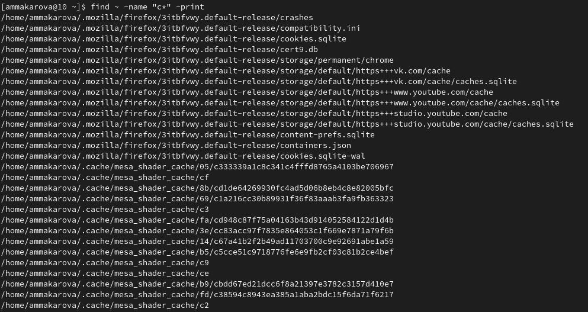
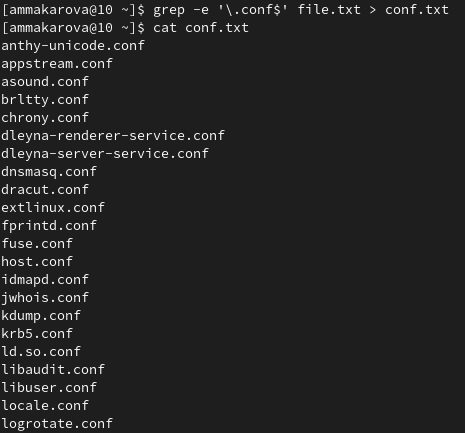
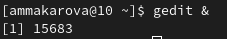
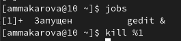

---
## Front matter
lang: ru-RU
title: Лабораторная работа №6
author: Макарова Анастасия Михайловна
institute: РУДН, Москва, Россия
date: 6 мая 2022

## Formatting
toc: false
slide_level: 2
theme: metropolis
header-includes: 
 - \metroset{progressbar=frametitle,sectionpage=progressbar,numbering=fraction}
 - '\makeatletter'
 - '\beamer@ignorenonframefalse'
 - '\makeatother'
aspectratio: 43
section-titles: true
---

## Цель работы 

Ознакомление с инструментами поиска файлов и фильтрации текстовых данных.
Приобретение практических навыков: по управлению процессами (и заданиями), по
проверке использования диска и обслуживанию файловых систем.

## Перенаправление ввода-вывода

Большинство используемых в консоли команд и программ записывают результаты своей работы в стандартный поток вывода stdout. Например, команда ls выводит в стандартный поток вывода (консоль) список файлов в текущей директории.

## Поиск файла

Команда find используется для поиска и отображения на экран имён файлов,соответствующих заданной строке символов. Путь определяет каталог, начиная с которого по всем подкаталогам будет вестись поиск.
Формат команды: find путь [-опции]

{ #fig:001 width=70% }

## Фильтрация текста

Найти в текстовом файле указанную строку символов позволяет команда grep.
Формат команды: grep строка имя_файла.
Кроме того, команда grep способна обрабатывать стандартный вывод других команд (любой текст).Для этого следует использовать конвейер, связав вывод команды с вводом
grep.

{ #fig:001 width=70% }

## Управление задачами

Любую выполняющуюся в консоли команду или внешнюю программу можно запустить в фоновом режиме. Для этого следует в конце имени команды указать знак амперсанда &. Например: gedit &
Будет запущен текстовой редактор gedit в фоновом режиме. Консоль при этом не будет заблокирована.
Запущенные фоном программы называются задачами (jobs).

{ #fig:001 width=70% }

{ #fig:001 width=70% }

## Выводы

1) я ознакомилась с инструментами поиска файлов и фильтрации текстовых данных;
2) я приобрела практические навыки по управлению процессами (и заданиями), по
проверке использования диска и обслуживанию файловых систем.

# Спасибо за внимание

