---
## Front matter
title: "Лабораторная работа №6"
subtitle: "Отчёт по лабораторной работе №6"
author: "Макарова Анастасия Михайловна"

## Generic otions
lang: ru-RU
toc-title: "Содержание"

## Bibliography
bibliography: bib/cite.bib
csl: pandoc/csl/gost-r-7-0-5-2008-numeric.csl

## Pdf output format
toc: true # Table of contents
toc-depth: 2
lof: true # List of figures
lot: true # List of tables
fontsize: 12pt
linestretch: 1.5
papersize: a4
documentclass: scrreprt
## I18n polyglossia
polyglossia-lang:
  name: russian
  options:
	- spelling=modern
	- babelshorthands=true
polyglossia-otherlangs:
  name: english
## I18n babel
babel-lang: russian
babel-otherlangs: english
## Fonts
mainfont: PT Serif
romanfont: PT Serif
sansfont: PT Sans
monofont: PT Mono
mainfontoptions: Ligatures=TeX
romanfontoptions: Ligatures=TeX
sansfontoptions: Ligatures=TeX,Scale=MatchLowercase
monofontoptions: Scale=MatchLowercase,Scale=0.9
## Biblatex
biblatex: true
biblio-style: "gost-numeric"
biblatexoptions:
  - parentracker=true
  - backend=biber
  - hyperref=auto
  - language=auto
  - autolang=other*
  - citestyle=gost-numeric
## Pandoc-crossref LaTeX customization
figureTitle: "Рис."
tableTitle: "Таблица"
listingTitle: "Листинг"
lofTitle: "Список иллюстраций"
lotTitle: "Список таблиц"
lolTitle: "Листинги"
## Misc options
indent: true
header-includes:
  - \usepackage{indentfirst}
  - \usepackage{float} # keep figures where there are in the text
  - \floatplacement{figure}{H} # keep figures where there are in the text
---

# Цель работы

Ознакомление с инструментами поиска файлов и фильтрации текстовых данных.
Приобретение практических навыков: по управлению процессами (и заданиями), по
проверке использования диска и обслуживанию файловых систем.

# Выполнение лабораторной работы

1. Осуществим вход в систему, используя только пароль (т.к. я работаю со своей техники).

2. Запишем в файл file.txt названия файлов, содержащихся в каталоге /etc. Допишем в этот же файл названия файлов, содержащихся в домашнем каталоге. Проверим содержимое файла file.txt командой cat (Рис.1, 1.1).

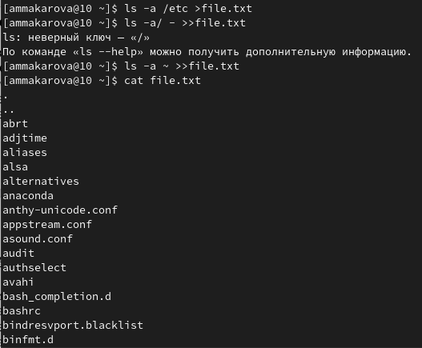{ #fig:001 width=70% }

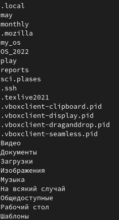{ #fig:001 width=70% }
   
3. Выведем имена всех файлов из file.txt, имеющих расширение .conf, после чего запишем их в новый текстовый файл conf.txt (Рис.2).

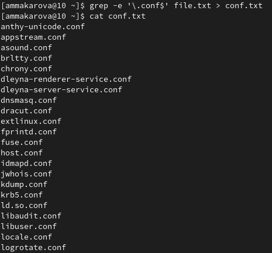{ #fig:001 width=70% }
    
4. Определим, какие файлы в домашнем каталоге имеют имена, начинающиеся с символа c, используя несколько способов (Рис.3, 3.1).
  
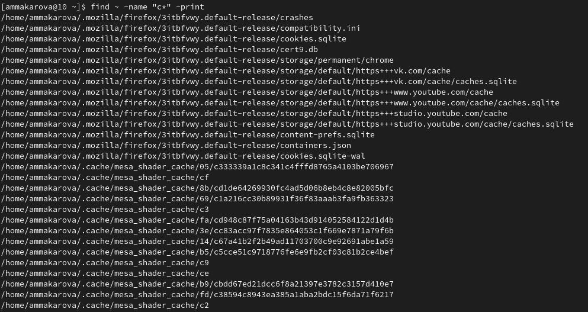{ #fig:001 width=70% }

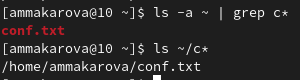{ #fig:001 width=70% } 

5. Выведем на экран (по странично) имена файлов из каталога /etc, начинающиеся с символа h, используя команду find /etc -maxdepth 1 -name "h*" | less (Рис.4).

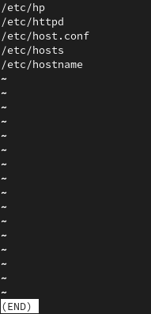{ #fig:001 width=70% }

6. Запустим в фоновом режиме процесс, который будет записывать в файл ~/logfile файлы, имена которых начинаются с log (Рис.5, 5.1).

{ #fig:001 width=70% }

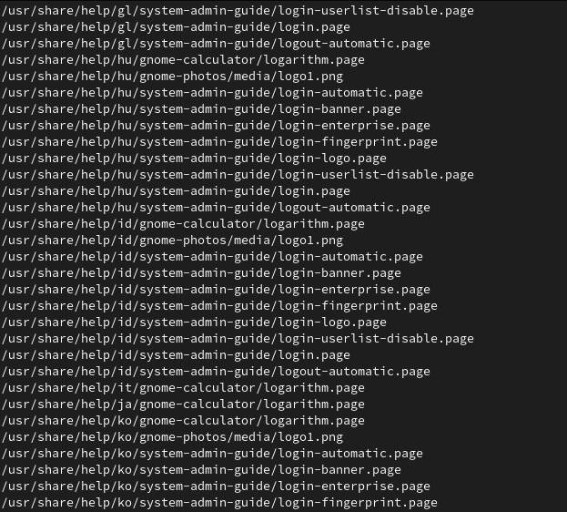{ #fig:001 width=70% }

7. Удалим файл logfile и проверим его отсутствие командой ls (Рис.6).

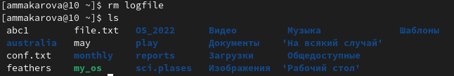{ #fig:001 width=70% }

8. Запустим из консоли в фоновом режиме редактор gedit (Рис.7, 7.1).

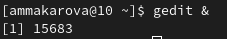{ #fig:001 width=70% }

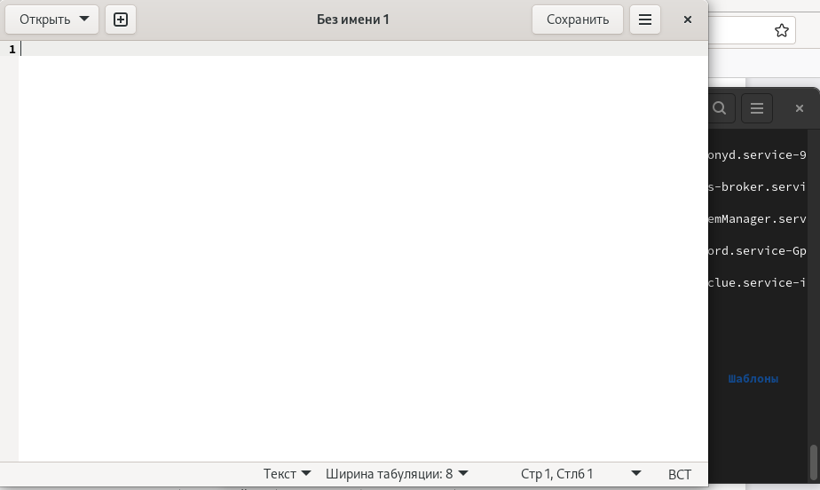{ #fig:001 width=70% }

9. Определим идентификатор процесса gedit, используя команду ps, конвейер и фильтр
grep (Рис.8, 8.1).

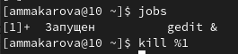{ #fig:001 width=70% }

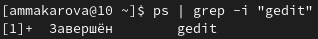{ #fig:001 width=70% }

10. Прочитаем справку (man) команды kill, после чего используем её для завершения
процесса gedit (с помощью этой команды мы завершили пооцесс и взяли скриншот с пункта 9) (Рис.8, 9).

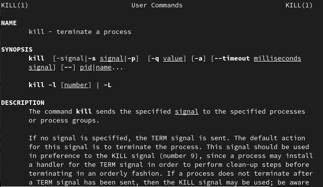{ #fig:001 width=70% }

{ #fig:001 width=70% }

11. Выполним команды df и du, предварительно получив более подробную информацию
об этих командах с помощью команды man (Рис.10-13).

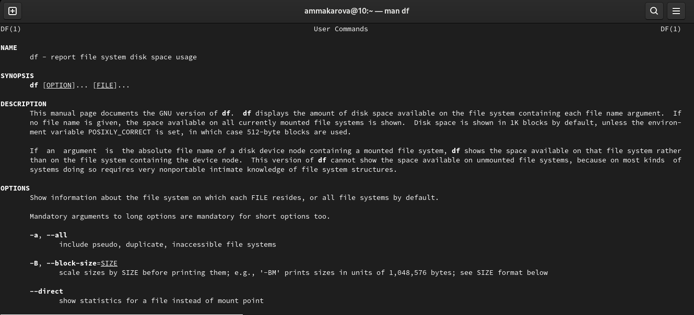{ #fig:001 width=70% }

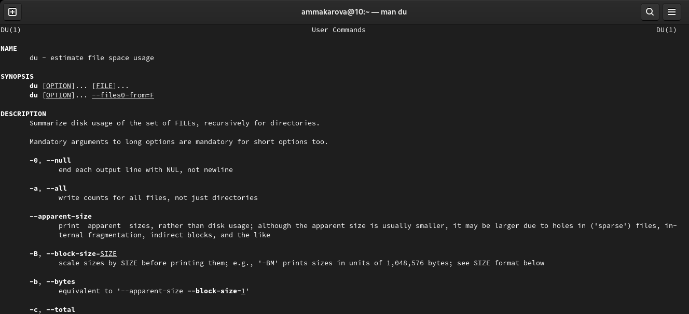{ #fig:001 width=70% }

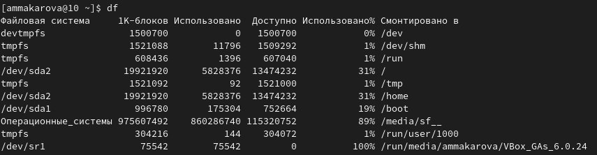{ #fig:001 width=70% }

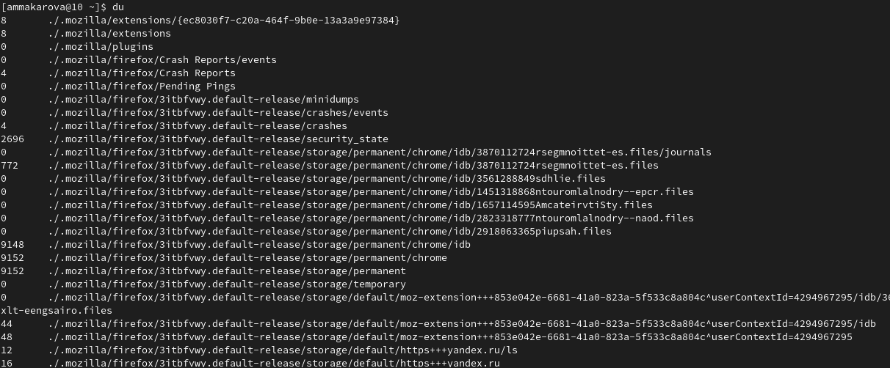{ #fig:001 width=70% }

12. Воспользовавшись справкой команды find, выведем имена всех директорий, имеющихся в домашнем каталоге (Рис.12, 13).

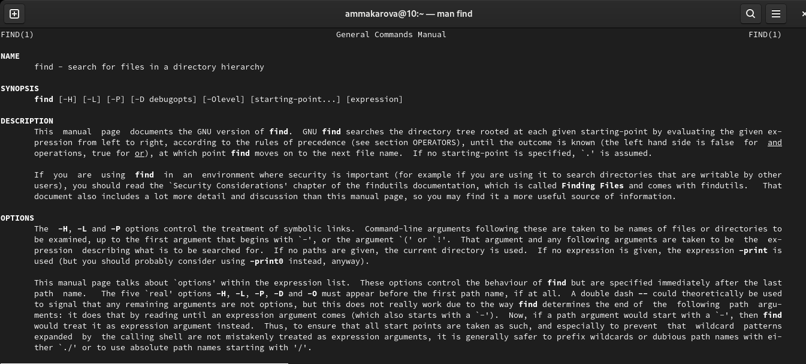{ #fig:001 width=70% }

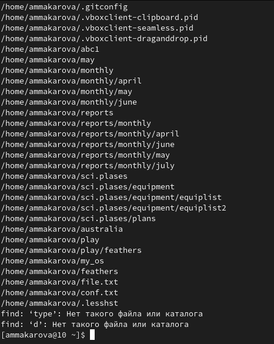{ #fig:001 width=70% }

# Вывод

В ходе выполнения данной лабораторной работы я ознакомилась с инструментами поиска файлов и фильтрации текстовых данных, а также приобрела практические навыки по управлению процессами (и заданиями), по проверке использования диска и обслуживанию файловых систем.

# Контрольные вопросы

1. Какие потоки ввода вывода вы знаете?
В системе по умолчанию открыто три специальных потока:
– stdin — стандартный поток ввода (по умолчанию: клавиатура), файловый дескриптор 0;
– stdout — стандартный поток вывода (по умолчанию: консоль), файловый дескриптор 1;
– stderr — стандартный поток вывод сообщений об ошибках (по умолчанию: консоль), файловый дескриптор 2.
Большинство используемых в консоли команд и программ записывают результаты своей работы в стандартный поток вывода stdout. Например, команда ls выводит в стандартный поток вывода (консоль) список файлов в текущей директории. Потоки вывода и ввода можно перенаправлять на другие файлы или устройства. Проще всего это делается с помощью символов >,>>,<,<<.

2. Объясните разницу между операцией > и >>.

> : Перезаписывает существующий файл или создает файл, если файл с указанным именем отсутствует в каталоге.
>> : добавляет существующий файл или создает файл, если файл с указанным именем отсутствует в каталоге.

3. Что такое конвейер?
Конвейер (pipe) служит для объединения простых команд или утилит в цепочки, в которых результат работы предыдущей команды передаётся последующей.

4. Что такое процесс? Чем это понятие отличается от программы?
Программа и процесс являются родственными терминами. Основное различие между программой и процессом заключается в том, что программа представляет собой группу инструкций для выполнения определенной задачи, тогда как процесс представляет собой программу в процессе выполнения. Хотя процесс является активной сущностью, программа считается пассивной.

5. Что такое PID и GID?
Эффективное имя пользователя Linux или Unix и эффективный идентификатор пользователя (UID). Имя действующей группы пользователей Linux или Unix и идентификатор эффективной группы (GID).

6. Что такое задачи и какая команда позволяет ими управлять?
Любую выполняющуюся в консоли команду или внешнюю программу можно запустить в фоновом режиме. Запущенные фоном программы называются задачами (jobs). Ими можно управлять с помощью команды jobs, которая выводит список запущенных в данный момент задач.

7. Найдите информацию об утилитах top и htop. Каковы их функции?
top − это консольная программа, которая показывает список работающих процессов в системе. Программа в реальном времени отсортирует запущенные процессы по их нагрузке на процессор.
htop − это продвинутый консольный мониторинг процессов. Утилита выводит постоянно меняющийся список системных процессов, который сортируется в зависимости от нагрузки на ЦПУ. Если делать сравнение сtop, то htop показывает абсолютно все процессы в системе, время их непрерывного использования, загрузку процессоров и расход оперативной памяти.

8. Назовите и дайте характеристику команде поиска файлов. Приведите примеры использования этой команды.
Команда find позволяет задействовать одноименную утилиту, предназначенную для поиска файлов в иерархии директорий файловой системы. Она позволяет задавать гибкие критерии поиска, генерировать форматированный вывод и выполнять пользовательские команды по отношению к найденным файлам. 
Базовый синтаксис команды выглядит следующим образом: $ find [параметры] [директория…] [выражение].
В случае утилиты find параметры используются достаточно редко: они позволяют регламентировать обработку символьных ссылок, задать уровень оптимизации выражения и передать параметры отладки. 
Например, чтобы увидеть список всех файлов системы, которые называются `top', нужно набрать:
$ find / -name top [Enter] 

9. Можно ли по контексту (содержанию) найти файл? Если да,то как?
Файл по его содержимому можно найти с помощью команды grep: «grep -r" слово/выражение, которое нужно найти"».

10. Как определить объем свободной памяти на жёстком диске?
Утилита df позволяет проанализировать свободное пространство на всех подключенных к системе разделах.

11. Как определить объем вашего домашнего каталога?
При выполнении команды du (без указания папки и опции) можно получить все файлы и папки текущей директории с их размерами. Для домашнего каталога: du ~/

12. Как удалить зависший процесс?
Существует несколько инструментов для завершения неотвечающего или зависшего процесса из командной строки, включая kill, pkill и killall. Эти команды работают, посылая определенные сигналы не отвечающим процессам. Нам понадобится PID, чтобы мы могли отправить им требуемый завершающий сигнал.

