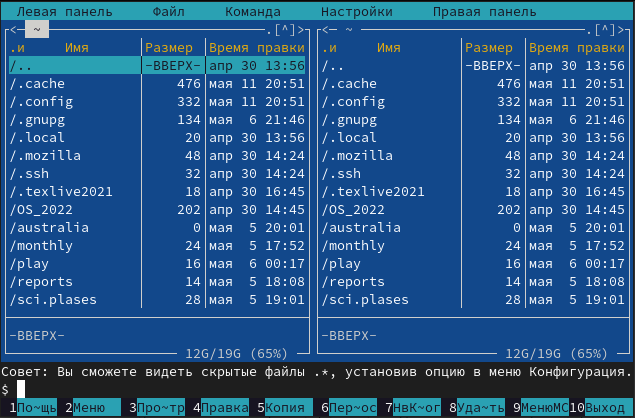
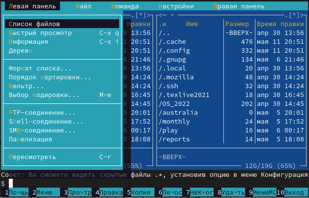
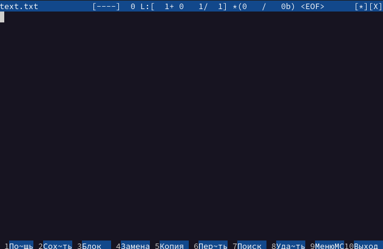

---
## Front matter
lang: ru-RU
title: Лабораторная работа №7
author: Макарова Анастасия Михайловна
institute: РУДН, Москва, Россия
date: 13 мая 2022

## Formatting
toc: false
slide_level: 2
theme: metropolis
header-includes: 
 - \metroset{progressbar=frametitle,sectionpage=progressbar,numbering=fraction}
 - '\makeatletter'
 - '\beamer@ignorenonframefalse'
 - '\makeatother'
aspectratio: 43
section-titles: true
---

## Цель работы 

Освоение основных возможностей командной оболочки Midnight Commander. Приобретение навыков практической работы по просмотру каталогов и файлов; манипуляций с ними.

## Общие сведения

Командная оболочка — интерфейс взаимодействия пользователя с операционной системой и программным обеспечением посредством команд.
Midnight Commander (или mc) — псевдографическая командная оболочка для UNIX/Linux систем. Для запуска mc необходимо в командной строке набрать mc и нажать Enter. Рабочее пространство mc имеет две панели, отображающие по умолчанию списки
файлов двух каталогов. 

{ #fig:001 width=70% }

## Режимы отображения панелей и управление ими

Панель в mc отображает список файлов текущего каталога. Абсолютный путь к этому каталогу отображается в заголовке панели. У активной панели заголовок и одна из её строк подсвечиваются. Управление панелями осуществляется с помощью определённых
комбинаций клавиш или пунктов меню mc.

## Меню панелей

Перейти в строку меню панелей mc можно с помощью функциональной клавиши F9. В строке меню имеются пять меню: Левая панель, Файл, Команда, Настройки и Правая панель. 

{ #fig:001 width=70% }

## Редактор mc

Встроенный в mc редактор вызывается с помощью функциональной клавиши F4. В нём удобно использовать различные комбинации клавиш при редактировании содержимого (как правило текстового) файла.

{ #fig:001 width=70% }

## Выводы

1) я освоила основные возможности командной оболочки Midnight Commander;
2) я приобрела навыки практической работы по просмотру каталогов и файлов; манипуляций с ними.

# Спасибо за внимание

