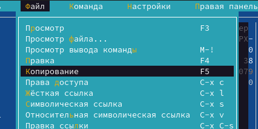
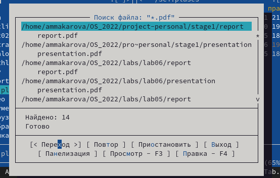
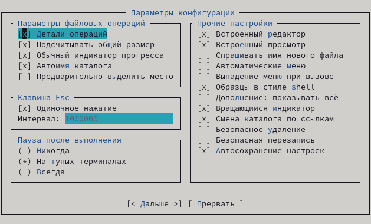
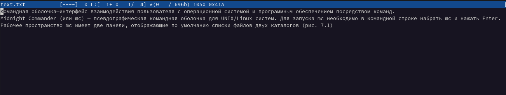
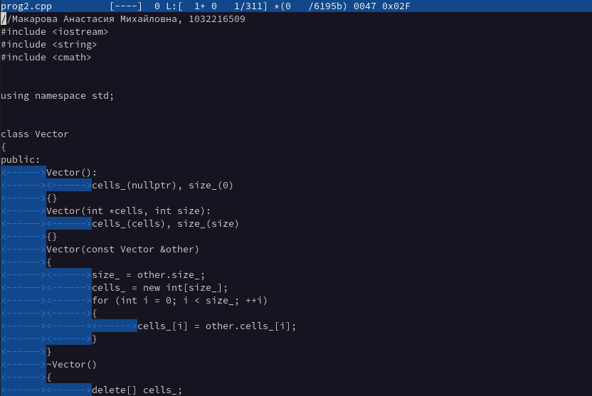

---
## Front matter
title: "Лабораторная работа №7"
subtitle: "Отчёт по лабораторной работе №7"
author: "Макарова Анастасия Михайловна"

## Generic otions
lang: ru-RU
toc-title: "Содержание"

## Bibliography
bibliography: bib/cite.bib
csl: pandoc/csl/gost-r-7-0-5-2008-numeric.csl

## Pdf output format
toc: true # Table of contents
toc-depth: 2
lof: true # List of figures
lot: true # List of tables
fontsize: 12pt
linestretch: 1.5
papersize: a4
documentclass: scrreprt
## I18n polyglossia
polyglossia-lang:
  name: russian
  options:
	- spelling=modern
	- babelshorthands=true
polyglossia-otherlangs:
  name: english
## I18n babel
babel-lang: russian
babel-otherlangs: english
## Fonts
mainfont: PT Serif
romanfont: PT Serif
sansfont: PT Sans
monofont: PT Mono
mainfontoptions: Ligatures=TeX
romanfontoptions: Ligatures=TeX
sansfontoptions: Ligatures=TeX,Scale=MatchLowercase
monofontoptions: Scale=MatchLowercase,Scale=0.9
## Biblatex
biblatex: true
biblio-style: "gost-numeric"
biblatexoptions:
  - parentracker=true
  - backend=biber
  - hyperref=auto
  - language=auto
  - autolang=other*
  - citestyle=gost-numeric
## Pandoc-crossref LaTeX customization
figureTitle: "Рис."
tableTitle: "Таблица"
listingTitle: "Листинг"
lofTitle: "Список иллюстраций"
lotTitle: "Список таблиц"
lolTitle: "Листинги"
## Misc options
indent: true
header-includes:
  - \usepackage{indentfirst}
  - \usepackage{float} # keep figures where there are in the text
  - \floatplacement{figure}{H} # keep figures where there are in the text
---

# Цель работы

Освоение основных возможностей командной оболочки Midnight Commander. Приобретение навыков практической работы по просмотру каталогов и файлов; манипуляций с ними.

# Выполнение лабораторной работы
## Задание по mc

1. Изучим информацию о mc, вызвав в командной строке man mc (Рис.1).

{ #fig:001 width=70% }

2. Запустим из командной строки mc, изучим его структуру и меню. Верхнее меню включает в себя: "Левая панель", "Файл", "Команда", "Настройки", "Правая панель", а с помощью горячих клавиш мы можем использовать функции из нижней панели, например, горячие клавиши F1 - "Помощь", F2 - "Меню пользователя" (Рис.2-9).

{ #fig:001 width=70% }

{ #fig:001 width=70% }

{ #fig:001 width=70% }

{ #fig:001 width=70% }

{ #fig:001 width=70% }

{ #fig:001 width=70% }

{ #fig:001 width=70% }

{ #fig:001 width=70% }
   
3. Выполним несколько операций в mc, используя управляющие клавиши:

* Выделение/отмена выделения файлов с помощью клавиши Insert (Рис.10).

{ #fig:001 width=70% }

* Копирование файлов с помощью клавиши F5 (Рис.11, 12).

{ #fig:001 width=70% }

{ #fig:001 width=70% }

* Перемещение файлов с помощью клавиши F6 (Рис.13, 14).

{ #fig:001 width=70% }

{ #fig:001 width=70% }

* Получение информации о размере и правах доступа на файлы и/или каталоги с помощью кнопки меню "Правая (Левая) панель" > "Информация" и "Файл" > "Права (расширенные)" (Рис.15, 16).

{ #fig:001 width=70% }

{ #fig:001 width=70% }
    
4. Выполним основные команды меню правой панели. При помощи команд этого меню можно изменить формат списка файлов, фильтровать файлы и просматривать их (Рис.7, 17-19).
  
{ #fig:001 width=70% }

{ #fig:001 width=70% } 

{ #fig:001 width=70% }

{ #fig:001 width=70% }

5. Используя возможности подменю "Файл", выполним: 

* просмотр содержимого текстового файла (я выбрала conf.txt). Для этого выделяем нужный файл и выбираем меню "Файл" > "Просмотр файла" (Рис.20.1, 20).

{ #fig:001 width=70% }

{ #fig:001 width=70% }

* редактирование содержимого текстового файла (без сохранения результатов редактирования). Я редактирую тот же файл conf.txt с помощью меню "Файл" > "Правка" (Рис.21.1, 21).

{ #fig:001 width=70% }

{ #fig:001 width=70% }

* создание каталога (создаю новый каталог с названием catalog) (Рис.22, 23).

{ #fig:001 width=70% }

{ #fig:001 width=70% }

* копирование файлов в созданный каталог (копирую файл conf.txt в созданный мною каталог с именем catalog) с помощью меню "Файл" > "Копирование" (Рис.24.1, 24, 25).

{ #fig:001 width=70% }

{ #fig:001 width=70% }

{ #fig:001 width=70% }

6. С помощью соответствующих средств подменю "Команда" осуществим:

* поиск в файловой системе файла с заданными условиями (я задаю условие посика файлов с расширением pdf) с помощью меню "Команда" > "Поиск файла" (Рис.26.1, 26, 27).

{ #fig:001 width=70% }

{ #fig:001 width=70% }

{ #fig:001 width=70% }

* выбор и повторение одной из предыдущих команд (у нас пустая история командной строки, т.к мы ничего не вводили в терминал) с помощью меню "Команда" > "История командной строки" (Рис.29). 

{ #fig:001 width=70% }

* переход в домашний каталог с помощью меню "Команда" > "Дерево Каталогов" (Рис.28, 28.1, 28.2).

{ #fig:001 width=70% }

{ #fig:001 width=70% }

{ #fig:001 width=70% }

* анализ файла меню и файла расширений (Рис.31, 32). 

{ #fig:001 width=70% }

{ #fig:001 width=70% }

7. Вызовем подменю "Настройки". Освоим операции, определяющие структуру экрана mc (Full screen, Double Width, Show Hidden Files и т.д.). Это меню "Конфигурация", "Внешний вид", "Настройки панелей", "Оформление" (Рис.32-37).

{ #fig:001 width=70% }

{ #fig:001 width=70% }

{ #fig:001 width=70% }

{ #fig:001 width=70% }

{ #fig:001 width=70% }

{ #fig:001 width=70% }

## Задание по встроенному редактору mc

1. Создадим текстовый файл text.txt с помощью команды touch text.txt (Рис.38).

{ #fig:001 width=70% }

2. Откроем этот файл с помощью встроенного в mc редактора с помощью команды mcedit text.txt (Рис.39).

{ #fig:001 width=70% }

3. Вставим в открытый файл небольшой фрагмент текста, я скопировала его из начала указаний к лабораторной работе (Рис.40).

{ #fig:001 width=70% }

4. Проделаем с текстом следующие манипуляции, используя горячие клавиши:

4.1) Удалим строку текста, используя комбинацию клавиш Ctrl+y (Рис.41, 42).

{ #fig:001 width=70% }

{ #fig:001 width=70% }

4.2) Выделим фрагмент текста и скопируем его на новую строку, используя клавиши F3+F5 (Рис.43).

{ #fig:001 width=70% }

4.3) Выделим фрагмент текста и перенесем его на новую строку, используя клавиши F3+F6 (Рис.44).

{ #fig:001 width=70% }

4.4) Сохраним файл с помощью клавиши F2 (Рис. 50).

{ #fig:001 width=70% }

4.5) Отменим последнее действие с помощью клавиш Ctrl+u (Рис.51).

{ #fig:001 width=70% }

4.6) Перейдём в конец файла (нажав комбинацию клавиш Ctrl+End) и напишем некоторый текст (Рис.45).

{ #fig:001 width=70% }

4.7) Перейдём в начало файла (нажав комбинацию клавиш Ctrl+Home) и напишем некоторый текст (Рис.46).

{ #fig:001 width=70% }

4.8) Сохраним и закроем файл. 

5. Откроем файл с исходным текстом на языке программирования С++ (Рис.47).

{ #fig:001 width=70% }

6. Используя меню редактора, выключим подсветку синтаксиса (Рис.48, 49).

{ #fig:001 width=70% }

{ #fig:001 width=70% }

# Вывод

В ходе выполнения данной лабораторной работы я освоила основные возможности командной оболочки Midnight Commander, а также приобрела навыки практической работы по просмотру каталогов и файлов; манипуляций с ними.

# Контрольные вопросы

1. Какие режимы работы есть в mc. Охарактеризуйте их.
Панели могут дополнительно быть переведены в один из двух режимов: «Информация» или «Дерево». В режиме «Информация» на панель выводятся сведения о файле и текущей файловой системе, расположенных на активной панели. В режиме «Дерево» на одной из панелей выводится структура дерева каталогов.

2. Как с помощью команд shell, так и с помощью меню (комбинаций клавиш) mc можно выполнить следующие операции с файлами:
* копирование «F5» («cp имя_файла имя_каталога (в который копируем)») 

* перемещение/переименование «F6» («mv имя_файла имя_каталога (в который перемещаем)»)

* создание каталога «F7» («mkdir имя_каталога»)

* удаление «F8» («rm имя_файла»)

* изменение прав доступа «ctrl+x» («chmod u+x имя_файла»)

3. Перейти в строку меню панелей mc можно с помощью функциональной клавиши «F9». В строке меню имеются пять меню: «Леваяпанель», «Файл», «Команда», «Настройки» и «Праваяпанель». Под пункт меню «Быстрый просмотр» позволяет выполнить быстрый просмотр содержимого панели.
Подпункт меню «Информация» позволяет посмотреть информацию о файле или каталоге. В меню каждой (левой или правой) панели можно выбрать «Формат списка»:

* стандартный − выводит список файлов и каталогов с указанием размера и времени правки;

* ускоренный − позволяет задать число столбцов, на которые разбивается панель при выводе списка имён файлов или каталогов без дополнительной информации;

* расширенный − помимо названия файла или каталога выводит сведения о правах доступа, владельце, группе, размере, времени правки;

* определённый пользователем − позволяет вывести те сведения о файле или каталоге, которые задаст сам пользователь.

Подпункт меню «Порядок сортировки» позволяет задать критерии сортировки при выводе списка файлов и каталогов: без сортировки, по имени, расширенный, время правки, время доступа, время изменения атрибута, размер, узел.

4. Команды меню «Файл»:

* Просмотр(«F3»)− позволяет посмотреть содержимое текущего (или выделенного) файла без возможности редактирования.

* Просмотр вывода команды («М»+«!»)− функция запроса команды с параметрами (аргумент к текущему выбранному файлу).

* Правка(«F4») − открывает текущий (или выделенный) файл для его редактирования.

* Копирование(«F5»)− осуществляет копирование одного или нескольких файлов или каталогов в указанное пользователем во всплывающем окне место.

* Права доступа («Ctrl-x»«c»)− позволяет указать (изменить) права доступа к одному или нескольким файлам или каталогам.

* Жёсткая ссылка («Ctrl-x»«l»)− позволяет создать жёсткую ссылку к текущему(или выделенному) файлу.

* Символическая ссылка («Ctrl-x»«s»)− позволяет создать символическую ссылку к текущему (или выделенному) файлу.

* Владелец/группа («Ctrl-x»«o»)− позволяет задать (изменить) владельца и имя группы для одного или нескольких файлов или каталогов.

* Права(расширенные)− позволяет изменить права доступа и владения для одного или нескольких файлов или каталогов.

* Переименование («F6»)− позволяет переименовать (или переместить) один или несколько файлов или каталогов.

* Создание каталога («F7») − позволяет создать каталог.

* Удалить («F8») − позволяет удалить один или несколько файлов или каталогов.

* Выход («F10») − завершает работу mc.

* Меню Команда В меню Команда содержатся более общие команды для работы с mc.

5. Команды меню Команда:

Дерево каталогов − отображает структуру каталогов системы.

Поиск файла − выполняет поиск файлов по заданным параметрам.

Переставить панели − меняет местами левую и правую панели.

Сравнить каталоги («Ctrl-x»«d») − сравнивает содержимое двух каталогов.

Размеры каталогов − отображает размер и время изменения каталога (по умолчанию в mc размер каталога корректно не отображается).

История командной строки − выводит на экран список ранее выполненных в оболочке команд.

Каталоги быстрого доступа(Ctrl-\»)− при вызове выполняется быстрая смена текущего каталога на один из заданного списка.

Восстановление файлов − позволяет восстановить файлы на файловых системах ext2 и ext3.

Редактировать файл расширений − позволяет задать с помощью определённого синтаксиса действия при запуске файлов с определённым расширением (например, какое программное обеспечение запускать для открытия или редактирования файлов с расширением doc или docx).

Редактировать файл меню − позволяет отредактировать контекстное меню пользователя, вызываемое по клавише «F2».

Редактировать файл расцветки имён − позволяет подобрать оптимальную для пользователя расцветку имён файлов в зависимости от их типа.

6. Меню Настройки содержит ряд дополнительных опций по внешнему виду и функциональности mc. Меню Настройки содержит:
Конфигурация − позволяет скорректировать настройки работы с панелями.

Внешний вид и Настройки панелей − определяет элементы (строка меню, командная строка, подсказки и прочее), отображаемые при вызове mc, а также геометрию расположения панелей и цветовыделение.

Биты символов − задаёт формат обработки информации локальным терминалом.

Подтверждение − позволяет установить или убрать вывод окна с запросом подтверждения действий при операциях удаления и перезаписи файлов, а также при выходе из программы.

Распознание клавиш − диалоговое окно используется для тестирования функциональных клавиш, клавиш управления курсором и прочее.

Виртуальные ФС − настройки виртуальной файловой системы: тайм-аут, пароль и прочее.

7. Функциональные клавиши mc: F1 – вызов контекстно-зависимой подсказки

F2 – вызов пользовательского меню с возможностью создания и/или дополнения дополнительных функций

F3 – просмотр содержимого файла, на который указывает подсветка в активной панели (без возможности редактирования)

F4 – вызов встроенного в mc редактора для изменения содержания файла, на который указывает подсветка в активной панели

F5 – копирование одного или нескольких файлов, отмеченных впервой (активной) панели, в каталог, отображаемый на второй панели

F6 – перенос одного или нескольких файлов, отмеченных в первой (активной) панели, в каталог, отображаемый на второй панели

F7 – создание подкаталога в каталоге, отображаемом в активной панели

F8 – удаление одного или нескольких файлов (каталогов), отмеченных в первой (активной) панели файлов

F9 – вызов меню mc

F10 – выход из mc

8. Встроенный в mc редактор вызывается с помощью функциональной клавиши «F4». В нём удобно использовать различные комбинации клавиш при редактировании содержимого (как правило текстового) файла. Клавиши для редактирования файла: «Ctrl-y» − удалить строку

«Ctrl-u» − отмена последней операции

«ins» - вставка/замена

«F7» − поиск (можно использовать регулярные выражения)

«↑-F7» − повтор последней операции поиска

«F4» − замена

«F3» − первое нажатие − начало выделения, второе − окончание выделения

«F5» − копировать выделенный фрагмент

«F6» − переместить выделенный фрагмент

«F8» − удалить выделенный фрагмент

«F2» − записать изменения в файл

«F10» − выйти из редактор

9. Для редактирования меню пользователя, которое вызывается клавишей «F2», необходимо перейти в пункт «Редактировать файл меню» → «Команда» и изменить настройки файла.

10. Часть команд «Меню пользователя», а также меню «Файл» позволяют выполнять действия, определяемые пользователем, над текущим файлом. Например, копирование каталога или файла, переименование, перемещение, архивирование.

