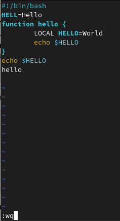
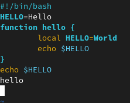

---
## Front matter
lang: ru-RU
title: Лабораторная работа №8
author: Макарова Анастасия Михайловна
institute: РУДН, Москва, Россия
date: 13 мая 2022

## Formatting
toc: false
slide_level: 2
theme: metropolis
header-includes: 
 - \metroset{progressbar=frametitle,sectionpage=progressbar,numbering=fraction}
 - '\makeatletter'
 - '\beamer@ignorenonframefalse'
 - '\makeatother'
aspectratio: 43
section-titles: true
---

## Цель работы 

Познакомиться с операционной системой Linux. Получить практические навыки работы с редактором vi, установленным по умолчанию практически во всех дистрибутивах.

## Текстовой редактор vi

В большинстве дистрибутивов Linux в качестве текстового редактора по умолчанию устанавливается интерактивный экранный редактор vi (Visual display editor).
Редактор vi имеет три режима работы.
Для вызова редактора vi необходимо указать команду vi и имя редактируемого файла: vi "имя_файла"

## Создание нового файла с использованием vi

1) Открываем файл в редакторе vi
2) Открываем режим вставки с помощью клавиши i
3) Печатаем текст
4) После завершения ввода текста нажмём клавишу Esc и затем : для перехода в режим последней строки
5) В конце строки введем wq, где w - запись, а q - выход, а затем нажмём клавишу Enter для сохранения текста и завершения работы

{ #fig:001 width=70% }

## Редактирование существующего файла

1) Вызовем vi на редактирование файла hello.sh
2) Установим курсор в конце слова HELL второй строки, перейдем в режим вставки и заменим слово HELL на HELLO. Нажмём клавишу Esc для возврата в командный режим
3) Установим курсор на четвертую строку и сотрём слово LOCAL, перейдём в режим вставки и наберём local, затем нажмём Esc для возврата в командный режим

{ #fig:001 width=70% }

## Выводы

1) я ознакомилась с операционной системой Linux;
2) я приобрела практические навыки работы с редактором vi, установленным по умолчанию практически во всех дистрибутивах.

# Спасибо за внимание

