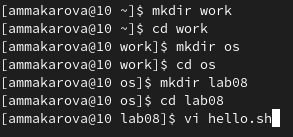
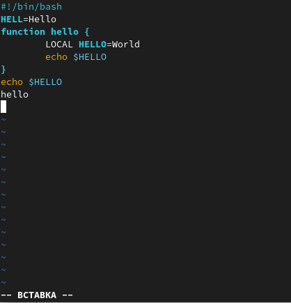
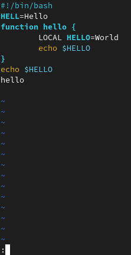
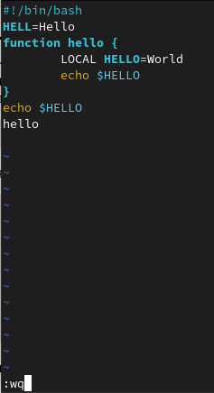
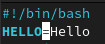
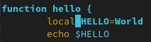
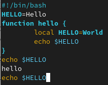
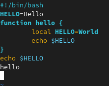
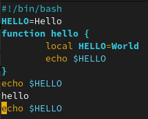
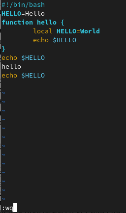

---
## Front matter
title: "Лабораторная работа №8"
subtitle: "Отчёт по лабораторной работе №8"
author: "Макарова Анастасия Михайловна"

## Generic otions
lang: ru-RU
toc-title: "Содержание"

## Bibliography
bibliography: bib/cite.bib
csl: pandoc/csl/gost-r-7-0-5-2008-numeric.csl

## Pdf output format
toc: true # Table of contents
toc-depth: 2
lof: true # List of figures
lot: true # List of tables
fontsize: 12pt
linestretch: 1.5
papersize: a4
documentclass: scrreprt
## I18n polyglossia
polyglossia-lang:
  name: russian
  options:
	- spelling=modern
	- babelshorthands=true
polyglossia-otherlangs:
  name: english
## I18n babel
babel-lang: russian
babel-otherlangs: english
## Fonts
mainfont: PT Serif
romanfont: PT Serif
sansfont: PT Sans
monofont: PT Mono
mainfontoptions: Ligatures=TeX
romanfontoptions: Ligatures=TeX
sansfontoptions: Ligatures=TeX,Scale=MatchLowercase
monofontoptions: Scale=MatchLowercase,Scale=0.9
## Biblatex
biblatex: true
biblio-style: "gost-numeric"
biblatexoptions:
  - parentracker=true
  - backend=biber
  - hyperref=auto
  - language=auto
  - autolang=other*
  - citestyle=gost-numeric
## Pandoc-crossref LaTeX customization
figureTitle: "Рис."
tableTitle: "Таблица"
listingTitle: "Листинг"
lofTitle: "Список иллюстраций"
lotTitle: "Список таблиц"
lolTitle: "Листинги"
## Misc options
indent: true
header-includes:
  - \usepackage{indentfirst}
  - \usepackage{float} # keep figures where there are in the text
  - \floatplacement{figure}{H} # keep figures where there are in the text
---

# Цель работы

Познакомиться с операционной системой Linux. Получить практические навыки работы с редактором vi, установленным по умолчанию практически во всех дистрибутивах.

# Выполнение лабораторной работы
## Задание 1. Создание нового файла с использованием vi

1. Создадим каталог с именем ~/work/os/lab08, перейдем в каталог lab08 и вызовем vi, создадим файл hello.sh (Рис.1).

{ #fig:001 width=70% }

2. Нажмём клавишу i, чтобы перейти в режим вставки, и введём предложенный нам текст (Рис.2).

{ #fig:001 width=70% }
   
3. Нажмём клавишу Esc для перехода в командный режим после завершения ввода текста и затем нажмём клавишу : для перехода в режим последней строки (Рис.3).

{ #fig:001 width=70% }
    
4. В конце строки введем wq, где w - запись, а q - выход, а затем нажмём клавишу Enter для сохранения текста и завершения работы (Рис.4).
  
{ #fig:001 width=70% }

5. Сделаем файл исполняемым с помощью команды chmod с опцией +x (Рис.5).

{ #fig:001 width=70% }

## Задание 2. Редактирование существующего файла

1. Вызовем vi на редактирование файла hello.sh. 

2. Установим курсор в конце слова HELL второй строки, перейдем в режим вставки и заменим слово HELL на HELLO. Нажмём клавишу Esc для возврата в командный режим (Рис.6).

{ #fig:001 width=70% }

3. Установим курсор на четвертую строку и сотрём слово LOCAL, перейдём в режим вставки и наберём local, затем нажмём Esc для возврата в командный режим (Рис.7).

{ #fig:001 width=70% }

4. Установим курсор на последней строке файла и вставим после неё строку с текстом echo $HELLO  с помощью клавиш y (копирование) и p (вставка) (Рис.8). 

{ #fig:001 width=70% }

5. Перейдём в командный режим и удалим последнюю строку, дважды нажав клавишу d (Рис.9).

{ #fig:001 width=70% }

6. Введём команду отмены изменений u для отмены последней команды (Рис.10)

{ #fig:001 width=70% }

7. Введём символ : для перехода в режим последней строки и запишем произведённые изменения, выйдем из редактора vi (Рис.11).

{ #fig:001 width=70% }

# Вывод

В ходе выполнения данной лабораторной работы я ознакомилась с операционной системой Linux и получила практические навыки работы с редактором vi, установленным по умолчанию практически во всех дистрибутивах.

# Контрольные вопросы

1. Дайте краткую характеристику режимам работы редактора vi.
  Редактор vi имеет три режима работы:
1) командный режим — предназначен для ввода команд редактирования и навигации по редактируемому файлу;
2) режим вставки — предназначен для ввода содержания редактируемого файла;
3) режим последней (или командной) строки — используется для записи изменений в файл и выхода из редактора.

2. Как выйти из редактора, не сохраняя произведённые изменения?
  Набрать символ q (или q!), если требуется выйти из редактора без сохранения.

3. Назовите и дайте краткую характеристику командам позиционирования.
1) 0 (ноль) — переход в начало строки;
2) $ — переход в конец строки;
3) G — переход в конец файла;
4) 𝑛 G — переход на строку с номером 𝑛.

4. Что для редактора vi является словом?
  Все, что набирается на клавиатуре, отображается на экране терминала и запоминается в буфере редактора.

5. Каким образом из любого места редактируемого файла перейти в начало (конец) файла?
  Нужно в режиме командной строки нажать клавиши "1" "G".

6. Назовите и дайте краткую характеристику основным группам команд редактирования.
* а — вставить текст после курсора;
* А — вставить текст в конец строки;
* i — вставить текст перед курсором;
* 𝑛 i — вставить текст 𝑛 раз;
* I — вставить текст в начало строки;
* о — вставить строку под курсором;
* О — вставить строку над курсором;
* x — удалить один символ в буфер;
* d w — удалить одно слово в буфер;
* d $ — удалить в буфер текст от курсора до конца строки;
* d 0 — удалить в буфер текст от начала строки до позиции курсора;
* d d — удалить в буфер одну строку;
* 𝑛 d d — удалить в буфер 𝑛 строк;
* u — отменить последнее изменение;
* . — повторить последнее изменение;
* Y — скопировать строку в буфер;
* 𝑛 Y — скопировать 𝑛 строк в буфер;
* y w — скопировать слово в буфер;
* p — вставить текст из буфера после курсора;
* P — вставить текст из буфера перед курсором;
* c w — заменить слово;
* 𝑛 c w — заменить 𝑛 слов;
* c $ — заменить текст от курсора до конца строки;
* r — заменить слово;
* R — заменить текст;
* / текст — произвести поиск вперёд по тексту указанной строки символов текст;
* ? текст — произвести поиск назад по тексту указанной строки символов текст.

7. Необходимо заполнить строку символами "$". Каковы ваши действия?
  Необходимо для начала перейти на эту строку, нажав клавиши n «G», где n – номер строки, далее нажать «0» для перехода в начало строки. Теперь необходимо нажать «c» «$», чтобы заменить текст от курсора до конца строки, и ввести символы $.

8. Как отменить некорректное действие, связанное с процессом редактирования?
  Чтобы отменить по одному предыдущему действию последовательно, необходимо нажать «u». Чтобы отменить все изменения, произведённые со времени последней записи, нужно нажать «:» «e» «!».

9. Назовите и дайте характеристику основным группам команд режима последней строки.
* : 𝑛,𝑚 d — удалить строки с 𝑛 по 𝑚;
* : 𝑖,𝑗 m 𝑘 — переместить строки с 𝑖 по 𝑗, начиная со строки 𝑘;
* : 𝑖,𝑗 t 𝑘 — копировать строки с 𝑖 по 𝑗 в строку 𝑘;
* : 𝑖,𝑗 w имя-файла — записать строки с 𝑖 по 𝑗 в файл с именем имя-файла;
* : w — записать изменённый текст в файл, не выходя из vi;
* : w имя-файла — записать изменённый текст в новый файл с именем имя-файла;
* : w ! имя-файла — записать изменённый текст в файл с именем имя-файла;
* : w q — записать изменения в файл и выйти из vi;
* : q — выйти из редактора vi;
* : q ! — выйти из редактора без записи;
* : e ! — вернуться в командный режим, отменив все изменения, произведённые со времени последней записи.

10. Как определить, не перемещая курсора, позицию, в которой заканчивается строка?
  Чтобы определить, не перемещая курсора, позицию, в которой заканчивается строка, нужно в командном режиме находясь на нужной строке нажать «$» и посмотреть на число после запятой в правом нижнем углу экрана.

11. Выполните анализ опций редактора vi (сколько их, как узнать их назначение и т.д.).
  Опции редактора vi позволяют настроить рабочую среду. Для задания опций используется команда set (в режиме командной строки). Если вы хотите отказаться от использования опции, то в команде set перед именем опции надо поставить no. Чтобы просмотреть опции редактора vi, необходимо нажать «:» set all. Нажав «:» help “название_опции”, можно узнать назначение конкретной опции.

12. Как определить режим работы редактора vi?
  В режиме командной строки внизу редактора присутствует «:», в режиме ввода – «--ВСТАВКА --», в командном режиме внизу ничего нет.

13. Постройте граф взаимосвязи режимов работы редактора vi.

{ #fig:001 width=70% }

