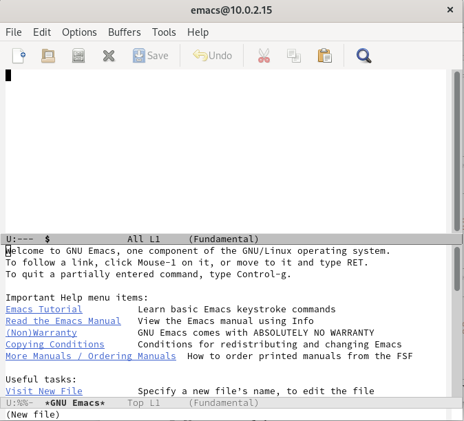
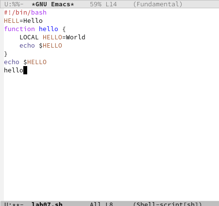
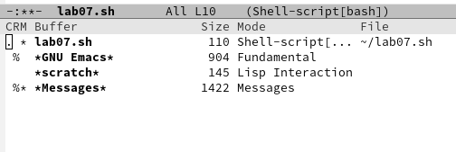
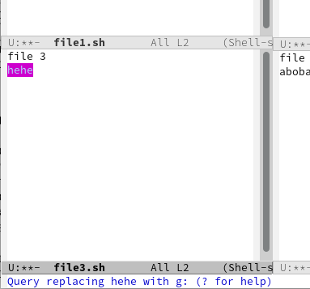

---
## Front matter
lang: ru-RU
title: Лабораторная работа №9
author: Макарова Анастасия Михайловна
institute: РУДН, Москва, Россия
date: 19 мая 2022

## Formatting
toc: false
slide_level: 2
theme: metropolis
header-includes: 
 - \metroset{progressbar=frametitle,sectionpage=progressbar,numbering=fraction}
 - '\makeatletter'
 - '\beamer@ignorenonframefalse'
 - '\makeatother'
aspectratio: 43
section-titles: true
---

## Цель работы 

Познакомиться с операционной системой Linux. Получить практические навыки работы с редактором Emacs.

## Основные термины Emacs
### Emacs представляет собой мощный экранный редактор текста, написанный на языке высокого уровня Elisp
* Буфер — объект, представляющий какой-либо текст.
* Фрейм соответствует окну в обычном понимании этого слова. Каждый фрейм содержит область вывода и одно или несколько окон Emacs.
* Окно — прямоугольная область фрейма, отображающая один из буфеов.

{ #fig:001 width=70% }

## Основы работы в Emacs

Для запуска Emacs необходимо в командной строке набрать emacs (или emacs & для работы в фоновом режиме относительно консоли).
Для работы с Emacs можно использовать как элементы меню, так и различные сочетания клавиш. 

{ #fig:001 width=70% }

{ #fig:001 width=70% }

{ #fig:001 width=70% }

## Выводы

1) я ознакомилась с операционной системой Linux;
2) я приобрела практические навыки работы с редактором Emacs.

# Спасибо за внимание

