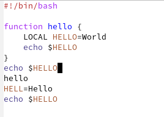
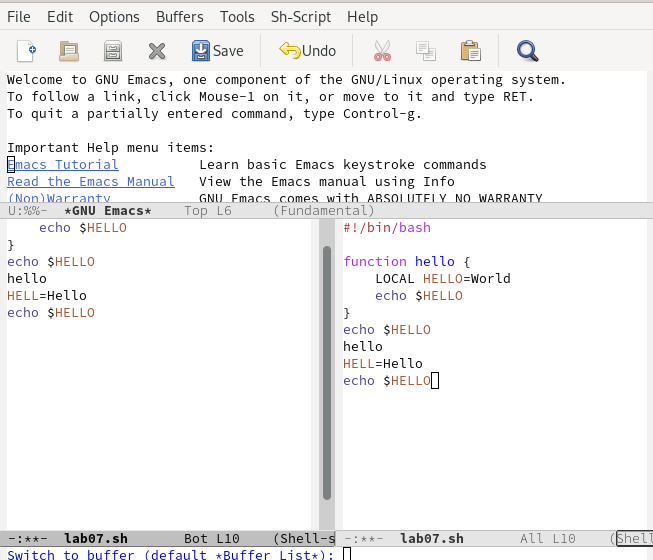
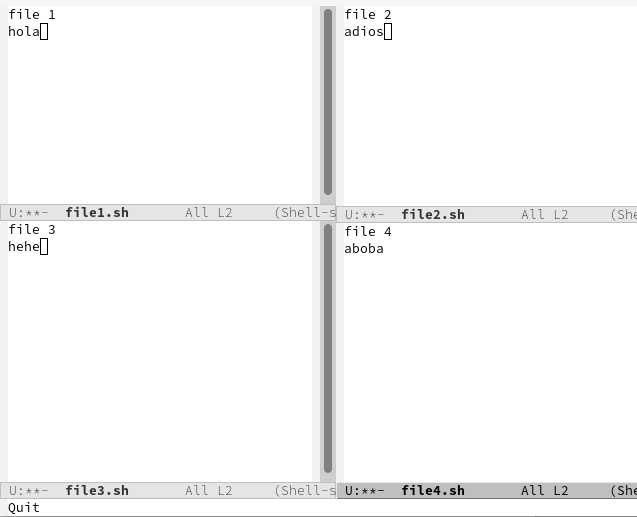

---
## Front matter
title: "Лабораторная работа №9"
subtitle: "Отчёт по лабораторной работе №9"
author: "Макарова Анастасия Михайловна"

## Generic otions
lang: ru-RU
toc-title: "Содержание"

## Bibliography
bibliography: bib/cite.bib
csl: pandoc/csl/gost-r-7-0-5-2008-numeric.csl

## Pdf output format
toc: true # Table of contents
toc-depth: 2
lof: true # List of figures
lot: true # List of tables
fontsize: 12pt
linestretch: 1.5
papersize: a4
documentclass: scrreprt
## I18n polyglossia
polyglossia-lang:
  name: russian
  options:
	- spelling=modern
	- babelshorthands=true
polyglossia-otherlangs:
  name: english
## I18n babel
babel-lang: russian
babel-otherlangs: english
## Fonts
mainfont: PT Serif
romanfont: PT Serif
sansfont: PT Sans
monofont: PT Mono
mainfontoptions: Ligatures=TeX
romanfontoptions: Ligatures=TeX
sansfontoptions: Ligatures=TeX,Scale=MatchLowercase
monofontoptions: Scale=MatchLowercase,Scale=0.9
## Biblatex
biblatex: true
biblio-style: "gost-numeric"
biblatexoptions:
  - parentracker=true
  - backend=biber
  - hyperref=auto
  - language=auto
  - autolang=other*
  - citestyle=gost-numeric
## Pandoc-crossref LaTeX customization
figureTitle: "Рис."
tableTitle: "Таблица"
listingTitle: "Листинг"
lofTitle: "Список иллюстраций"
lotTitle: "Список таблиц"
lolTitle: "Листинги"
## Misc options
indent: true
header-includes:
  - \usepackage{indentfirst}
  - \usepackage{float} # keep figures where there are in the text
  - \floatplacement{figure}{H} # keep figures where there are in the text
---

# Цель работы

Познакомиться с операционной системой Linux. Получить практические навыки работы с редактором Emacs.

# Выполнение лабораторной работы

1. Откроем редактор emacs помощью команды emacs $ (Рис.1).

{ #fig:001 width=70% }

2. Создаем файл lab07.sh с помощью комбинации Ctrl-x Ctrl-f (Рис.2).

{ #fig:001 width=70% }
   
3. Наберем предложенный нам текст (Рис.3).

{ #fig:001 width=70% }
    
4. Сохраним файл с помощью комбинации Ctrl-x Ctrl-s.

5. Проделаем с текстом стандартные процедуры редактирования:

5.1. Вырежем одной командой целую строку с помощью комбинации клавиш Сtrl-k (Рис.4).

{ #fig:001 width=70% }

5.2. Вставим эту строку в конец файла с помощью комбинации клавиш Сtrl-y (Рис.5).

{ #fig:001 width=70% }

5.3. Выделим область текста с помощью комбинации клавиш Сtrl-space (Рис.6)

{ #fig:001 width=70% }

5.4. Скопируем область в буфер обмена с помощью комбинации клавиш Alt-w.

5.5. Вставим область в конец файла с помощью комбинации клавиш Сtrl-y (Рис.7)

{ #fig:001 width=70% }

5.6. Вновь выделим эту область и на этот раз вырежем её с помощью комбинации клавиш Сtrl-w (Рис.8)

{ #fig:001 width=70% }

5.7. Отменим последнее действие с помощью комбинации клавиш Сtrl-/ (Рис.9)

{ #fig:001 width=70% }

6. Научимся использовать команды по перемещению курсора:

6.1. Переместим курсор в начало строки с помощью комбинации клавиш Сtrl-a (Рис.10).

{ #fig:001 width=70% }

6.2. Переместим курсор в конец строки с помощью комбинации клавиш Сtrl-e (Рис.11).

{ #fig:001 width=70% }

6.3. Переместим курсор в начало буфера с помощью комбинации клавиш Alt-< (Рис.12).

{ #fig:001 width=70% }

6.4. Переместим курсор в конец буфера с помощью комбинации клавиш Alt-> (Рис.13).

{ #fig:001 width=70% }

7. Управляем буферами:

7.1. Выведем список активных буферов на экран с помощью комбинации клавиш Ctrl-x Ctrl-b (Рис.14).

{ #fig:001 width=70% }

7.2. Переместимся во вновь открытое окно с помощью комбинации клавиш Ctrl-x со списком открытых буферов и переключимся на другой буфер (Рис.15).

{ #fig:001 width=70% }

7.3. Закроем это окно с помощью комбинации клавиш Ctrl-x 0 (Рис.16).

{ #fig:001 width=70% }

7.4. Теперь вновь переключимся между буферами, но уже без вывода их списка на экран с помощью комбинации клавиш Ctrl-x b (Рис.17).

{ #fig:001 width=70% }

8. Управляем окнами:

8.1. Поделим фрейм на 4 части: разделим фрейм на два окна по вертикали с помощью клавиш Ctrl-x 3, а затем каждое из этих окон на две части по горизонтали с помощью комбинации клавиш Ctrl-x 2 (Рис.18, 19).

{ #fig:001 width=70% }

{ #fig:001 width=70% }

8.2. В каждом из четырёх созданных окон откроем новый буфер (файл) и введем несколько строк текста (Рис.20).

{ #fig:001 width=70% }

9. Управляем режимом поиска:

9.1. Переключимся в режим поиска с помощью клавиш Ctrl-s и найдем несколько слов, присутствующих в тексте (Рис.21).

{ #fig:001 width=70% }

9.2. Переключаемся между результатами поиска, нажимая клавиши Ctrl-s (Рис.22).

{ #fig:001 width=70% }

9.3. Выйдем из режима поиска, нажав клавиши Ctrl-g (Рис.23).

{ #fig:001 width=70% }

9.4. Перейдем в режим поиска и замены с помощью клавиш Alt-%, введем текст, который следует найти и заменить, нажмем Enter, затем введем текст для замены. После того как будут подсвечены результаты поиска, нажмем ! для подтверждения замены (Рис.24, 25, 26).

{ #fig:001 width=70% }

{ #fig:001 width=70% }

{ #fig:001 width=70% }

9.5. Испробуем другой режим поиска, нажав клавиши Alt-s o (Рис.27).

{ #fig:001 width=70% }

# Вывод

В ходе выполнения данной лабораторной работы я ознакомилась с операционной системой Linux и получила практические навыки работы с редактором Emacs.

# Контрольные вопросы

1. Кратко охарактеризуйте редактор emacs.
Emacs − один из наиболее мощных и широко распространённых редакторов, используемых в мире Unix. По популярности он соперничает с редактором vi и его клонами. В зависимости от ситуации, Emacs может быть текстовым редактором; программой для чтения почты и новостей Usenet; интегрированной средой разработки (IDE); операционной системой и т.д.Всё это разнообразие достигается благодаря архитектуре Emacs, которая позволяет расширять возможности редактора при помощи языка Emacs Lisp. На языке C написаны лишь самые базовые и низкоуровневые части Emacs, включая полнофункциональный. интерпретатор языка Lisp. Таким образом, Emacs имеет встроенный язык программирования, который может использоваться для настройки, расширения и изменения поведения редактора. В действительности, большая часть того редактора, с которым пользователи Emacs работают в наши дни,написана на языке Lisp.

2. Какие особенности данного редактора могут сделать его сложным для освоения новичком?
Основную трудность для новичков при освоении данного редактора могут составлять большое количество команд, комбинаций клавиш, которые не получится запомнить с первого раза и поэтому придется часто обращаться к справочным материалам.

3. Своими словами опишите, что такое буфер и окно в терминологии emacs’а.
Буфер –это объект, представляющий собой текст. Если имеется несколько буферов, то редактировать можно только один. Обычно буфер считывает данные из файла или записывает в файл данные из буфера. Окно – это область экрана, отображающая буфер. При запуске редактора отображается одно окно, но при обращении к некоторым функциям могут открыться дополнительные окна. Окна Emacs и окна графической среды XWindow – разные вещи. Одно окно XWindow может быть разбито на несколько окон в смысле Emacs, в каждом из которых отображается отдельный буфер.

4. Можно ли открыть больше 10 буферов в одном окне?
Да, можно.

5. Какие буферы создаются по умолчанию при запуске emacs?
При запуске Emacs по умолчанию создаются следующие буферы: «scratch» (буфер для несохраненного текста), «Messages» (журнал ошибок, включающий такжеинформацию, которая появляется в области EchoArea), «GNUEmacs»(справочный буфер о редакторе).

6. Какие клавиши вы нажмёте, чтобы ввести следующую комбинацию C-c | и C-c C-|?
C-c |сначала, удерживая «ctrl», нажимаю «c», после – отпускаю обе клавишии, нажимаю «|» C-cC-|сначала, удерживая «ctrl», нажимаю «с», после – отпускаю обе клавиши и, удерживая «ctrl», нажимаю «|».

7. Как поделить текущее окно на две части?
Чтобы поделить окно на две части необходимо воспользоваться комбинацией «Ctrl-x 3» (по вертикали) или «Ctrl-x 2» (по горизонтали).

8. В каком файле хранятся настройки редактора emacs?
Настройки Emacs хранятся в файле .emacs.

9. Какую функцию выполняет клавиша и можно ли её переназначить?
По умолчанию клавиша «←» удаляет символ перед курсором, но в редакторе её можно переназначить. Для этого необхдимо изменить конфигурацию файла .emacs.

10. Какой редактор вам показался удобнее в работе vi или emacs? Поясните почему.
Более удобным я считаю редактор emacs, потому что Vim - это всего лишь редактор. Emacs - не только редактор, ко всему прочему это IDE, файловый менеджер, эмулятор терминала, веб-браузер, почтовый клиент, клиент новостей и много чего еще. 

