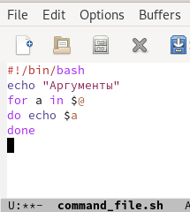
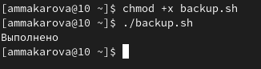

---
## Front matter
lang: ru-RU
title: Лабораторная работа №10
author: Макарова Анастасия Михайловна
institute: РУДН, Москва, Россия
date: 20 мая 2022

## Formatting
toc: false
slide_level: 2
theme: metropolis
header-includes: 
 - \metroset{progressbar=frametitle,sectionpage=progressbar,numbering=fraction}
 - '\makeatletter'
 - '\beamer@ignorenonframefalse'
 - '\makeatother'
aspectratio: 43
section-titles: true
---

## Цель работы 

Изучить основы программирования в оболочке ОС UNIX/Linux. Научиться писать небольшие командные файлы.

## Командные процессоры (оболочки)

Командный процессор (командная оболочка, интерпретатор команд shell) — это программа, позволяющая пользователю взаимодействовать с операционной системой компьютера.

## Переменные в языке программирования bash

Командный процессор bash обеспечивает возможность использования переменных типа строка символов. Пользователь имеет возможность присвоить переменной значение некоторой строки символов. Значение, присвоенное некоторой переменной, может быть впоследствии использовано. Для этого в соответствующем месте командной строки должно быть употреблено имя этой переменной, которому предшествует метасимвол $.

{ #fig:001 width=70% }

## Командные файлы и функции

Последовательность команд может быть помещена в текстовый файл. Такой файл называется командным. 
Чтобы не вводить каждый раз последовательности символов bash, необходимо изменить код защиты этого командного файла, обеспечив доступ к этому файлу по выполнению. Это может быть сделано с помощью команды:
* chmod +x имя_файла

{ #fig:001 width=70% }

## Выводы

1) Изучила основы программирования в оболочке ОС UNIX/Linux;
2) Научилась писать небольшие командные файлы.

# Спасибо за внимание :)

