---
## Front matter
title: "Лабораторная работа №10"
subtitle: "Отчёт по лабораторной работе №10"
author: "Макарова Анастасия Михайловна"

## Generic otions
lang: ru-RU
toc-title: "Содержание"

## Bibliography
bibliography: bib/cite.bib
csl: pandoc/csl/gost-r-7-0-5-2008-numeric.csl

## Pdf output format
toc: true # Table of contents
toc-depth: 2
lof: true # List of figures
lot: true # List of tables
fontsize: 12pt
linestretch: 1.5
papersize: a4
documentclass: scrreprt
## I18n polyglossia
polyglossia-lang:
  name: russian
  options:
	- spelling=modern
	- babelshorthands=true
polyglossia-otherlangs:
  name: english
## I18n babel
babel-lang: russian
babel-otherlangs: english
## Fonts
mainfont: PT Serif
romanfont: PT Serif
sansfont: PT Sans
monofont: PT Mono
mainfontoptions: Ligatures=TeX
romanfontoptions: Ligatures=TeX
sansfontoptions: Ligatures=TeX,Scale=MatchLowercase
monofontoptions: Scale=MatchLowercase,Scale=0.9
## Biblatex
biblatex: true
biblio-style: "gost-numeric"
biblatexoptions:
  - parentracker=true
  - backend=biber
  - hyperref=auto
  - language=auto
  - autolang=other*
  - citestyle=gost-numeric
## Pandoc-crossref LaTeX customization
figureTitle: "Рис."
tableTitle: "Таблица"
listingTitle: "Листинг"
lofTitle: "Список иллюстраций"
lotTitle: "Список таблиц"
lolTitle: "Листинги"
## Misc options
indent: true
header-includes:
  - \usepackage{indentfirst}
  - \usepackage{float} # keep figures where there are in the text
  - \floatplacement{figure}{H} # keep figures where there are in the text
---

# Цель работы

Изучить основы программирования в оболочке ОС UNIX/Linux. Научиться писать небольшие командные файлы.

# Выполнение лабораторной работы

1. Изучим справку команд архивации zip, bzip2 и tar с помощью команды man (Рис.1-4).

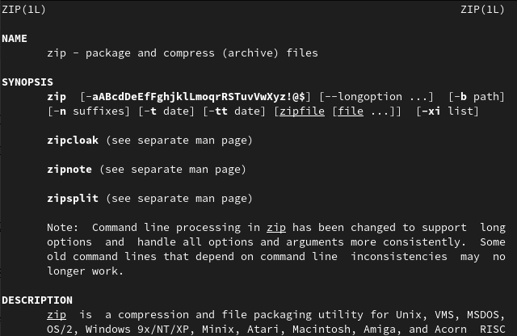{ #fig:001 width=70% }

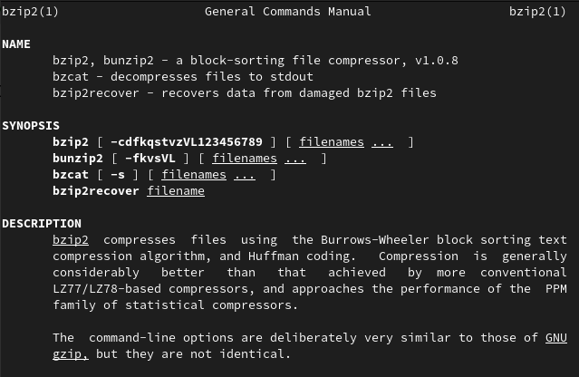{ #fig:001 width=70% }

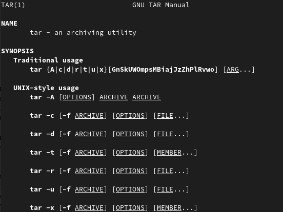{ #fig:001 width=70% }

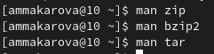{ #fig:001 width=70% }

Напишем скрипт, который при запуске будет делать резервную копию самого себя (то есть файла, в котором содержится его исходный код) в другую директорию backup в нашем домашнем каталоге. Файл должен архивироваться одним из архиваторов на выбор: zip, bzip2 или tar, я выбрала bzip2 (Рис.5).

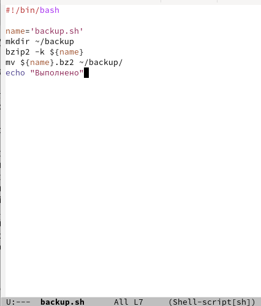{ #fig:001 width=70% }

Добавим права на выполнение программы backup.sh с помощью команды chmod с опцией +x и проверим работу скрипта с помощью команды ./backup.sh (Рис.6, 7).

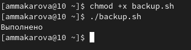{ #fig:001 width=70% }

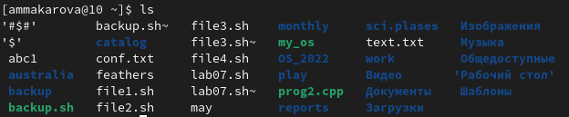{ #fig:001 width=70% }

Переходим в каталог backup и видим, что файл появился в этом каталоге, затем просмотрим содержимое архива с помощью команды bunzip2 -c backup.sh.bz2 (Рис.8).

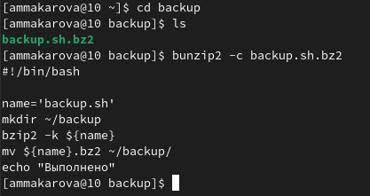{ #fig:001 width=70% }
   
2. Создадим в редакторе emacs файл с названием command_file.sh, в нем мы будем писать второй скрипт (Рис.9).

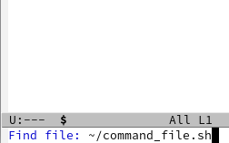{ #fig:001 width=70% }

Напишем пример командного файла, обрабатывающего любое произвольное число аргументов командной строки, в том числе превышающее десять. Например, скрипт может последовательно распечатывать значения всех переданных аргументов (Рис.10).

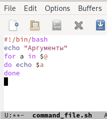{ #fig:001 width=70% }

Добавим права на выполнение программы command_file.sh с помощью команды chmod с опцией +x и проверим работу скрипта, вводя различные аргументы (Рис.11, 12).

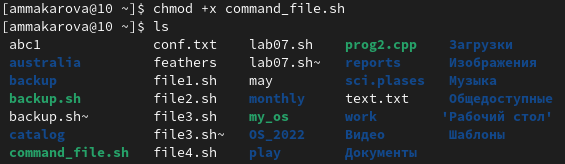{ #fig:001 width=70% }

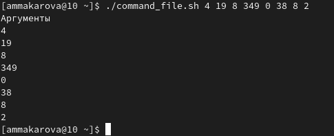{ #fig:001 width=70% }
    
3. Создадим в редакторе emacs файл с названием command_file_3.sh, в нем мы будем писать третий скрипт. Напишем командный файл - аналог команды ls (без использования самой этой команды и команды dir). Требуется, чтобы он выдавал информацию о нужном каталоге и выводил информацию о возможностях доступа к файлам этого каталога (Рис.13).

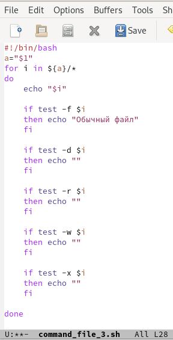{ #fig:001 width=70% }

Добавим права на выполнение программы command_file_3.sh с помощью команды chmod с опцией +x и проверим работу скрипта с помощью команды ./command_file_3.sh ~ (Рис.14).

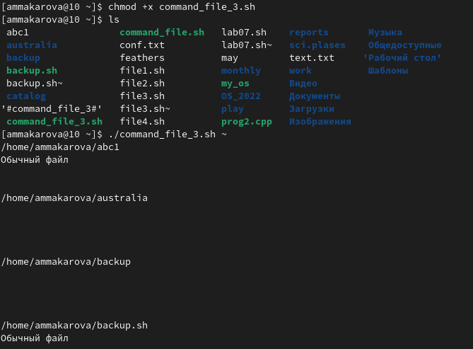{ #fig:001 width=70% }

4. Создадим в редакторе emacs файл с названием command_file_4.sh, в нем мы будем писать четвертый скрипт (Рис.15).

{ #fig:001 width=70% }

Напишем командный файл, который получает в качестве аргумента командной строки формат файла (.txt, .doc, .jpg, .pdf и т.д.) и вычисляет количество таких файлов в указанной директории. Путь к директории также передаётся в виде аргумента командной строки (Рис.16).

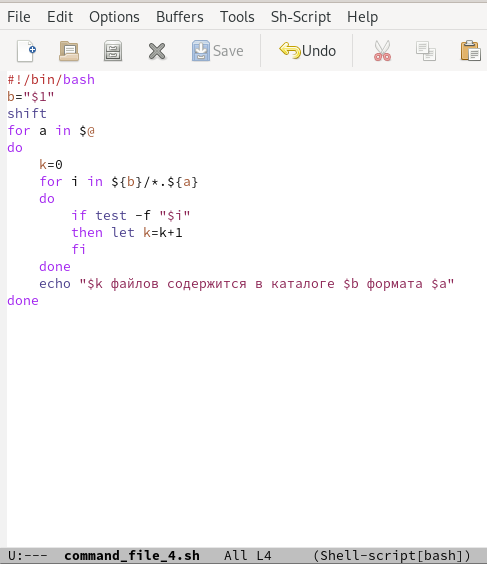{ #fig:001 width=70% }

Добавим права на выполнение программы command_file_4.sh с помощью команды chmod с опцией +x и проверим работу скрипта с помощью команды ./command_file_4.sh. Я просматриваю файлы с форматом txt cpp, поэтому после команды добавляю ~ txt cpp (Рис.17).

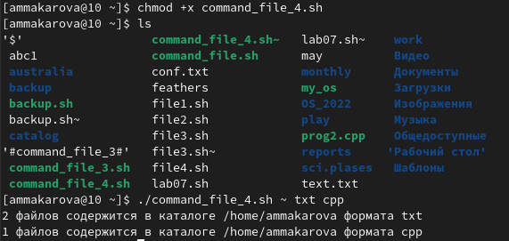{ #fig:001 width=70% }

# Вывод

В ходе выполнения данной лабораторной работы я изучила основы программирования в оболочке ОС UNIX/Linux и научилась писать
небольшие командные файлы.

# Контрольные вопросы

1. Объясните понятие командной оболочки. Приведите примеры командных оболочек. Чем они отличаются?
Командный процессор (командная оболочка, интерпретатор команд shell) — это программа, позволяющая пользователю взаимодействовать с операционной системой компьютера.
* оболочка Борна (Bourne shell или sh) — стандартная командная оболочка UNIX/Linux, содержащая базовый, но при этом полный набор функций;
* С-оболочка (или csh) — надстройка на оболочкой Борна, использующая С-подобный синтаксис команд с возможностью сохранения истории выполнения команд;
* оболочка Корна (или ksh) — напоминает оболочку С, но операторы управления программой совместимы с операторами оболочки Борна;
* BASH — сокращение от Bourne Again Shell (опять оболочка Борна), в основе своей совмещает свойства оболочек С и Корна (разработка компании Free Software Foundation).

2. Что такое POSIX?
POSIX (Portable Operating System Interface for Computer Environments) — набор стандартов описания интерфейсов взаимодействия операционной системы и прикладных программ.

3. Как определяются переменные и массивы в языке программирования bash?
Командный процессор bash обеспечивает возможность использования переменных
типа строка символов. Имена переменных могут быть выбраны пользователем. Пользователь имеет возможность присвоить переменной значение некоторой строки символов. Значение, присвоенное некоторой переменной, может быть впоследствии использовано. Для этого в соответствующем месте командной строки должно быть употреблено имя этой переменной, которому предшествует метасимвол $. 

4. Каково назначение операторов let и read?
Оболочка bash поддерживает встроенные арифметические функции. Команда let является показателем того, что последующие аргументы представляют собой выражение, подлежащее вычислению. Простейшее выражение — это единичный терм (term), обычно целочисленный. Команда let берет два операнда и присваивает их переменной. Положительным моментом команды let можно считать то, что для идентификации переменной ей не нужен знак доллара; вы можете писать команды типа let sum=x+7, и let будет искать переменную x и добавлять к ней 7. Команда let также расширяет другие выражения let, если они заключены в двойные круглые скобки. Таким способом вы можете создавать довольно сложные выражения. Команда read позволяет читать значения переменных со стандартного ввода. 

5. Какие арифметические операции можно применять в языке программирования bash?

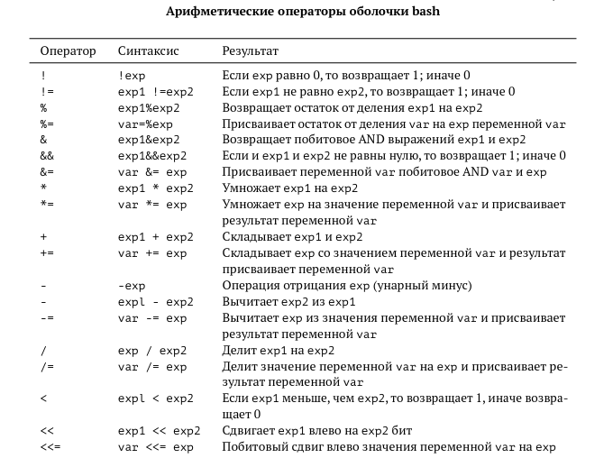{ #fig:001 width=70% }
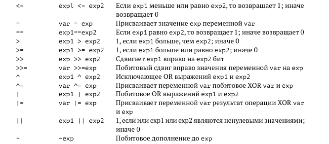{ #fig:001 width=70% }

6. Что означает операция (( ))?
В эти скобки можно записывать условия оболочки bash.

7. Какие стандартные имена переменных Вам известны?
Имена некоторых переменных имеют для командного процессора специальный смысл. 
* Значением переменной PATH (т.е. $РАТН) является список каталогов, в которых командный процессор осуществляет поиск программы или команды, указанной в командной строке, в том случае, если указанное имя программы или команды не содержит ни одного символа /. Если имя команды содержит хотя бы один символ /, то последовательность поиска, предписываемая значением переменной PATH, нарушается. В этом случае в зависимости от того, является имя команды абсолютным или относительным, поиск начинается соответственно от корневого или текущего каталога.
* HOME — имя домашнего каталога пользователя. Если команда cd вводится без аргументов, то происходит переход в каталог, указанный в этой переменной.
* IFS — последовательность символов, являющихся разделителями в командной строке, например, пробел, табуляция и перевод строки (new line).
* MAIL — командный процессор каждый раз перед выводом на экран промптера проверяет содержимое файла, имя которого указано в этой переменной, и если содержимое этого файла изменилось с момента последнего ввода из него, то перед тем как вывести на терминал промптер, командный процессор выводит на терминал сообщение You have mail (у Вас есть почта).
* TERM — тип используемого терминала.
* LOGNAME — содержит регистрационное имя пользователя, которое устанавливается.

8. Что такое метасимволы?
Такие символы, как ' < > * ? | \ " &, являются метасимволами и имеют для командного процессора специальный смысл. 

9. Как экранировать метасимволы?
Снятие специального смысла с метасимвола называется экранированием метасимвола. Экранирование может быть осуществлено с помощью предшествующего метасимволу символа \, который, в свою очередь, является метасимволом.
Для экранирования группы метасимволов нужно заключить её в одинарные кавычки. Строка, заключённая в двойные кавычки, экранирует все метасимволы, кроме $, ' , \, ". Например:
* echo \* выведет на экран символ *,
* echo ab’*\|*’cd выведет на экран строку ab*\|*cd.

10. Как создавать и запускать командные файлы?
Последовательность команд может быть помещена в текстовый файл. Такой файл называется командным. Далее этот файл можно выполнить по команде:
* bash командный_файл [аргументы]
Чтобы не вводить каждый раз последовательности символов bash, необходимо изменить код защиты этого командного файла, обеспечив доступ к этому файлу по выполнению. Это может быть сделано с помощью команды:
* chmod +x имя_файла
Теперь можно вызывать свой командный файл на выполнение, просто вводя его имя с терминала так, как-будто он является выполняемой программой.

11. Как определяются функции в языке программирования bash?
Группу команд можно объединить в функцию. Для этого существует ключевое слово function, после которого следует имя функции и список команд, заключённых в фигурные скобки. Удалить функцию можно с помощью команды unset c флагом -f. Команда typeset имеет четыре опции для работы с функциями:
* -f — перечисляет определённые на текущий момент функции;
* -ft — при последующем вызове функции инициирует её трассировку;
* -fx — экспортирует все перечисленные функции в любые дочерние программы оболочек;
* -fu — обозначает указанные функции как автоматически загружаемые. Автоматически загружаемые функции хранятся в командных файлах, а при их вызове оболочка просматривает переменную FPATH, отыскивая файл с одноимёнными именами функций, загружает его и вызывает эти функции.

12. Каким образом можно выяснить, является файл каталогом или обычным файлом?
Команда test, например, создана специально для использования в командных файлах. Единственная функция этой команды заключается в выработке кода завершения. Так например, команда:
* test -f file возвращает нулевой код завершения (истина), если файл file существует, и ненулевой код завершения (ложь) в противном случае:
* test s –— истина, если аргумент s имеет значение истина;
* test -f file — истина, если файл file существует;
* test -i file — истина, если файл file доступен по чтению;
* test -w file — истина, если файл file доступен по записи;
* test -e file — истина, если файл file — исполняемая программа;
* test -d file — истина, если файл file является каталогом.

13. Каково назначение команд set, typeset и unset?
* Вы можете использовать команду set для вывода списка переменных окружения. Поэтому для ознакомления со всеми элементами списка переменных окружения при работе с данными системами рекомендуется использовать команду set | more. 
* Следует использовать команду unset для удаления переменной из вашего окружения командной оболочки. 
* Команда typeset является встроенной и предназначена для наложения ограничений на переменные. Это попытка контроля над типами, которая имеется во многих языках программирования. 

14. Как передаются параметры в командные файлы?
При вызове командного файла на выполнение параметры ему могут быть переданы точно таким же образом, как и выполняемой программе. С точки зрения командного файла эти параметры являются позиционными. Символ $ является метасимволом командного процессора. Он используется, в частности, для ссылки на параметры, точнее, для получения их значений в командном файле. В командный файл можно передать до девяти параметров. При использовании где-либо в командном файле комбинации символов $i, где 0 < 𝑖 < 10, вместо неё будет осуществлена подстановка значения параметра с порядковым номером i, т.е. аргумента командного файла с порядковым
номером i. Использование комбинации символов $0 приводит к подстановке вместо неё имени данного командного файла. 

15. Назовите специальные переменные языка bash и их назначение.

* $* — отображается вся командная строка или параметры оболочки;
* $? — код завершения последней выполненной команды;
* $$ — уникальный идентификатор процесса, в рамках которого выполняется командный процессор;
* $! — номер процесса, в рамках которого выполняется последняя вызванная на выполнение в командном режиме команда;
* $- — значение флагов командного процессора;
* ${#*} — возвращает целое число — количество слов, которые были результатом $*;
* ${#name} — возвращает целое значение длины строки в переменной name;
* ${name[n]} — обращение к n-му элементу массива;
* ${name[*]} — перечисляет все элементы массива, разделённые пробелом;
* ${name[@]} — то же самое, но позволяет учитывать символы пробелы в самих переменных;
* ${name:-value} — если значение переменной name не определено, то оно будет заменено на указанное value;
* ${name:value} — проверяется факт существования переменной;
* ${name=value} — если name не определено, то ему присваивается значение value;
* ${name?value} — останавливает выполнение, если имя переменной не определено, и выводит value как сообщение об ошибке;
* ${name+value} — это выражение работает противоположно ${name-value}. Если переменная определена, то подставляется value;
* ${name#pattern} — представляет значение переменной name с удалённым самым коротким левым образцом (pattern);
* ${#name[*]} и ${#name[@]} — эти выражения возвращают количество элементов в массиве name.

