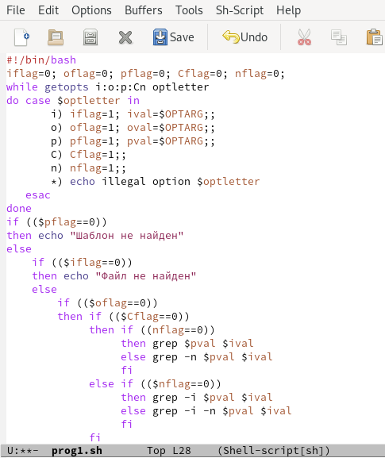
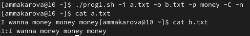
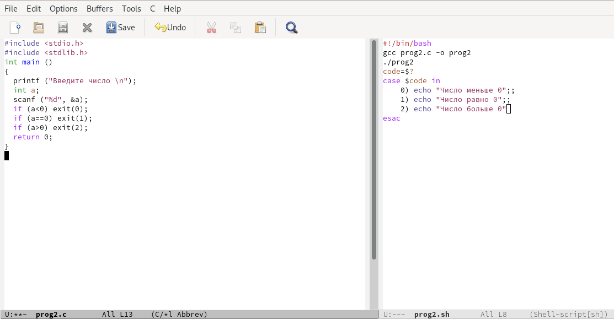
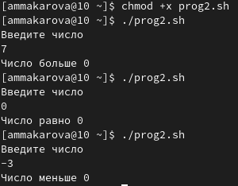
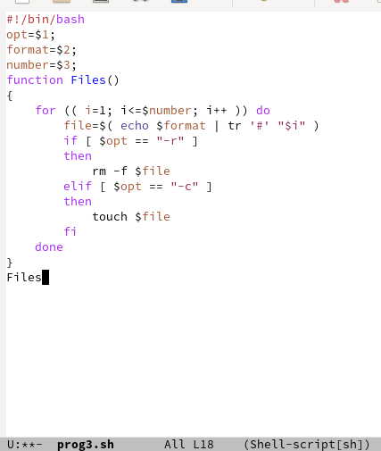
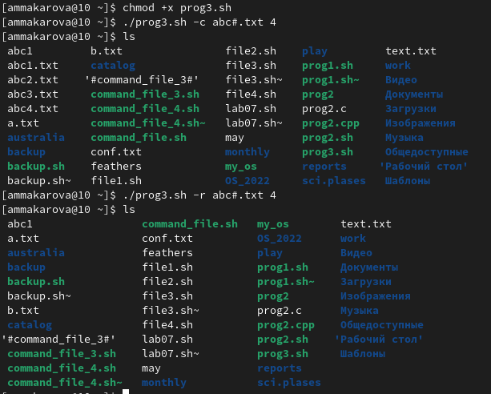
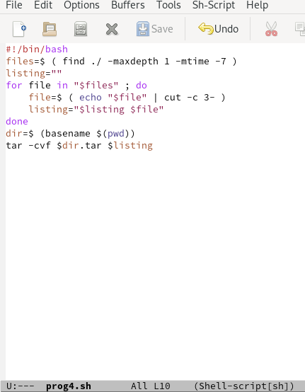
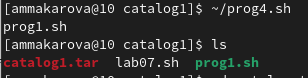

---
## Front matter
lang: ru-RU
title: Лабораторная работа №11
author: Макарова Анастасия Михайловна
institute: РУДН, Москва, Россия
date: 27 мая 2022

## Formatting
toc: false
slide_level: 2
theme: metropolis
header-includes: 
 - \metroset{progressbar=frametitle,sectionpage=progressbar,numbering=fraction}
 - '\makeatletter'
 - '\beamer@ignorenonframefalse'
 - '\makeatother'
aspectratio: 43
section-titles: true
---

## Цель работы 

Изучить основы программирования в оболочке ОС UNIX/Linux. Научиться писать более сложные командные файлы с использованием логических управляющих конструкций и циклов.

## Первая программа

Используя команды getopts grep, напишем командный файл, который анализирует командную строку с ключами:
* -iinputfile;
* -ooutputfile;
* -pшаблон;
* -C;
* -n.
А затем ищет в указанном файле нужные строки, определяемые ключом -p

{ #fig:001 width=70% }

{ #fig:001 width=70% }

## Вторая программа

Написать на языке Си программу, которая вводит число и определяет, является ли оно больше нуля, меньше нуля или равно нулю. 

{ #fig:001 width=70% }

{ #fig:001 width=70% }

## Третья программа

Написать командный файл, создающий указанное число файлов, пронумерованных последовательно от 1 до 𝑁.

{ #fig:001 width=70% }

{ #fig:001 width=70% }

## Четвертая программа

Написать командный файл, который с помощью команды tar запаковывает в архив все файлы в указанной директории.

{ #fig:001 width=70% }

{ #fig:001 width=70% }

## Выводы

1) Изучила основы программирования в оболочке ОС UNIX/Linux;
2) Научилась писать более сложные командные файлы с использованием логических управляющих конструкций и циклов.

# Спасибо за внимание :)

