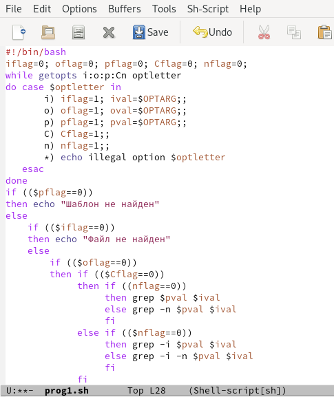
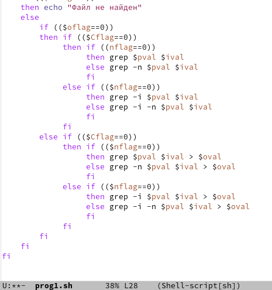
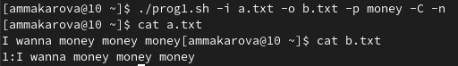
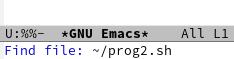
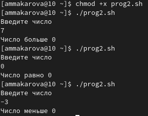
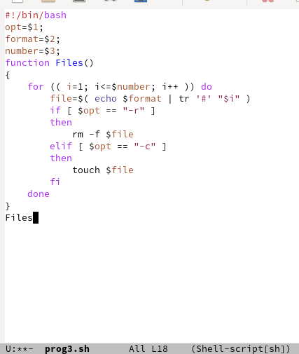
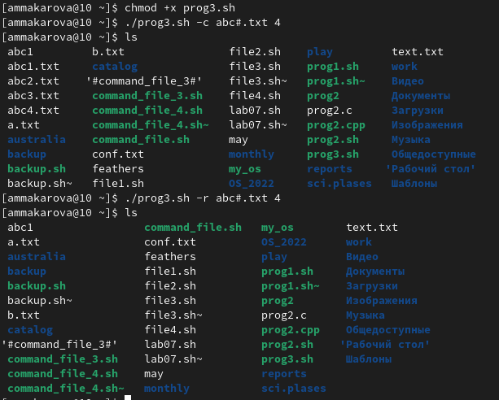
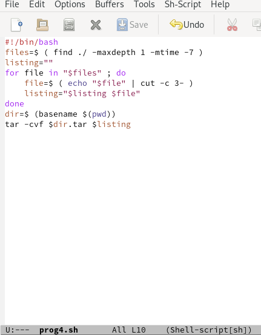
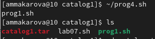

---
## Front matter
title: "Лабораторная работа №11"
subtitle: "Отчёт по лабораторной работе №11"
author: "Макарова Анастасия Михайловна"

## Generic otions
lang: ru-RU
toc-title: "Содержание"

## Bibliography
bibliography: bib/cite.bib
csl: pandoc/csl/gost-r-7-0-5-2008-numeric.csl

## Pdf output format
toc: true # Table of contents
toc-depth: 2
lof: true # List of figures
lot: true # List of tables
fontsize: 12pt
linestretch: 1.5
papersize: a4
documentclass: scrreprt
## I18n polyglossia
polyglossia-lang:
  name: russian
  options:
	- spelling=modern
	- babelshorthands=true
polyglossia-otherlangs:
  name: english
## I18n babel
babel-lang: russian
babel-otherlangs: english
## Fonts
mainfont: PT Serif
romanfont: PT Serif
sansfont: PT Sans
monofont: PT Mono
mainfontoptions: Ligatures=TeX
romanfontoptions: Ligatures=TeX
sansfontoptions: Ligatures=TeX,Scale=MatchLowercase
monofontoptions: Scale=MatchLowercase,Scale=0.9
## Biblatex
biblatex: true
biblio-style: "gost-numeric"
biblatexoptions:
  - parentracker=true
  - backend=biber
  - hyperref=auto
  - language=auto
  - autolang=other*
  - citestyle=gost-numeric
## Pandoc-crossref LaTeX customization
figureTitle: "Рис."
tableTitle: "Таблица"
listingTitle: "Листинг"
lofTitle: "Список иллюстраций"
lotTitle: "Список таблиц"
lolTitle: "Листинги"
## Misc options
indent: true
header-includes:
  - \usepackage{indentfirst}
  - \usepackage{float} # keep figures where there are in the text
  - \floatplacement{figure}{H} # keep figures where there are in the text
---

# Цель работы

Изучить основы программирования в оболочке ОС UNIX. Научится писать более сложные командные файлы с использованием логических управляющих конструкций и циклов.

# Выполнение лабораторной работы

1. Откроем редактор emacs с помощью команды emacs & и создадим в нем файл prog1.sh.

Используя команды getopts grep, напишем командный файл, который анализирует командную строку с ключами:
* -iinputfile — прочитать данные из указанного файла;
* -ooutputfile — вывести данные в указанный файл;
* -pшаблон — указать шаблон для поиска;
* -C — различать большие и малые буквы;
* -n — выдавать номера строк.
А затем ищет в указанном файле нужные строки, определяемые ключом -p (Рис.1, 2).

{ #fig:001 width=70% }

{ #fig:001 width=70% }

Передадим нашему файлу права на выполнение с помощью команды chmod с опцией +x, затем создадим 2 файла для проверки работы программы (Рис.3).

{ #fig:001 width=70% }

Запускаем программу и видим, что она работает корректно (Рис.4).

{ #fig:001 width=70% }

2. Создаем в emacs файлы prog2.c и prog2.sh (Рис.5, 6).

{ #fig:001 width=70% }

{ #fig:001 width=70% }

Затем напишем на языке Си программу, которая вводит число и определяет, является ли оно больше нуля, меньше нуля или равно нулю. Затем программа завершается с помощью функции exit(n), передавая информацию в о коде завершения в оболочку. Командный файл должен вызывать эту программу и, проанализировав с помощью команды $?, выдать сообщение о том, какое число было введено (Рис.7).

{ #fig:001 width=70% }

Добавим права на выполнение программы с помощью команды chmod с опцией +x и запустим ее (Рис.8).

{ #fig:001 width=70% }

3. Создадим в редакторе emacs файл prog3.sh (Рис.9).

{ #fig:001 width=70% }

Напишем командный файл, создающий указанное число файлов, пронумерованных последовательно от 1 до 𝑁 (например 1.tmp, 2.tmp, 3.tmp,4.tmp и т.д.). Число файлов, которые необходимо создать, передадим в аргументы командной строки. Этот же командный файл должен уметь удалять все созданные им файлы (если они существуют) (Рис.10).

{ #fig:001 width=70% }

Добавим права на выполнение программы с помощью команды chmod с опцией +x и проверим ее работу (Рис.11).

{ #fig:001 width=70% }
  
4. Создадим в редакторе emacs файл prog4.sh (Рис.12).

{ #fig:001 width=70% }

Напишем командный файл, который с помощью команды tar запаковывает в архив все файлы в указанной директории. Модифицируем его так, чтобы запаковывались только те файлы, которые были изменены менее недели тому назад (используем команду find) (Рис.13).

{ #fig:001 width=70% }

Добавим права на выполнение программы с помощью команды chmod с опцией +x и проверим ее работу (Рис.14).

{ #fig:001 width=70% }

# Вывод

В ходе выполнения данной лабораторной работы я изучила основы программирования в оболочке ОС UNIX/Linux и научилась писать
более сложные командные файлы с использованием логических управляющих конструкций и циклов.

# Контрольные вопросы

1. Каково предназначение команды getopts?
Команда getopts является встроенной командой командной оболочки bash, предназначенной для разбора параметров сценариев. Она обрабатывает исключительно однобуквенные параметры как с аргументами, так и без них и этого вполне достаточно для передачи сценариям любых входных данных.

2. Какое отношение метасимволы имеют к генерации имён файлов?
Метасимволы - символы, имеющие специальное значение для интерпретатора : ? * ; & ( ) | ^ < > <пробел> <табуляция> <возврат_каретки>. Однако каждый из этих символов может представлять самого себя, если перед ним стоит \. Все символы, заключенные между кавычка-ми ' и ', представляют самих себя. Между двойными кавычками (") выполняются подстановки команд и параметров, а символы \, `," и $ могут экранироваться предшествующим символом \. После всех подстановок в каждом слове команды ищутся символы *,?, и [. Если находится хотя бы один из них, то это слово рассматривается как шаблон имен файлов и заменяется именами файлов, удовлетворяющих данному шаблону (в алфавитном порядке). Если ни одно имя файла не удовлетворяет шаблону, то он остается неизменным. 

3. Какие операторы управления действиями вы знаете?
Оператор if можно использовать для создания последовательности проверок, покрывающих все возможные варианты. Для этого необходимо начать с проверки первого условия с помощью оператора if; а затем посредством операторов elseif последовательно проверить все остальные условия. Поместив else в конец, вы перекрываете все возможные варианты. Альтернативой структурам if-elseif-else является оператор switch, работающий с допущением, что производится сравнение одного выражения и множества возможных значений. Простейшим циклом является цикл while. Выражение проверяется сразу же при первом удобном случае. Если это условие является ложным, программный блок просто пропускается, а если усл овие дает значение “истина”, программный блок выполняется, после чего управление передается обратно наверх и опять проверяется условие. 

4. Какие операторы используются для прерывания цикла?
Использование оператора break. Он используется как в операторах цикла, так и в структурах switch. Оператор break прерывает выполнение тела любого цикла for, do или while и передает управление следующему за циклом выполняемому оператору. Еще один способ прерывания цикла использование оператора goto, передающего управление какому-то оператору, расположенному вне тела цикла. Для прерывания циклов, размещенных в функциях, можно воспользоваться оператором return. В отличие от оператора break, оператор return прервет не только выполнение цикла, но и выполнение той функции, в которой расположен цикл. Прервать выполнение цикла, а заодно и блока, в котором расположен цикл, можно также генерацией какого-то исключения. Наиболее часто в этих целях используется процедура Abort, генерирующая «молчаливое» исключение, не связанное с каким-то сообщением об ошибке. 

5. Для чего нужны команды false и true?
true,: - всегда возвращает 0 в качестве кода выхода. false - всегда возвращает 1 в качестве кода выхода.

6. Что означает строка if test -f man$s/$i.$s, встреченная в командном файле?
Проверяет, существует ли этот файл и является ли он обычным файлом.

7. Объясните различия между конструкциями while и until
1) В конструкции while...do проверка условия выхода выполняется вначале, а не в конце цикла, если условие не удовлетворяется до начала выполнения цикла, то управление передается оператору стоящему сразу за телом цикла. 
2) В конструкции while ...do условие выхода удовлетворяется, если выражение, определяющее условие выхода, ложно, а в конструкции repeat ...until - если это выражение истинно. 
3) Между зарезервированными словами repeat...until может размещаться не-сколько операторов не применяя операторные скобки begin end, когда, как в конструкции while ...do только один.

