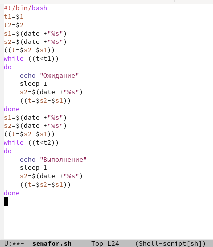
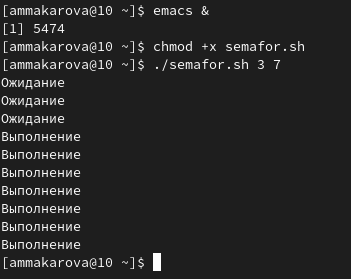
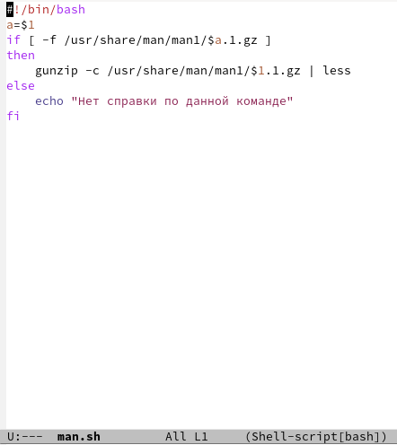
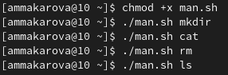
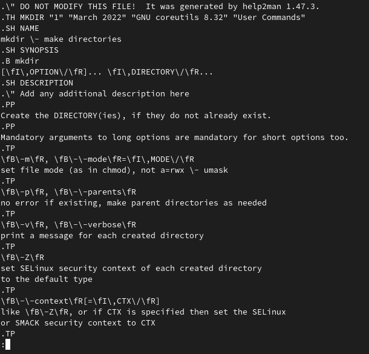
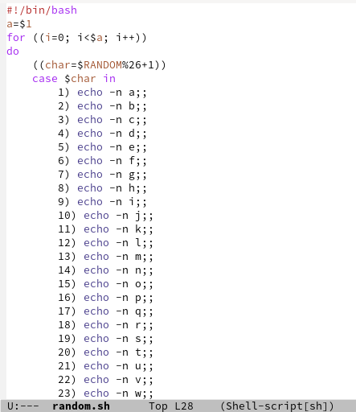
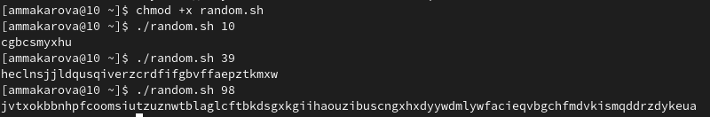

---
## Front matter
lang: ru-RU
title: Лабораторная работа №12
author: Макарова Анастасия Михайловна
institute: РУДН, Москва, Россия
date: 28 мая 2022

## Formatting
toc: false
slide_level: 2
theme: metropolis
header-includes: 
 - \metroset{progressbar=frametitle,sectionpage=progressbar,numbering=fraction}
 - '\makeatletter'
 - '\beamer@ignorenonframefalse'
 - '\makeatother'
aspectratio: 43
section-titles: true
---

## Цель работы 

Изучить основы программирования в оболочке ОС UNIX/Linux. Научиться писать более сложные командные файлы с использованием логических управляющих конструкций и циклов.

## Первая программа

Написать командный файл, реализующий упрощённый механизм семафоров. Командный файл должен в течение некоторого времени t1 дожидаться освобождения ресурса, выдавая об этом сообщение, а дождавшись его освобождения, использовать его в течение некоторого времени t2<>t1, также выдавая информацию о том, что ресурс используется соответствующим командным файлом (процессом). 

{ #fig:001 width=70% }

{ #fig:001 width=70% }

## Вторая программа

Реализовать команду man с помощью командного файла. Командный файл должен получать в виде аргумента командной строки название команды и в виде результата выдавать справку об этой команде или сообщение об отсутствии справки, если соответствующего файла нет в каталоге man1. 

{ #fig:001 width=70% }

{ #fig:001 width=70% }

{ #fig:001 width=70% }

## Третья программа

Используя встроенную переменную $RANDOM, напиcать командный файл, генерирующий случайную последовательность букв латинского алфавита.

{ #fig:001 width=70% }

{ #fig:001 width=70% }

## Выводы

1) Изучила основы программирования в оболочке ОС UNIX/Linux;
2) Научилась писать более сложные командные файлы с использованием логических управляющих конструкций и циклов.

# Спасибо за внимание :)

