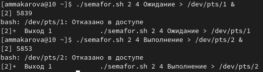
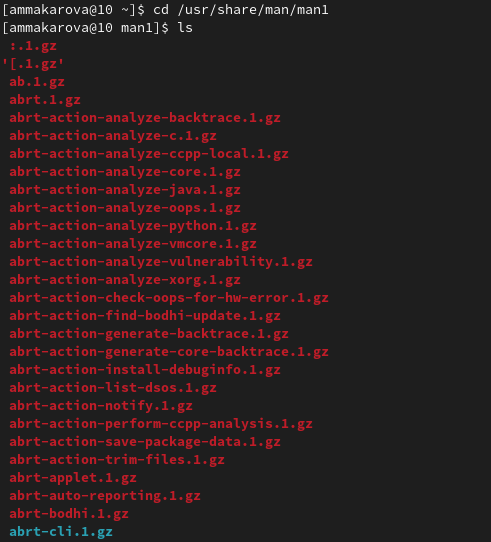

---
## Front matter
title: "Лабораторная работа №12"
subtitle: "Отчёт по лабораторной работе №12"
author: "Макарова Анастасия Михайловна"

## Generic otions
lang: ru-RU
toc-title: "Содержание"

## Bibliography
bibliography: bib/cite.bib
csl: pandoc/csl/gost-r-7-0-5-2008-numeric.csl

## Pdf output format
toc: true # Table of contents
toc-depth: 2
lof: true # List of figures
lot: true # List of tables
fontsize: 12pt
linestretch: 1.5
papersize: a4
documentclass: scrreprt
## I18n polyglossia
polyglossia-lang:
  name: russian
  options:
	- spelling=modern
	- babelshorthands=true
polyglossia-otherlangs:
  name: english
## I18n babel
babel-lang: russian
babel-otherlangs: english
## Fonts
mainfont: PT Serif
romanfont: PT Serif
sansfont: PT Sans
monofont: PT Mono
mainfontoptions: Ligatures=TeX
romanfontoptions: Ligatures=TeX
sansfontoptions: Ligatures=TeX,Scale=MatchLowercase
monofontoptions: Scale=MatchLowercase,Scale=0.9
## Biblatex
biblatex: true
biblio-style: "gost-numeric"
biblatexoptions:
  - parentracker=true
  - backend=biber
  - hyperref=auto
  - language=auto
  - autolang=other*
  - citestyle=gost-numeric
## Pandoc-crossref LaTeX customization
figureTitle: "Рис."
tableTitle: "Таблица"
listingTitle: "Листинг"
lofTitle: "Список иллюстраций"
lotTitle: "Список таблиц"
lolTitle: "Листинги"
## Misc options
indent: true
header-includes:
  - \usepackage{indentfirst}
  - \usepackage{float} # keep figures where there are in the text
  - \floatplacement{figure}{H} # keep figures where there are in the text
---

# Цель работы

Изучить основы программирования в оболочке ОС UNIX. Научиться писать более сложные командные файлы с использованием логических управляющих конструкций и циклов.

# Выполнение лабораторной работы

1. Откроем редактор emacs с помощью команды emacs & и создадим в нем файл semafor.sh (Рис.1).

{ #fig:001 width=70% }

Напишем командный файл, реализующий упрощённый механизм семафоров. Командный файл должен в течение некоторого времени t1 дожидаться освобождения ресурса, выдавая об этом сообщение, а дождавшись его освобождения, использовать его в течение некоторого времени t2<>t1, также выдавая информацию о том, что ресурс используется соответствующим командным файлом (процессом) (Рис.2). 

{ #fig:001 width=70% }

Передадим нашему файлу права на выполнение с помощью команды chmod с опцией +x, затем проверим работу файла командой ./semafor.sh 3 7 (Рис.3).

{ #fig:001 width=70% }

Изменим программу таким образом, чтобы можно было запустить командный файл в одном виртуальном терминале в фоновом режиме, перенаправив его вывод в другой (> /dev/tty#, где # — номер терминала куда перенаправляется вывод), в котором также запущен этот файл, но не фоновом, а в привилегированном режиме (Рис.4, 5).

{ #fig:001 width=70% }

{ #fig:001 width=70% }

Проверим работу файла с помощью команды ./semafor.sh 2 4 Ожидание > /dev/pts/1 &. Хотя нам и отказано в доступе, программа работает верно (Рис.6, 7).

{ #fig:001 width=70% }

{ #fig:001 width=70% }

2. Изучим содержимое каталога /usr/share/man/man1 с помощью команды ls. В нем находятся архивы текстовых файлов, содержащих справку по большинству установленных в системе программ и команд. Каждый архив можно открыть командой less сразу же просмотрев содержимое справки (Рис.8, 9).

{ #fig:001 width=70% }

{ #fig:001 width=70% }

Реализуем команду man с помощью командного файла. Создаем в редакторе emacs файл man.sh (Рис.10). Командный файл должен получать в виде аргумента командной строки название команды и в виде результата выдавать справку об этой команде или сообщение об отсутствии справки, если соответствующего файла нет в каталоге man1 (Рис.11).

{ #fig:001 width=70% }

{ #fig:001 width=70% }

Добавим права на выполнение программы с помощью команды chmod с опцией +x и проверим работу файла (Рис.12).

{ #fig:001 width=70% }

Результаты работы программ (Рис.13-16):

{ #fig:001 width=70% }

{ #fig:001 width=70% }

{ #fig:001 width=70% }

{ #fig:001 width=70% }

3. Создадим в редакторе emacs файл random.sh (Рис.17). Используя встроенную переменную $RANDOM, напишем командный файл, генерирующий случайную последовательность букв латинского алфавита. Учитываем, что $RANDOM выдаёт псевдослучайные числа в диапазоне от 0 до 32767 (Рис.18, 19).

{ #fig:001 width=70% }

{ #fig:001 width=70% }

{ #fig:001 width=70% }

Добавим права на выполнение программы с помощью команды chmod с опцией +x и проверим работу файла (Рис.20).

{ #fig:001 width=70% }
  
# Вывод

В ходе выполнения данной лабораторной работы я изучила основы программирования в оболочке ОС UNIX/Linux и научилась писать
более сложные командные файлы с использованием логических управляющих конструкций и циклов.

# Контрольные вопросы

1. Найдите синтаксическую ошибку в следующей строке:
* while [$1 != "exit"]
1) Не хватает пробела после первой скобки и перед второй скобкой;
2) $1 необходимо взять в кавычки, потому что эта переменная может содержать пробелы.

2. Как объединить (конкатенация) несколько строк в одну?
Самый простой способ объединить две или более строковых переменных — записать их одну за другой.
Вы также можете объединить одну или несколько переменных с помощью буквальных строк:
VAR1="Hello, "
VAR2="${VAR1}World"
echo "$VAR2"

Hello, World

В приведенном выше примере переменная VAR1 заключена в фигурные скобки, чтобы защитить имя переменной от окружающих символов. Если за переменной следует другой допустимый символ имени переменной, вы должны заключить его в фигурные скобки ${VAR1} .
Чтобы избежать проблем с разделением слов или подстановкой слов, вы всегда должны стараться заключать имя переменной в двойные кавычки. Если вы хотите подавить интерполяцию переменных и особую обработку символа обратной косой черты вместо двойных, используйте одинарные кавычки.
Bash не разделяет переменные по «типу», переменные обрабатываются как целые или строковые в зависимости от контекстов. Вы также можете объединять переменные, содержащие только цифры.
Другой способ объединения строк в bash — это добавление переменных или буквальных строк к переменной с помощью оператора +=

3. Найдите информацию об утилите seq. Какими иными способами можно реализовать её функционал при программировании на bash?
Используется для генерации чисел от первого до последнего шага increment.
Если вы запускаете seq с одним числом в качестве параметра командной строки, он считается от единицы до этого числа. Затем он печатает числа в окне терминала, по одному числу в строке. Мы также можем попросить seq создать список чисел от самого высокого до самого низкого. 

4. Какой результат даст вычисление выражения $((10/3))?
Результат будет 3, т.к. это целочисленное деление без остатка.

5. Укажите кратко основные отличия командной оболочки zsh от bash.
Подобно Bash, Z Shell можно в общем рассматривать как расширенную версию Bourne Shell, и она содержит много черт, сходных с Bash, что вы сможете заметить ниже. Также можно видеть, что она довольно сильно напоминает Korn Shell.
Вот список того, что вы получите, используя Z Shell вместо Bash:

* Встроенная команда zmv поможет вам массово переименовать файлы/директории, например, чтобы добавить ‘.txt’ к имени каждого файла, запустите zmv –C '(*)(#q.)' '$1.txt'.
 * Утилита zcalc — это замечательный калькулятор командной строки, это удобный способ считать быстро, не покидая терминал. Загрузите её через autoload -Uz zcalc и запустите командой zcalc.
* Команда zparseopts — это однострочник, который поможет вам разобрать сложные варианты, которые предоставляются вашему скрипту(?)
* Команда autopushd позволяет вам делать popd после того, как вы с помощью cd, чтобы вернуться в предыдущую директорию.
* Поддержка чисел с плавающей точкой (коей Bash, к удивлению, не содержит).
* Поддержка для структур данных “хэш”.

6. Проверьте, верен ли синтаксис данной конструкции:
* for ((a=1; a <= LIMIT; a++))
Конуструкция верна.

7. Сравните язык bash с какими-либо языками программирования. Какие преимущества у bash по сравнению с ними? Какие недостатки?
Bash — это командный язык, а не язык программирования общего назначения. Поэтому с усложнением логики вашего автоматизированного сценария он становится более запутанным и менее читаемым. Кроме того, Bash все и всегда воспринимает как команду, потому что это командный язык. 
Если вам нужно часто инициировать процессы и писать небольшой переносимый Shell-сценарий для Unix или Unix-подобных операционных систем, Bash, несомненно, будет хорошим выбором.
Если вам нужно написать кроссплатформенный Shell-скрипт для обработки некоторых данных и выполнения определенных команд, можете выбрать Python.
JavaScript отлично подходит для тех же сценариев, что и Python. Однако, в отличие от Python, JavaScript имеет некоторые дополнительные преимущества. JavaScript быстр, изначально поддерживает JSON и имеет впечатляющие встроенные функции. 

