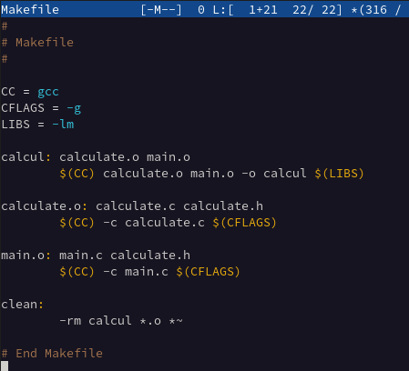
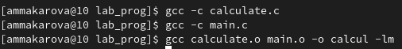

---
## Front matter
lang: ru-RU
title: Лабораторная работа №13
author: Макарова Анастасия Михайловна
institute: РУДН, Москва, Россия
date: 4 июня 2022

## Formatting
toc: false
slide_level: 2
theme: metropolis
header-includes: 
 - \metroset{progressbar=frametitle,sectionpage=progressbar,numbering=fraction}
 - '\makeatletter'
 - '\beamer@ignorenonframefalse'
 - '\makeatother'
aspectratio: 43
section-titles: true
---

## Цель работы 

Приобрести простейшие навыки разработки, анализа, тестирования и отладки приложений в ОС типа UNIX/Linux на примере создания на языке программирования калькулятора с простейшими функциями.

## Компиляция исходного текста и построение исполняемого файла

Стандартным средством для компиляции программ в ОС типа UNIX является GCC (GNU Compiler Collection). Это набор компиляторов для разного рода языков программирования (С, C++, Java, Фортран и др.). Работа с GCC производится при помощи одноимённой
управляющей программы gcc, которая интерпретирует аргументы командной строки, определяет и осуществляет запуск нужного компилятора для входного файла. 

## Утилита make

Она позволяет автоматизировать процесс преобразования файлов программы из одной формы в другую, отслеживает взаимосвязи между файлами. Для работы с утилитой make необходимо в корне рабочего каталога с Вашим проектом создать файл с названием makefile или Makefile, в котором будут описаны правила обработки файлов Вашего программного комплекса.
В самом простом случае Makefile имеет следующий синтаксис:
1 <цель_1> <цель_2> ... : <зависимость_1> <зависимость_2> ...
2 <команда 1>
3 ...
4 <команда n>. 

{ #fig:001 width=70% }

## Тестирование и отладка

Во время работы над кодом программы программист неизбежно сталкивается с появлением ошибок в ней. Использование отладчика для поиска и устранения ошибок в программе существенно облегчает жизнь программиста. В комплект программ GNU для ОС типа UNIX входит отладчик GDB (GNU Debugger). 

{ #fig:001 width=70% }

## Выводы

Приобрела простейшие навыки разработки, анализа, тестирования и отладки приложений в ОС типа UNIX/Linux на примере создания на языке программирования калькулятора с простейшими функциями.

# Спасибо за внимание :)

