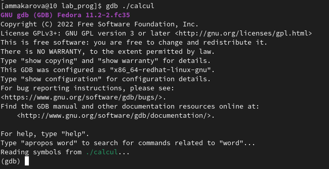
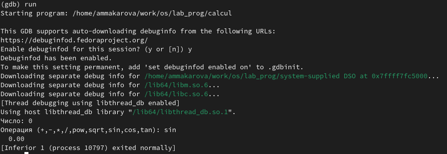

---
## Front matter
title: "Лабораторная работа №13"
subtitle: "Отчёт по лабораторной работе №13"
author: "Макарова Анастасия Михайловна"

## Generic otions
lang: ru-RU
toc-title: "Содержание"

## Bibliography
bibliography: bib/cite.bib
csl: pandoc/csl/gost-r-7-0-5-2008-numeric.csl

## Pdf output format
toc: true # Table of contents
toc-depth: 2
lof: true # List of figures
lot: true # List of tables
fontsize: 12pt
linestretch: 1.5
papersize: a4
documentclass: scrreprt
## I18n polyglossia
polyglossia-lang:
  name: russian
  options:
	- spelling=modern
	- babelshorthands=true
polyglossia-otherlangs:
  name: english
## I18n babel
babel-lang: russian
babel-otherlangs: english
## Fonts
mainfont: PT Serif
romanfont: PT Serif
sansfont: PT Sans
monofont: PT Mono
mainfontoptions: Ligatures=TeX
romanfontoptions: Ligatures=TeX
sansfontoptions: Ligatures=TeX,Scale=MatchLowercase
monofontoptions: Scale=MatchLowercase,Scale=0.9
## Biblatex
biblatex: true
biblio-style: "gost-numeric"
biblatexoptions:
  - parentracker=true
  - backend=biber
  - hyperref=auto
  - language=auto
  - autolang=other*
  - citestyle=gost-numeric
## Pandoc-crossref LaTeX customization
figureTitle: "Рис."
tableTitle: "Таблица"
listingTitle: "Листинг"
lofTitle: "Список иллюстраций"
lotTitle: "Список таблиц"
lolTitle: "Листинги"
## Misc options
indent: true
header-includes:
  - \usepackage{indentfirst}
  - \usepackage{float} # keep figures where there are in the text
  - \floatplacement{figure}{H} # keep figures where there are in the text
---

# Цель работы

Приобрести простейшие навыки разработки, анализа, тестирования и отладки приложений в ОС типа UNIX/Linux на примере создания на языке программирования калькулятора с простейшими функциями.

# Выполнение лабораторной работы

1. В домашнем каталоге создадим подкаталог ~/work/os/lab_prog и создим в нём файлы: calculate.h, calculate.c, main.c (Рис.1).

{ #fig:001 width=70% }

2. Реализуем функции калькулятора в файле calculate.c. Это будет примитивнейший калькулятор, способный складывать, вычитать, умножать и делить, возводить число в степень, брать квадратный корень, вычислять sin, cos, tan. При запуске он будет запрашивать первое число, операцию, второе число. После этого программа выведет результат и остановится (Рис.2). 

{ #fig:001 width=70% }

Интерфейсный файл calculate.h, описывающий формат вызова функции калькулятора (Рис.3).

{ #fig:001 width=70% }

Основной файл main.c, реализующий интерфейс пользователя к калькулятору (Рис.4).

{ #fig:001 width=70% }

При редактировании программ используем редактор mcedit (Рис.5).

{ #fig:001 width=70% }

3. Выполним компиляцию программы посредством gcc (Рис.6).

{ #fig:001 width=70% }

4. Создадим Makefile и откроем его в редакторе mcedit (Рис.7).

{ #fig:001 width=70% }

Этот файл необходим для того, чтобы автоматически компилировать файлы calculate.c, main.c, а также объединять их в один исполняемый файл calcul. Цель clean нужна для автоматического удаления файлов. Переменная CC отвечает за утилиту для компиляции. Переменная CFLAGS отвечает за опции в данной утилите. Переменная LIBS отвечает за опции для объединения объектных файлов в один исполняеиый файл (Рис.8).

{ #fig:001 width=70% }

Перед использованием gdb исправим Makefile. В переменную CFLAGS добавим опцию -g, которая необходима для компиляции объектных файлов и их использования в отладчике GDB. Утилита компиляции будет выбираться с помощью переменной CC (Рис.9).

{ #fig:001 width=70% }

5. Удалим исполняемые и объектные файлы из каталога с помощью команды make clean. Выполним компиляцию файлов с помощью команд make calculate.o, make main.o, make calcul (Рис.10).

{ #fig:001 width=70% }

6. С помощью gdb выполним отладку программы calcul.
* Запустим отладчик GDB, загрузив в него программу для отладки (Рис.11):

{ #fig:001 width=70% }

* Для запуска программы внутри отладчика введем команду run (Рис.12):

{ #fig:001 width=70% }

* Для постраничного (по 9 строк) просмотра исходного код используем команду list (Рис.13):

{ #fig:001 width=70% }

* Для просмотра строк с 12 по 15 основного файла используем list с параметрами (Рис.14):

{ #fig:001 width=70% }

* Для просмотра определённых строк не основного файла используем list с параметрами (Рис.15):

{ #fig:001 width=70% }

* Установим точку останова в файле calculate.c на строке номер 21 и выведем информацию об имеющихся в проекте точка останов (Рис.16):

{ #fig:001 width=70% }

* Запустим программу внутри отладчика и убедимся, что программа остановится в момент прохождения точки останова. Команда backtrace покажет весь стек вызываемых функций от начала программы до текущего места (Рис.17):

{ #fig:001 width=70% }

* Посмотрим, чему равно на этом этапе значение переменной Numeral и сравним с результатом вывода на экран после использования команды display Numeral (Рис.18):

{ #fig:001 width=70% }

* Уберем точки останова (Рис.19):

{ #fig:001 width=70% }

7. С помощью утилиты splint проанализируем коды файлов calculate.c и main.c. (Рис.20, 21).

{ #fig:001 width=70% }

{ #fig:001 width=70% }

# Вывод

В ходе выполнения данной лабораторной работы я приобрела простейшие навыки разработки, анализа, тестирования и отладки приложений в ОС типа UNIX/Linux на примере создания на языке программирования калькулятора с простейшими функциями.

# Контрольные вопросы

1. Как получить информацию о возможностях программ gcc, make, gdb и др.?
Нужно воспользоваться командой man или опцией -help для каждой комнады.

2. Назовите и дайте краткую характеристику основным этапам разработки приложений в UNIX.
Unix поддерживает следующие основные этапы разработки приложений:

* создание исходного кода программы;

* представляется в виде файла;

* сохранение различных вариантов исходного текста;

* анализ исходного текста; Необходимо отслеживать изменения исходного кода, а также при работе более двух программистов над проектом программы нужно, чтобы они не делали изменений кода в одно время.

* компиляция исходного текста и построение исполняемого модуля;

* тестирование и отладка; 

* проверка кода на наличие ошибок

* сохранение всех изменений, выполняемых при тестировании и отладке.

3. Что такое суффикс в контексте языка программирования? Приведите примеры использования.
Использование суффикса ".с" для имени файла с программой на языке Си отражает удобное и полезное соглашение, принятое в ОС UNIX. Для любого имени входного файла суффикс определяет какая компиляция требуется. Суффиксы и префиксы указывают тип объекта. Одно из полезных свойств компилятора Си — его способность по суффиксам определять типы файлов. По суффиксу .c компилятор распознает, что файл abcd.c должен компилироваться, а по суффиксу .o, что файл abcd.о является объектным модулем и для получения исполняемой программы необходимо выполнить редактирование связей. Простейший пример командной строки для компиляции программы abcd.c и построения исполняемого модуля abcd имеет вид: gcc -o abcd abcd.c.

Некоторые проекты предпочитают показывать префиксы в начале текста изменений для старых (old) и новых (new) файлов. Опция – prefix может быть использована для установки такого префикса. Плюс к этому команда bzr diff -p1 выводит префиксы в форме которая подходит для команды patch -p1. 

4. Каково основное назначение компилятора языка С в UNIX?
Предупреждения компилятора это очень полезный механизм, позволивший программистам избежать многих незаметных на первый взгляд ошибок, которые могли проявиться только после запуска уже скомпилированной программы (возможно, много лет спустя после первого запуска). Его, безусловно, нужно использовать, и относиться к предупреждениям следует максимально внимательно. Многие авторитетные книги по C++, написанные в жанре сборников советов (Скотта Мейерса, Герба Саттера, Андрея Александреску, Стивена Дьюхерста), содержат совет компилировать программу на максимально строгом уровне предупреждений и добиваться того, чтобы компилятору не к чему было придраться.

Компилятор GCC позволяет включать несколько десятков видов предупреждений, для каждого из которых имеется свой ключ компиляции. Для удобства основные из них сгруппированы и включаются двумя ключами: -Wall и -Wextra

5. Для чего предназначена утилита make?
Утилита, автоматизирующая процесс преобразования файлов из одной формы в другую. Чаще всего это компиляция исходного кода в объектные файлы и последующая компоновка в исполняемые файлы или библиотеки.

6. Приведите пример структуры Makefile. Дайте характеристику основным элементам этого файла.
Текст, следующий за точкой с запятой, и все последующие строки, начинающиеся с литеры табуляции, являются командами OC UNIX, которые необходимо выполнить для обновления целевого файла. Таким образом, спецификация взаимосвязей имеет формат:

target1 [ target2...]: [:] [dependment1...]

[(tab)commands]

[#commentary]

[(tab)commands]

[#commentary],

где # — специфицирует начало комментария, так как содержимое строки, начиная с # и до конца строки, не будет обрабатываться командой make; : — последовательность команд ОС UNIX должна содержаться в одной строке make-файла (файла описаний), есть возможность переноса команд (\), но она считается как одна строка; :: — последовательность команд ОС UNIX может содержаться в нескольких последовательных строках файла описаний.

7. Назовите основное свойство, присущее всем программам отладки. Что необходимо сделать, чтобы его можно было использовать?

8. Назовите и дайте основную характеристику основным командам отладчика gdb.
* backtrace – выводит весь путь к текущей точке останова, то есть названия всех функций, начиная от main(); иными словами, выводит весь стек функций;
* break – устанавливает точку останова; параметром может быть номер строки или название функции;
* clear – удаляет все точки останова на текущем уровне стека (то есть в текущей функции);
* continue – продолжает выполнение программы от текущей точки до конца;
* delete – удаляет точку останова или контрольное выражение;
* display – добавляет выражение в список выражений, значения которых отображаются каждый раз при остановке программы;
* finish – выполняет программу до выхода из текущей функции; отображает возвращаемое значение,если такое имеется;
* info breakpoints – выводит список всех имеющихся точек останова;
* info watchpoints – выводит список всех имеющихся контрольных выражений;
* list – выводит исходный код; в качестве параметра передаются название файла исходного кода, затем, через двоеточие, номер начальной и конечной строки;
* next – пошаговое выполнение программы, но, в отличие от команды step, не выполняет пошагово вызываемые функции;
* print – выводит значение какого-либо выражения (выражение передаётся в качестве параметра);
* run – запускает программу на выполнение;
* set – устанавливает новое значение переменной
* step – пошаговое выполнение программы;
* watch – устанавливает контрольное выражение, программа остановится, как только значение контрольного выражения изменится;
9. Опишите по шагам схему отладки программы, которую Вы использовали при выполнении лабораторной работы.
10. Прокомментируйте реакцию компилятора на синтаксические ошибки в программе при его первом запуске.
11. Назовите основные средства, повышающие понимание исходного кода программы.
12. Каковы основные задачи, решаемые программой splint?
Эта утилита анализирует программный код, проверяет корректность задания аргументов использованных в программе функций и типов возвращаемых значений, обнаруживает синтаксические и семантические ошибки. В отличие от компилятора C анализатор splint генерирует комментарии с описанием разбора кода программы и осуществляет общий контроль, обнаруживая такие ошибки, как одинаковые объекты, определённые в разных файлах, или объекты, чьи значения не используются в работе программы, переменные с некорректно заданными значениями и типами и многое другое.

