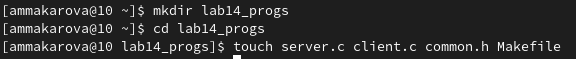
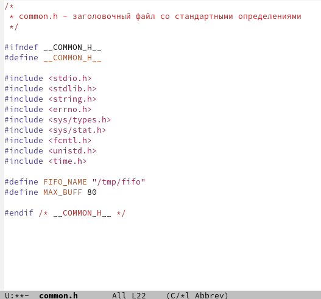
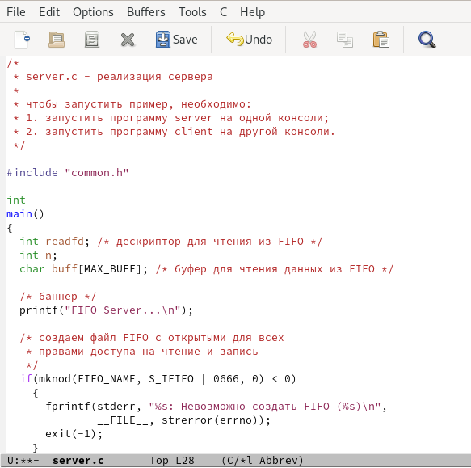
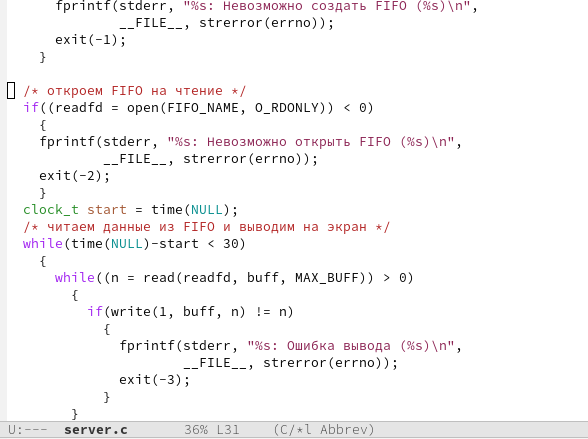
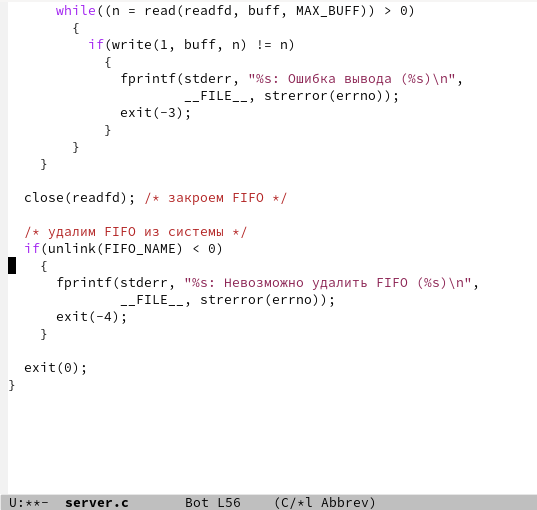
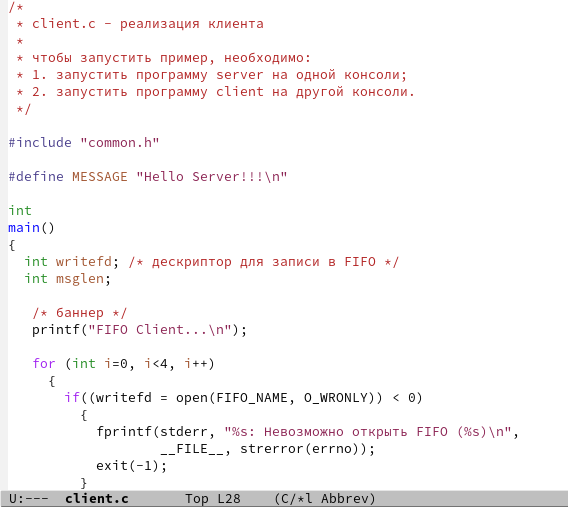
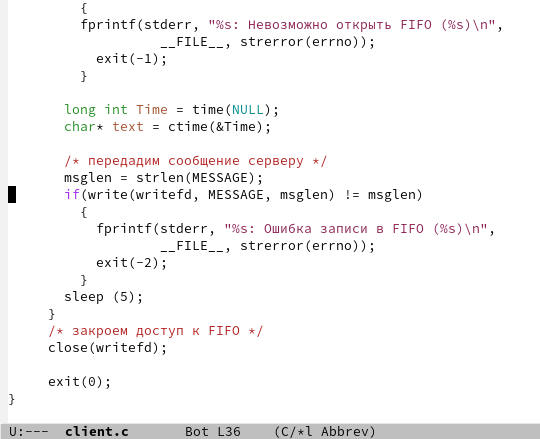
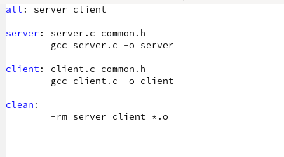
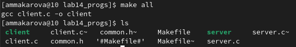
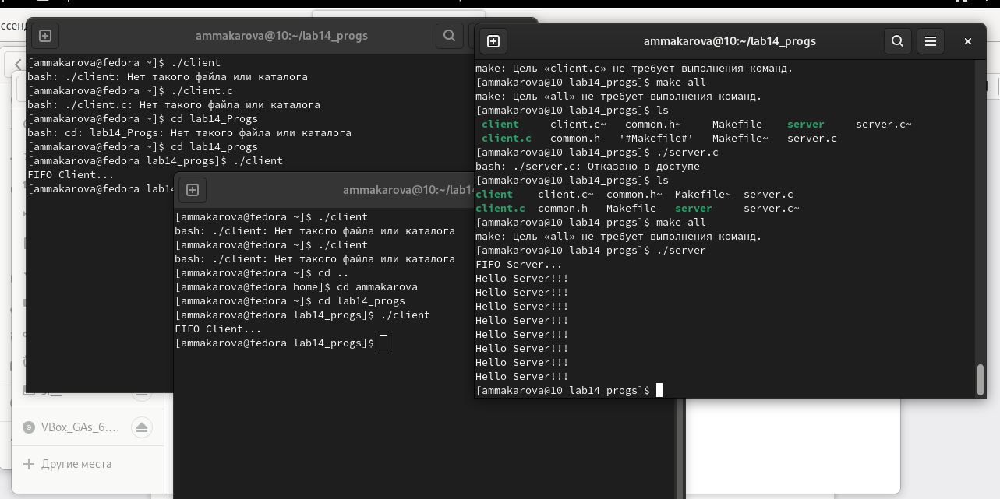

---
## Front matter
title: "Лабораторная работа №14"
subtitle: "Отчёт по лабораторной работе №14"
author: "Макарова Анастасия Михайловна"

## Generic otions
lang: ru-RU
toc-title: "Содержание"

## Bibliography
bibliography: bib/cite.bib
csl: pandoc/csl/gost-r-7-0-5-2008-numeric.csl

## Pdf output format
toc: true # Table of contents
toc-depth: 2
lof: true # List of figures
lot: true # List of tables
fontsize: 12pt
linestretch: 1.5
papersize: a4
documentclass: scrreprt
## I18n polyglossia
polyglossia-lang:
  name: russian
  options:
	- spelling=modern
	- babelshorthands=true
polyglossia-otherlangs:
  name: english
## I18n babel
babel-lang: russian
babel-otherlangs: english
## Fonts
mainfont: PT Serif
romanfont: PT Serif
sansfont: PT Sans
monofont: PT Mono
mainfontoptions: Ligatures=TeX
romanfontoptions: Ligatures=TeX
sansfontoptions: Ligatures=TeX,Scale=MatchLowercase
monofontoptions: Scale=MatchLowercase,Scale=0.9
## Biblatex
biblatex: true
biblio-style: "gost-numeric"
biblatexoptions:
  - parentracker=true
  - backend=biber
  - hyperref=auto
  - language=auto
  - autolang=other*
  - citestyle=gost-numeric
## Pandoc-crossref LaTeX customization
figureTitle: "Рис."
tableTitle: "Таблица"
listingTitle: "Листинг"
lofTitle: "Список иллюстраций"
lotTitle: "Список таблиц"
lolTitle: "Листинги"
## Misc options
indent: true
header-includes:
  - \usepackage{indentfirst}
  - \usepackage{float} # keep figures where there are in the text
  - \floatplacement{figure}{H} # keep figures where there are in the text
---

# Цель работы

Приобретение практических навыков работы с именованными каналами.

# Выполнение лабораторной работы

1. Изучим приведённые в тексте программы server.c и client.c. Для написания программ создадим каталог и файлы с помощью команды touch (Рис.1).

{ #fig:001 width=70% }

2. Изменим код программы common.h. Добавим стандартные заголовочные файлы, необходимые для работы других файлов. Этот файл предназначен для заголовочных файлов, чтобы не прописывать их в других программах (Рис.2). 

{ #fig:001 width=70% }

3. Изменим код программы server.c. Добавим цикл while для контроля за временем работы сервера, причем время от начала работы сервера и до настоящего не должно превышать 30 секунд (Рис.3-5).

{ #fig:001 width=70% }

{ #fig:001 width=70% }

{ #fig:001 width=70% }

4. Изменим код программы client.c. Добавим цикл for, который отвечает за количество сообщений о текущем времени (4 сообщения), и команду sleep(5) для остановки работы клиента через 5 секунд (Рис.6, 7).

{ #fig:001 width=70% }

{ #fig:001 width=70% }

5. Файл Makefile оставляем без изменений (Рис.8).

{ #fig:001 width=70% }

6. С помощью команды make all компилируем необходимые файлы для работы программы (Рис.9).

{ #fig:001 width=70% }

7. Проверяем работу программы. Открываем три терминала: в первом окне запускаем команду ./server, а во втором и третьем - ./client. В результате каждый треминал выводит по 4 сообщения о текущем времени. Спустя 30 секунд работа сервера прекращается (Рис.10).

{ #fig:001 width=70% }

# Вывод

В ходе выполнения данной лабораторной работы я приобрела практические навыки работы с именованными каналами.

# Контрольные вопросы

1. В чем ключевое отличие именованных каналов от неименованных?
Именованные каналы, в отличие от неименованных, могут использоваться неродственными процессами. Они дают вам, по сути, те же возможности, что и неименованные каналы, но с некоторыми преимуществами, присущими обычным файлам. Именованные каналы используют специальную запись в директории для управления правами доступа.

2. Возможно ли создание неименованного канала из командной строки?
Вы можете создавать именованные каналы из командной строки и внутри программы. С давних времен программой создания их в командной строке была команда mknod:
* $ mknod имя_файла p
Однако команды mknod нет в списке команд X/Open, поэтому она включена не во все UNIX-подобные системы. Предпочтительнее применять в командной строке
* $ mkfifo имя_файла

3. Возможно ли создание именованного канала из командной строки?
Чтобы создать именованный канал из командной строкинужно использовать либо команду «mknod<имя_файла>», либо команду «mkfifo<имя_файла>».

4. Опишите функцию языка С, создающую неименованный канал.
один из методов межпроцессного взаимодействия (IPC) в операционной системе, который доступен связанным процессам — родительскому и дочернему. Представляется в виде области памяти на внешнем запоминающем устройстве, управляемой операционной системой, которая осуществляет выделение взаимодействующим процессам частей из этой области памяти для совместной работы. Организация данных в канале использует стратегию FIFO, то есть информация, которая первой записана в канал, будет первой прочитана из канала.

Важное отличие неименованного канала от файла заключается в том, что прочитанная информация немедленно удаляется из него и не может быть прочитана повторно. Выполнение вышеперечисленных системных вызовов может переводить процесс в состояние ожидания. Это происходит, если процесс пытается читать данные из пустого канала или писать данные в переполненный канал. Процесс выходит из ожидания, когда в канале появляются данные или когда в канале появляется свободное место, соответственно.

Двустороннее взаимодействие между процессами обычно требует наличия двух неименованных каналов. 

5. Опишите функцию языка С, создающую именованный канал.
один из методов межпроцессного взаимодействия, расширение понятия конвейера в Unix и подобных ОС. Именованный канал позволяет различным процессам обмениваться данными, даже если программы, выполняющиеся в этих процессах, изначально не были написаны для взаимодействия с другими программами. Это понятие также существует и в Microsoft Windows, хотя там его семантика существенно отличается. Традиционный канал — «безымянен», потому что существует анонимно и только во время выполнения процесса. Именованный канал — существует в системе и после завершения процесса. Он должен быть «отсоединён» или удалён, когда уже не используется. Процессы обычно подсоединяются к каналу для осуществления взаимодействия между ними. 

6. Что будет в случае прочтения из fifo меньшего числа байтов, чем находится в канале? Большего числа байтов?
7. Аналогично, что будет в случае записи в fifo меньшего числа байтов, чем позволяет буфер? Большего числа байтов?
8. Могут ли два и более процессов читать или записывать в канал?
Родитель после записи не может узнать считал ли дочерний процесс данные, а если считал то сколько. 
9. Опишите функцию write (тип возвращаемого значения, аргументы и логику работы). Что означает 1 (единица) в вызове этой функции в программе server.c (строка 42)?
Функция write записывает байты count из буфера buffer в файл, связанный с handle. Операции write начинаются с текущей позиции указателя на файл. 
10. Опишите функцию strerror.
Строковая функция strerror - функция языков C/C++, транслирующая код ошибки, который обычно хранится в глобальной переменной errno, в сообщение об ошибке, понятном человеку. 

