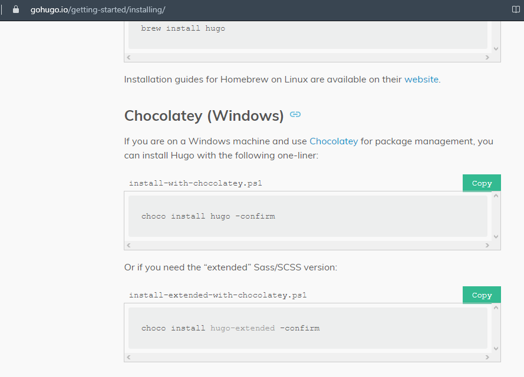

---
## Front matter
lang: ru-RU
title: Индивидуальный проект (Этап 1)
author: Макарова Анастасия Михайловна
institute: РУДН, Москва, Россия
date: 30.04.2022

## Formatting
toc: false
slide_level: 2
theme: metropolis
header-includes: 
 - \metroset{progressbar=frametitle,sectionpage=progressbar,numbering=fraction}
 - '\makeatletter'
 - '\beamer@ignorenonframefalse'
 - '\makeatother'
aspectratio: 43
section-titles: true
---

## Установка необходимого ПО

- устанавливаем chocolately
- устанавливаем hugo
- устанавливаем Visual Studio

{ #fig:001 width=70% }

## Работа с шаблоанми

Создаем сайт с помощью шаблонов.

{ #fig:001 width=70% }

## Работа с сайтом

Клонируем репозиторий с github

{ #fig:001 width=70% }

## Хостинг Netlify

Размещаем сайт на хостинге

# Спасибо за внимание

