---
## Front matter
title: "Отчёт по первому этапу индивидуального проекта"
subtitle: "Операционные системы"
author: "Макарова Анастасия Михайловна"

## Generic otions
lang: ru-RU
toc-title: "Содержание"

## Bibliography
bibliography: bib/cite.bib
csl: pandoc/csl/gost-r-7-0-5-2008-numeric.csl

## Pdf output format
toc: true # Table of contents
toc-depth: 2
lof: true # List of figures
lot: true # List of tables
fontsize: 12pt
linestretch: 1.5
papersize: a4
documentclass: scrreprt
## I18n polyglossia
polyglossia-lang:
  name: russian
  options:
	- spelling=modern
	- babelshorthands=true
polyglossia-otherlangs:
  name: english
## I18n babel
babel-lang: russian
babel-otherlangs: english
## Fonts
mainfont: PT Serif
romanfont: PT Serif
sansfont: PT Sans
monofont: PT Mono
mainfontoptions: Ligatures=TeX
romanfontoptions: Ligatures=TeX
sansfontoptions: Ligatures=TeX,Scale=MatchLowercase
monofontoptions: Scale=MatchLowercase,Scale=0.9
## Biblatex
biblatex: true
biblio-style: "gost-numeric"
biblatexoptions:
  - parentracker=true
  - backend=biber
  - hyperref=auto
  - language=auto
  - autolang=other*
  - citestyle=gost-numeric
## Pandoc-crossref LaTeX customization
figureTitle: "Рис."
tableTitle: "Таблица"
listingTitle: "Листинг"
lofTitle: "Список иллюстраций"
lotTitle: "Список таблиц"
lolTitle: "Листинги"
## Misc options
indent: true
header-includes:
  - \usepackage{indentfirst}
  - \usepackage{float} # keep figures where there are in the text
  - \floatplacement{figure}{H} # keep figures where there are in the text
---

# Цель работы

Создать "основу" для проекта: установить программное обеспечние hugo и создать свой сайт, используя шаблон Academic, и выложить его на хостинг.

# Выполнение лабораторной работы

1. Для начала работы с Hugo, нужно установить необходимое ПО. Для начала мы установим Chocolately для WIndows (без этого ПО Hugo не будет работать) (Рис.1). Заходим на оф. сайт Chocolately и нажимаем Get Started, затем копируем нужную команду для установки в терминале. Устанавливаем (Рис.2). Затем на официальном сайте Hugo мы находим раздел Install, и также копируем нужные команды из раздела Windows (Рис.3). Копируем обе строки, вставляем в терминал и устанавливаем (Рис.4). ПО готово для дальнейшей работы. Также я установила Microsoft Visual Studio, для работы с кодом непосредственно. 

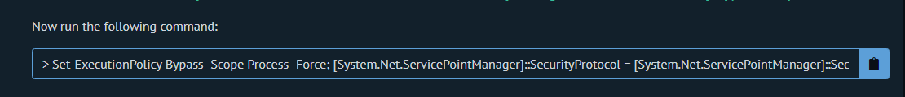{ #fig:001 width=70% }

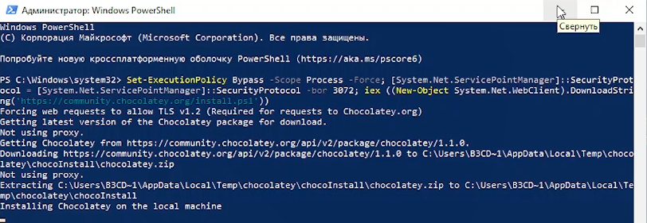{ #fig:001 width=70% }

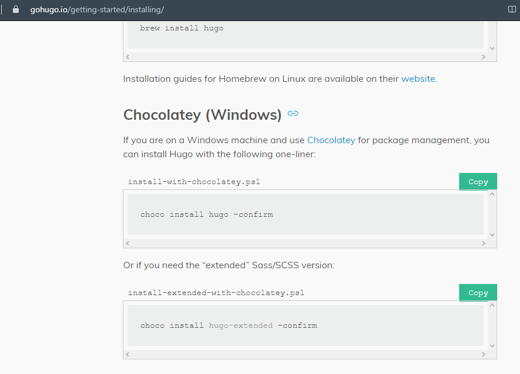{ #fig:001 width=70% }

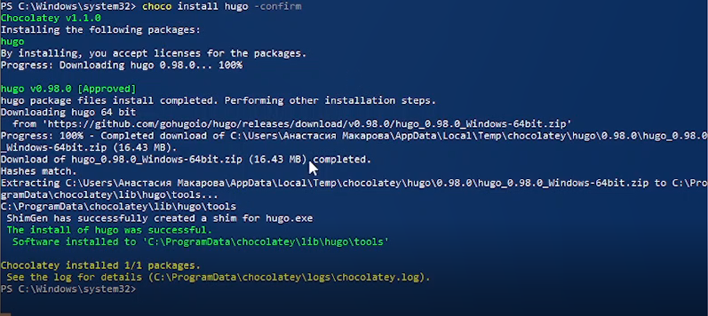{ #fig:001 width=70% }

2. Следующий шаг - установка предложенного шаблона темы сайта Academic. Для этого мы переходим по ссылке на сайт https://wowchemy.com/hugo-themes/ и выбираем тему Academic Resume (Рис.5). Я воспользовалась хостингом Netlify, для этого я нажала на Start with Academic Resume и перешла на сайт Netlify. Затем присоединяеи свой GitHub и создаем репозиторий с моей новой темой project_mak (Рис.6). Таким образом, я создала и разместила сайт в открытом доступе (Рис.7). Если перейти на GitHub, можно увидеть новый созданный репозиторий с именем project_mac (Рис.8).

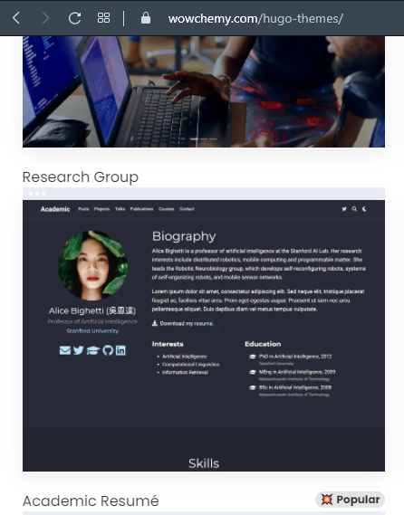{ #fig:001 width=70% }

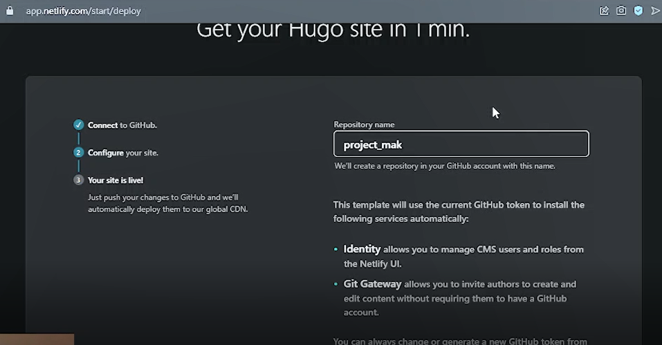{ #fig:001 width=70% }

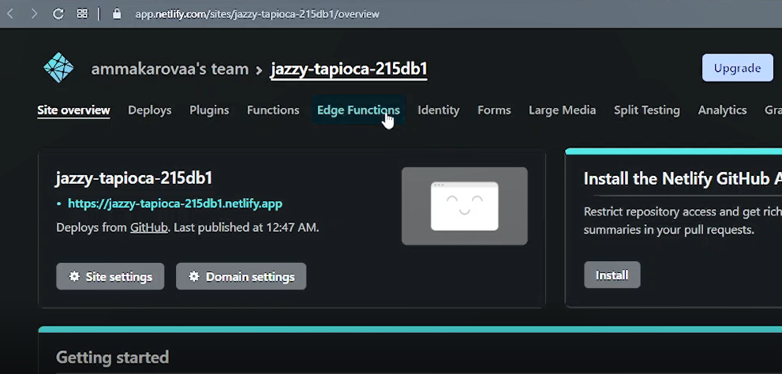{ #fig:001 width=70% }

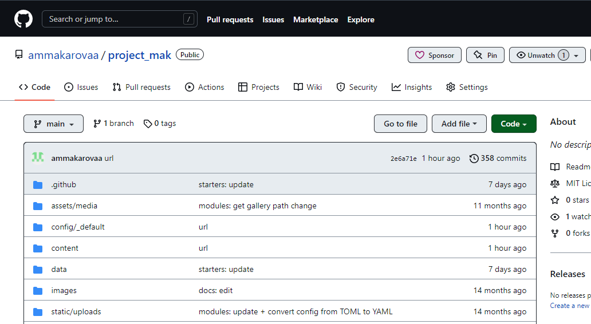{ #fig:001 width=70% }

3. Чтобы редактировать сайт, нужно скачать все файлы с репозитория на github. Для этого клонируем репозиторий в каталог, где будет находиться сайт (рис.9), и изучаем содержимое сайта (каталога) (рис.10). Нам нужен только файл ../config/_default/config.yml. Чтобы было удобнее редактировать свой сайт, открываем каталог через Microsoft Visual Studio (рис.11). Затем открываем файл config.yml, находим в нем строку, начинающуюся с baseURL, и изменяем url сайта на тот, который сгенерировал мне Netlify (рис.12). Сохраняю изменения. Затем удаляю файл content/home/demo.md, так как она отвечает за рекламу на сайте, которая нам не нужна.

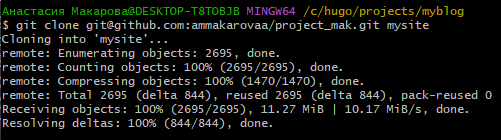{ #fig:001 width=70% }

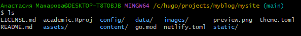{ #fig:001 width=70% }

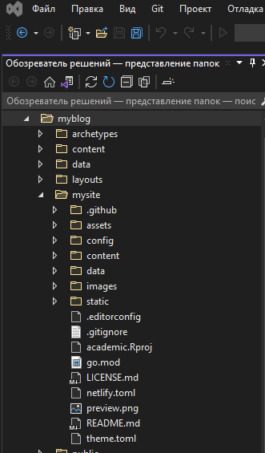{ #fig:001 width=70% }

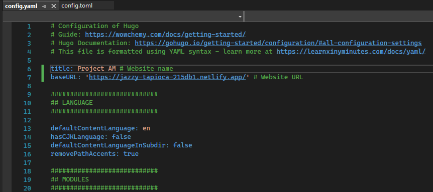{ #fig:001 width=70% }

4. Чтобы Netlify учел изменения, которые мы внесли, отправляем все это GitHub (рис.13). Перейдя на свою страницу на netlify и подождав, пока закончится загрузка, открываем свой сайт.

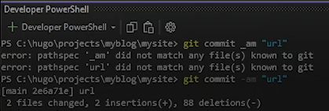{ #fig:001 width=70% }

# Вывод

Выполняя данную лабораторную работу, я изучила среду разработки Visual Studio и научилась работать с Hugo, создала основу своего сайта с помощью шаблонов.

