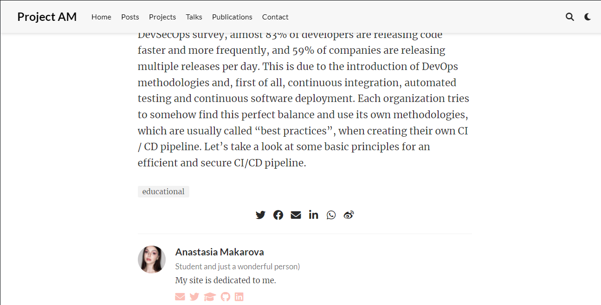

---
## Front matter
title: "Отчёт по второму этапу индивидуального проекта"
subtitle: "Операционные системы"
author: "Макарова Анастасия Михайловна"

## Generic otions
lang: ru-RU
toc-title: "Содержание"

## Bibliography
bibliography: bib/cite.bib
csl: pandoc/csl/gost-r-7-0-5-2008-numeric.csl

## Pdf output format
toc: true # Table of contents
toc-depth: 2
lof: true # List of figures
lot: true # List of tables
fontsize: 12pt
linestretch: 1.5
papersize: a4
documentclass: scrreprt
## I18n polyglossia
polyglossia-lang:
  name: russian
  options:
	- spelling=modern
	- babelshorthands=true
polyglossia-otherlangs:
  name: english
## I18n babel
babel-lang: russian
babel-otherlangs: english
## Fonts
mainfont: PT Serif
romanfont: PT Serif
sansfont: PT Sans
monofont: PT Mono
mainfontoptions: Ligatures=TeX
romanfontoptions: Ligatures=TeX
sansfontoptions: Ligatures=TeX,Scale=MatchLowercase
monofontoptions: Scale=MatchLowercase,Scale=0.9
## Biblatex
biblatex: true
biblio-style: "gost-numeric"
biblatexoptions:
  - parentracker=true
  - backend=biber
  - hyperref=auto
  - language=auto
  - autolang=other*
  - citestyle=gost-numeric
## Pandoc-crossref LaTeX customization
figureTitle: "Рис."
tableTitle: "Таблица"
listingTitle: "Листинг"
lofTitle: "Список иллюстраций"
lotTitle: "Список таблиц"
lolTitle: "Листинги"
## Misc options
indent: true
header-includes:
  - \usepackage{indentfirst}
  - \usepackage{float} # keep figures where there are in the text
  - \floatplacement{figure}{H} # keep figures where there are in the text
---

# Цель работы

Добавить к сайту данные о себе.

1. Список добавляемых данных: разместить фотографию владельца сайта, разместить краткое описание владельца сайта (Biography), добавить информацию об интересах (Interests), добавить информацию от образовании (Education), сделать пост по прошедшей неделе.

2. Добавить пост на тему по выбору: "Управление версиями. Git" или "Непрерывная интеграция и непрерывное развертывание (CI/CD)".

# Выполнение лабораторной работы

1. Размещаем свой аватар на сайте. Для этого меняем исходное изображение в папке mysite/content/authors/admin avatar.jpg на свою фотографию (Рис. 1).
Затем я разместила свою биографию. Для смены информации в биографии мы открываем файл _index.md в той же папке admin (Рис. 2). Меняем содержимое файла на информацию о себе: биография, интересы и образование (Рис. 3, 3.1, 3.2). Размещаем всё на сайте с помощью уже изместному нам набору команд: git add . , git commit -am "", git push. Результат работы представлен на рисунке 4. 

{ #fig:001 width=70% }

{ #fig:001 width=70% }

{ #fig:001 width=70% }

{ #fig:001 width=70% }

{ #fig:001 width=70% }

{ #fig:001 width=70% }

2. Сделаем пост по прошедшей неделе. Для этого удаляем заготовленную папку с шаблоном и создаем новую с помощью командной строки: hugo new post/post1.md (Рис. 5). Открываем созданный нами файл (Рис. 6) и редактируем его, внося информацию о себе, а именно: о проведенном нами времени на прошедшей неделе (Рис. 7). Также изменяем название, подзаголовок, автора, добавляем тэг и категорию (Рис. 8). Отправляем изменения на наш сайт и открываем созданный пост (Рис. 9).

{ #fig:001 width=70% }

{ #fig:001 width=70% }

{ #fig:001 width=70% }

{ #fig:001 width=70% }

{ #fig:001 width=70% }

3. Добавим пост на тему по выбору. Я выбрала тему: Непрерывная интеграция и непрерывное развертывание (CI/CD). Как и в предыдущем пункте, создаем с помощью командной строки и команды hugo new post/post1.md новую папку для поста и открываем ее (Рис. 10). Редактируем его (Рис. 11, 11.1). Отправляем изменения на сайт (Рис. 12, 12.1, 12.2).

{ #fig:001 width=70% }

{ #fig:001 width=70% }

{ #fig:001 width=70% }

{ #fig:001 width=70% }

{ #fig:001 width=70% }

{ #fig:001 width=70% }

# Выводы

В ходе выполнения второго этапа по созданию сайта я научилась редактировать информацию, создавать посты, менять изображения.

