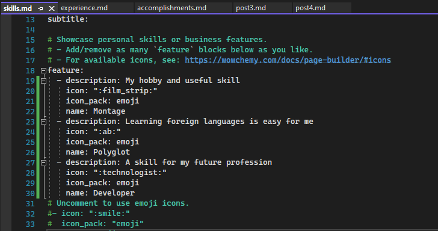
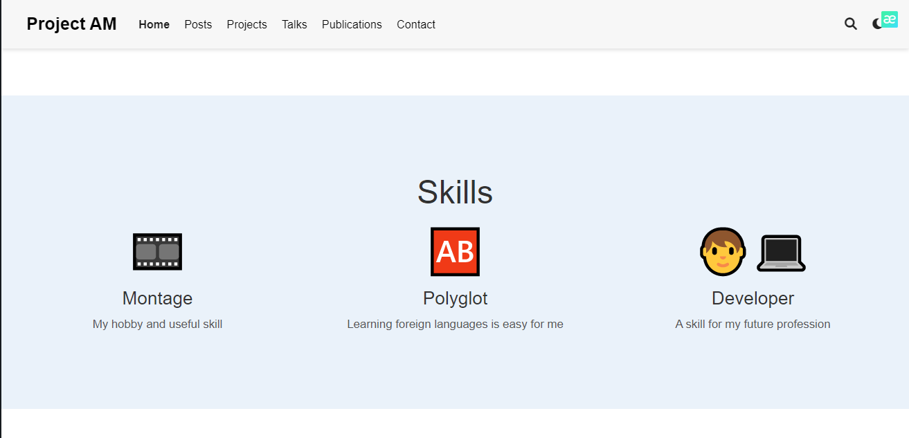
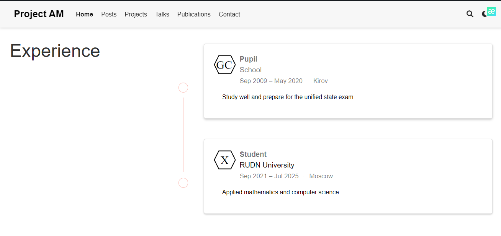
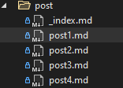
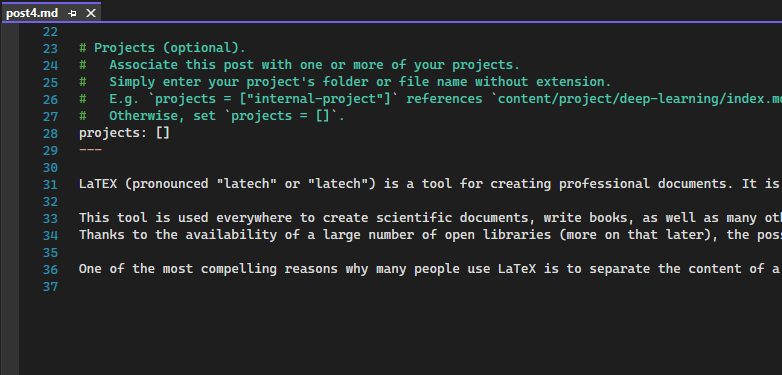
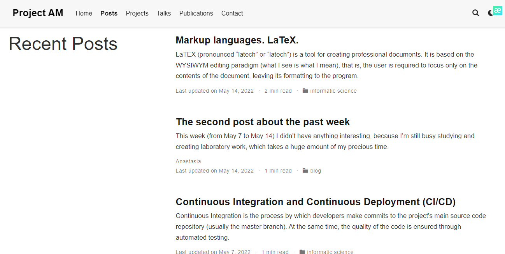

---
## Front matter
lang: ru-RU
title: Индивидуальный проект (Этап 3)
author: Макарова Анастасия Михайловна
institute: РУДН, Москва, Россия
date: 14.05.2022

## Formatting
toc: false
slide_level: 2
theme: metropolis
header-includes: 
 - \metroset{progressbar=frametitle,sectionpage=progressbar,numbering=fraction}
 - '\makeatletter'
 - '\beamer@ignorenonframefalse'
 - '\makeatother'
aspectratio: 43
section-titles: true
---

## Достижения

1) Добавляем информацию о навыках (Skills)
2) Добавляем  информацию об опыте (Experience)
3) Добавляем информацию о достижениях (Accomplishments)

{ #fig:001 width=70% }

{ #fig:001 width=70% }

{ #fig:001 width=70% }

## Создание постов

Нам нужно сделать 2 поста: создаем файлы с помощью командной строки и команды hugo new post/post3.md, затем hugo new post/post4.md и редактируем информацию: описываем нашу неделю во 2 посте, и добавляем научную статью в третьем посте.

{ #fig:001 width=70% }

{ #fig:001 width=70% }

{ #fig:001 width=70% }

{ #fig:001 width=70% }

# Спасибо за внимание!

