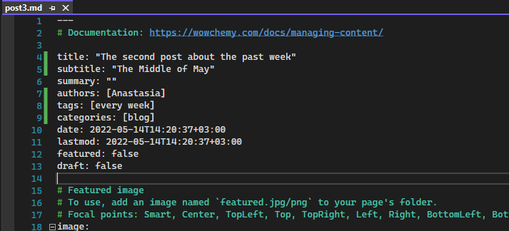

---
## Front matter
title: "Отчёт по третьему этапу индивидуального проекта"
subtitle: "Операционные системы"
author: "Макарова Анастасия Михайловна"

## Generic otions
lang: ru-RU
toc-title: "Содержание"

## Bibliography
bibliography: bib/cite.bib
csl: pandoc/csl/gost-r-7-0-5-2008-numeric.csl

## Pdf output format
toc: true # Table of contents
toc-depth: 2
lof: true # List of figures
lot: true # List of tables
fontsize: 12pt
linestretch: 1.5
papersize: a4
documentclass: scrreprt
## I18n polyglossia
polyglossia-lang:
  name: russian
  options:
	- spelling=modern
	- babelshorthands=true
polyglossia-otherlangs:
  name: english
## I18n babel
babel-lang: russian
babel-otherlangs: english
## Fonts
mainfont: PT Serif
romanfont: PT Serif
sansfont: PT Sans
monofont: PT Mono
mainfontoptions: Ligatures=TeX
romanfontoptions: Ligatures=TeX
sansfontoptions: Ligatures=TeX,Scale=MatchLowercase
monofontoptions: Scale=MatchLowercase,Scale=0.9
## Biblatex
biblatex: true
biblio-style: "gost-numeric"
biblatexoptions:
  - parentracker=true
  - backend=biber
  - hyperref=auto
  - language=auto
  - autolang=other*
  - citestyle=gost-numeric
## Pandoc-crossref LaTeX customization
figureTitle: "Рис."
tableTitle: "Таблица"
listingTitle: "Листинг"
lofTitle: "Список иллюстраций"
lotTitle: "Список таблиц"
lolTitle: "Листинги"
## Misc options
indent: true
header-includes:
  - \usepackage{indentfirst}
  - \usepackage{float} # keep figures where there are in the text
  - \floatplacement{figure}{H} # keep figures where there are in the text
---

# Цель работы

Добавить к сайту свои достижения:

1. Список достижений: информация о навыках (Skills), информация об опыте (Experience), информация о достижениях (Accomplishments).

2. Сделать пост по прошедшей неделе.

3. Добавить пост на тему по выбору: "Легковесные языки разметки" или "Языки разметки. LaTeX" или "Язык разметки Markdown".

# Выполнение лабораторной работы

1. Добавляем список достижений:

* Добавляем информацию о навыках, для этого переходим в папку mysite/content/home и редактируем файл skills.md (Рис. 1). Пишем о своих навыках и добавляем иконки (Рис. 2, 3). В качестве иконок я использу эмоджи и их коды с сайта https://github.com/ikatyang/emoji-cheat-sheet/blob/master/README.md (Рис. 4). Отправляем изменения на наш сайт (Рис.5). 

{ #fig:001 width=70% }

{ #fig:001 width=70% }

{ #fig:001 width=70% }

{ #fig:001 width=70% }

{ #fig:001 width=70% }

* Добавляем информацию об опыте, для этого переходим в папку mysite/content/home и редактируем файл experience.md, пишу о своем опыте обучения в школе и университете (Рис. 6). Отправляем изменения на наш сайт (Рис. 7).

{ #fig:001 width=70% }

{ #fig:001 width=70% }

* Добавляем информацию о достижениях, для этого переходим в папку mysite/content/home и редактируем файл accomplishments.md, я пишу о своем обучении в онлайн школе (Рис. 8). Отправляем изменения на наш сайт (Рис. 9).

{ #fig:001 width=70% }

{ #fig:001 width=70% }

2. Сделаем пост по прошедшей неделе. Для создаем новый файл с помощью командной строки: hugo new post/post3.md (Рис. 10). Открываем созданный нами файл и редактируем его, внося информацию о себе, а именно: о проведенном нами времени на прошедшей неделе (Рис. 11). Также изменяем название, подзаголовок, автора, добавляем тэг и категорию (Рис. 12). Отправляем изменения на наш сайт и открываем созданный пост (Рис. 13).

{ #fig:001 width=70% }

{ #fig:001 width=70% }

{ #fig:001 width=70% }

{ #fig:001 width=70% }

3. Добавим пост на тему по выбору. Я выбрала тему: "Языки разметки. LaTeX". Как и в предыдущем пункте, создаем с помощью командной строки и команды hugo new post/post4.md новый файл и открываем его (Рис. 14, 15). Редактируем его (Рис. 16, 17). Отправляем изменения на сайт (Рис. 18, 19, 20).

{ #fig:001 width=70% }

{ #fig:001 width=70% }

{ #fig:001 width=70% }

{ #fig:001 width=70% }

{ #fig:001 width=70% }

{ #fig:001 width=70% }

{ #fig:001 width=70% }

# Выводы

В ходе выполнения второго этапа по созданию сайта я научилась редактировать информацию о себе (достижения, опыт и навыки), а также написала новые посты.

