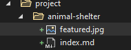
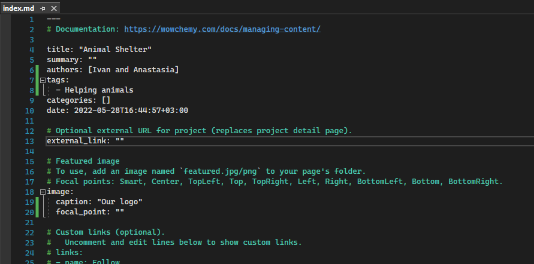
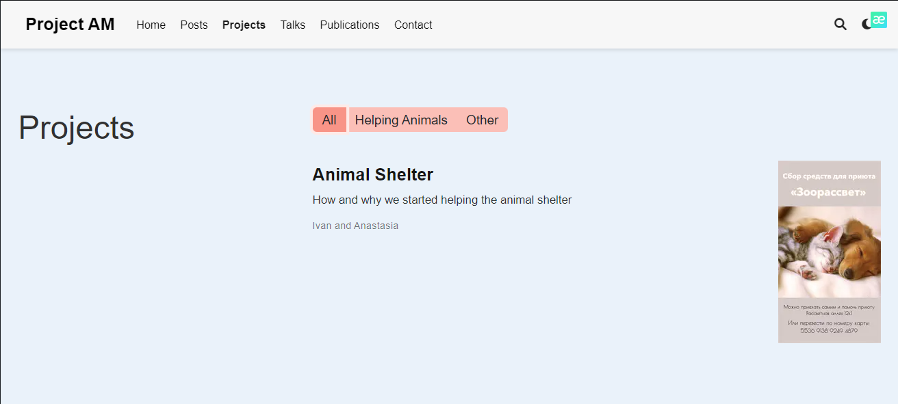
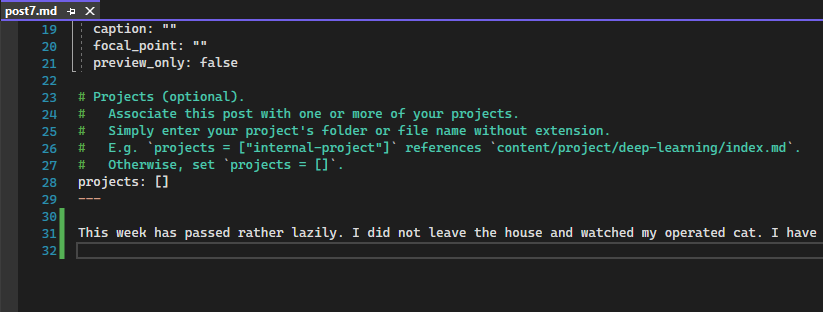
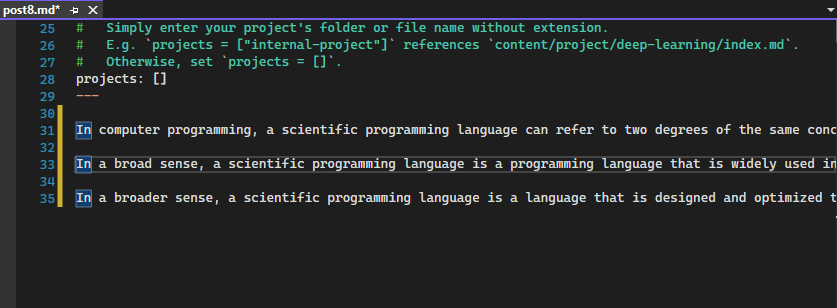
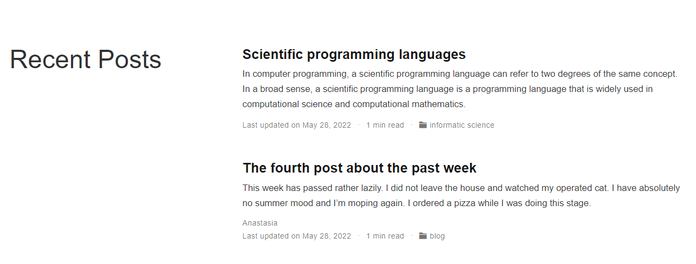

---
## Front matter
lang: ru-RU
title: Индивидуальный проект (Этап 5)
author: Макарова Анастасия Михайловна
institute: РУДН, Москва, Россия
date: 28.05.2022

## Formatting
toc: false
slide_level: 2
theme: metropolis
header-includes: 
 - \metroset{progressbar=frametitle,sectionpage=progressbar,numbering=fraction}
 - '\makeatletter'
 - '\beamer@ignorenonframefalse'
 - '\makeatother'
aspectratio: 43
section-titles: true
---

## Персональный проект

Сделаем запись для персонального проекта. Для это создаем папку animal-shelter в каталоге mysite/content/project. Добавляем изображение с именем featured.jpg в папку mysite/content/project/animal-shelter и редактируем информацию.

{ #fig:001 width=70% }

{ #fig:001 width=70% }

{ #fig:001 width=70% }

## Создание постов

Нам нужно сделать 2 поста: создаем файлы с помощью командной строки и команды hugo new post/post7.md, затем hugo new post/post8.md и редактируем информацию: описываем нашу неделю в седьмом посте, и добавляем научную статью в восьмом посте.

{ #fig:001 width=70% }

{ #fig:001 width=70% }

{ #fig:001 width=70% }

# Спасибо за внимание!

