---
## Front matter
title: "Отчёт по пятому этапу индивидуального проекта"
subtitle: "Операционные системы"
author: "Макарова Анастасия Михайловна"

## Generic otions
lang: ru-RU
toc-title: "Содержание"

## Bibliography
bibliography: bib/cite.bib
csl: pandoc/csl/gost-r-7-0-5-2008-numeric.csl

## Pdf output format
toc: true # Table of contents
toc-depth: 2
lof: true # List of figures
lot: true # List of tables
fontsize: 12pt
linestretch: 1.5
papersize: a4
documentclass: scrreprt
## I18n polyglossia
polyglossia-lang:
  name: russian
  options:
	- spelling=modern
	- babelshorthands=true
polyglossia-otherlangs:
  name: english
## I18n babel
babel-lang: russian
babel-otherlangs: english
## Fonts
mainfont: PT Serif
romanfont: PT Serif
sansfont: PT Sans
monofont: PT Mono
mainfontoptions: Ligatures=TeX
romanfontoptions: Ligatures=TeX
sansfontoptions: Ligatures=TeX,Scale=MatchLowercase
monofontoptions: Scale=MatchLowercase,Scale=0.9
## Biblatex
biblatex: true
biblio-style: "gost-numeric"
biblatexoptions:
  - parentracker=true
  - backend=biber
  - hyperref=auto
  - language=auto
  - autolang=other*
  - citestyle=gost-numeric
## Pandoc-crossref LaTeX customization
figureTitle: "Рис."
tableTitle: "Таблица"
listingTitle: "Листинг"
lofTitle: "Список иллюстраций"
lotTitle: "Список таблиц"
lolTitle: "Листинги"
## Misc options
indent: true
header-includes:
  - \usepackage{indentfirst}
  - \usepackage{float} # keep figures where there are in the text
  - \floatplacement{figure}{H} # keep figures where there are in the text
---

# Цель работы

Добавить к сайту все остальные элементы:

1) Сделать записи для персональных проектов.
2) Сделать пост по прошедшей неделе.
3) Добавить пост на тему по выбору: "Языки научного программирования".

# Выполнение лабораторной работы

1. Сделаем запись для персонального проекта. Для это создаем папку animal-shelter в каталоге mysite/content/project (Рис. 1, 2):

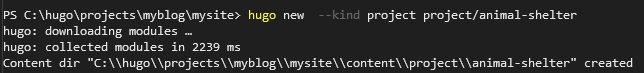{ #fig:001 width=70% }

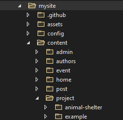{ #fig:001 width=70% }

Добавляем изображение с именем featured.jpg в папку mysite/content/project/animal-shelter (Рис. 3, 4):

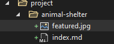{ #fig:001 width=70% }

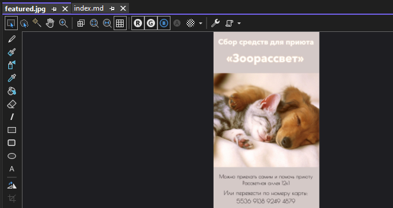{ #fig:001 width=70% }

Для смены информации о проекте мы открываем файл index.md в той же папке animal-shelter и редактируем информацию (Рис. 5, 6):

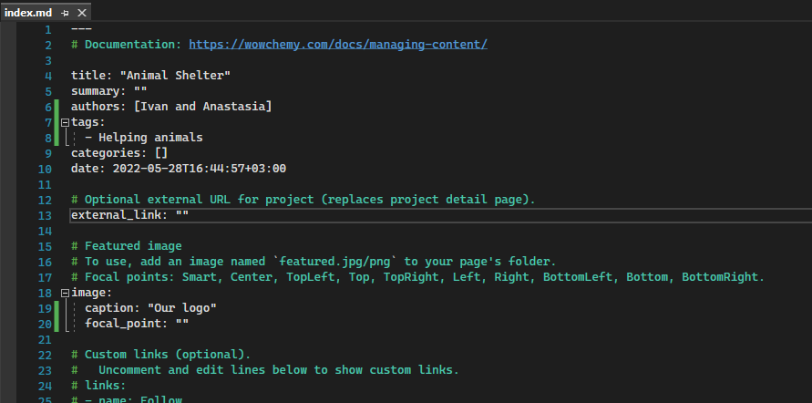{ #fig:001 width=70% }

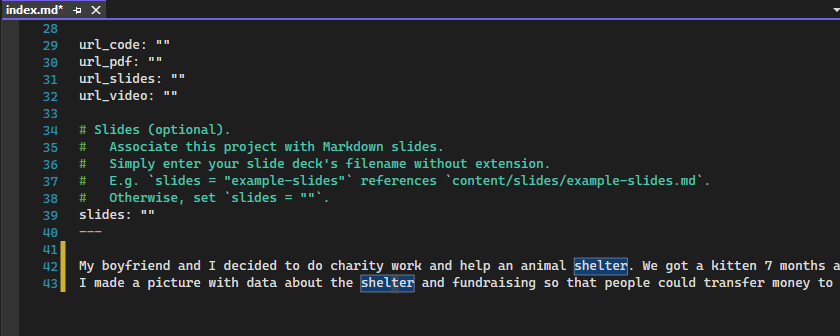{ #fig:001 width=70% }

Создаем новый тэг для проекта (Рис. 7, 8):

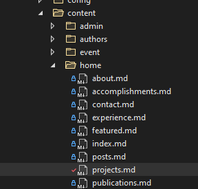{ #fig:001 width=70% }

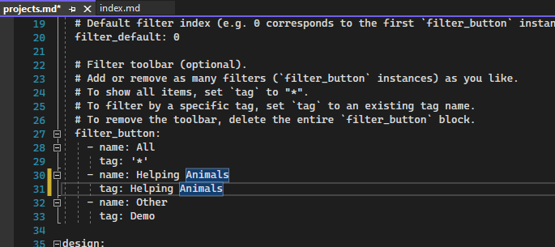{ #fig:001 width=70% }

Отправляем изменения на наш сайт (Рис. 9-11):

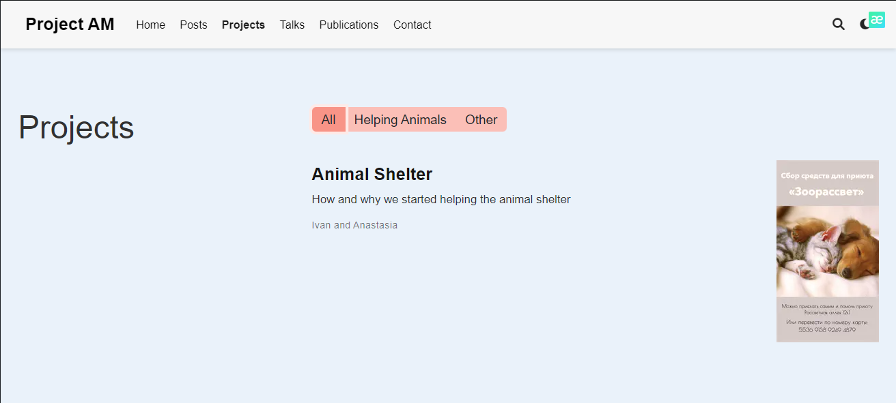{ #fig:001 width=70% }

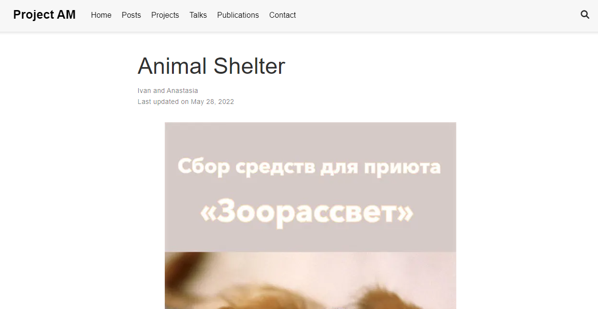{ #fig:001 width=70% }

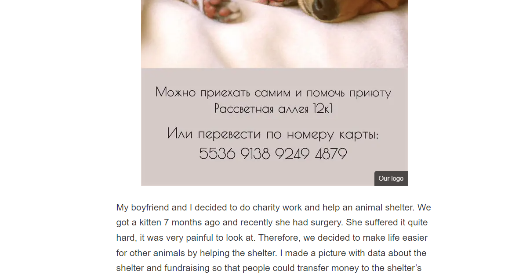{ #fig:001 width=70% }

2. Меняем раздел с предстоящими встречами. Создаем новую папку exam в каталоге mysite/content/event (Рис. 12):

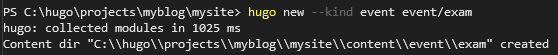{ #fig:001 width=70% }

Добавляем изображение с именем featured.jpg в папку mysite/content/event/exam (Рис. 13, 14):

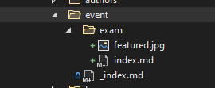{ #fig:001 width=70% }

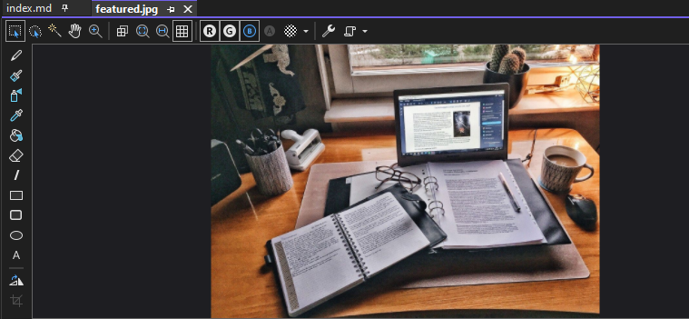{ #fig:001 width=70% }

Открываем файл index.md и редактируем его, вносм информацию о предстоящих встречах, в моем случае это экзамен по матанализу (Рис. 15-17):

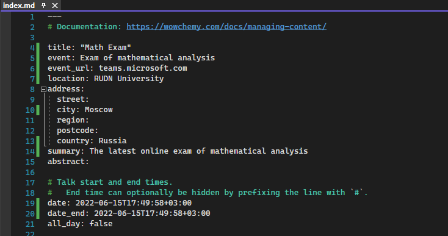{ #fig:001 width=70% }

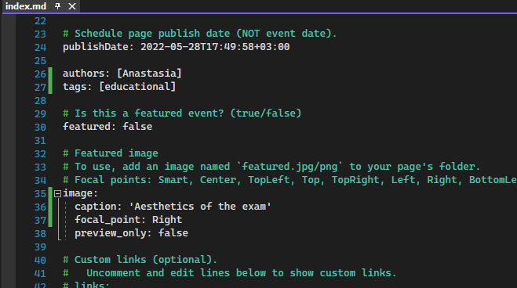{ #fig:001 width=70% }

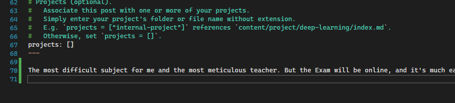{ #fig:001 width=70% }

Отправляем изменения на наш сайт (Рис. 18-20):

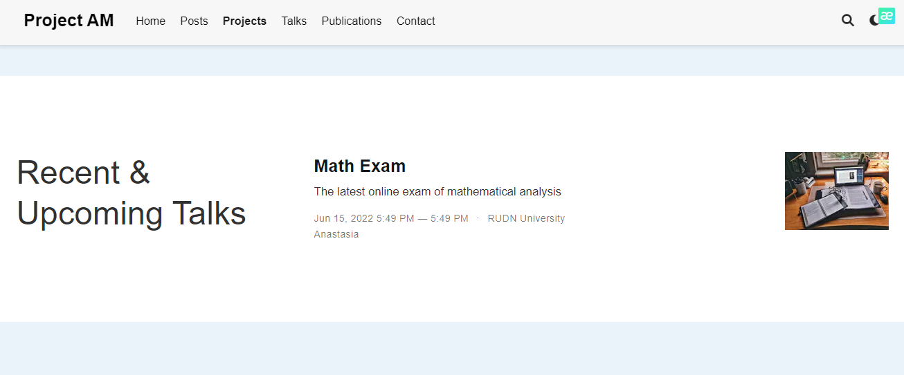{ #fig:001 width=70% }

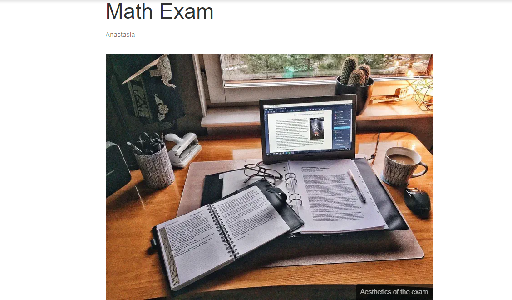{ #fig:001 width=70% }

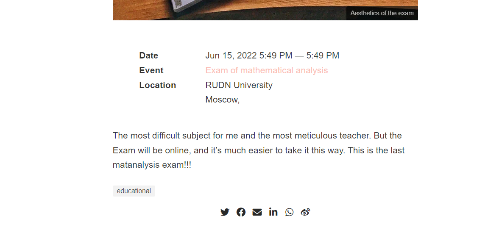{ #fig:001 width=70% }

3. Меняем раздел с избранными публикациями. Создаем новую папку cat в каталоге mysite/content/publication (Рис. 21):

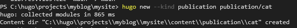{ #fig:001 width=70% }

Добавляем изображение с именем featured.jpg в папку mysite/content/publication/cat (Рис. 22, 23):

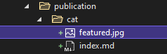{ #fig:001 width=70% }

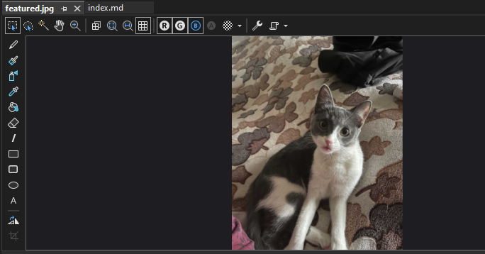{ #fig:001 width=70% }

Открываем файл index.md и редактируем его, я сделала пост про свою кошку :) (Рис. 24):

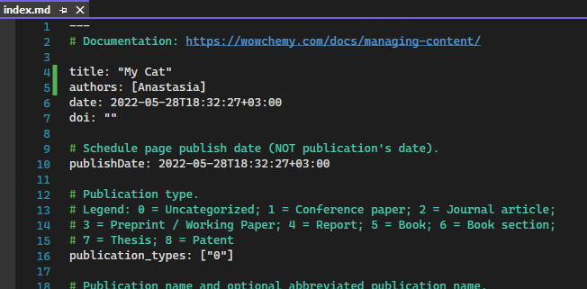{ #fig:001 width=70% }

Отправляем изменения на наш сайт (Рис. 25, 26):

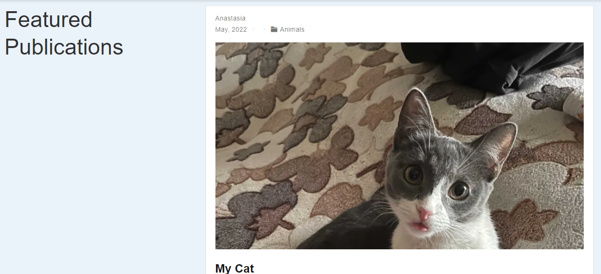{ #fig:001 width=70% }

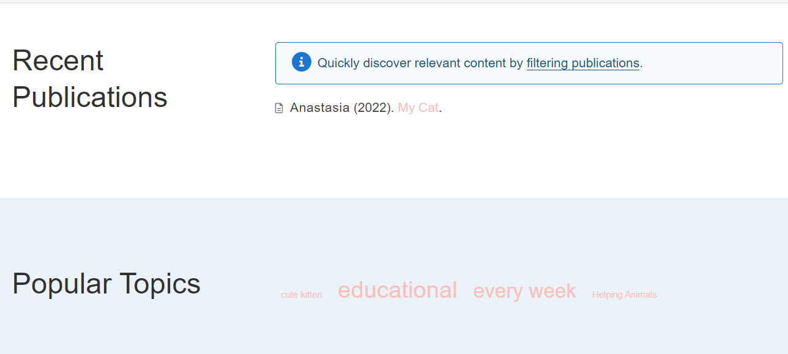{ #fig:001 width=70% }

4. Поменяем наши контакты. Для этого открываем файл mysite/content/home/contact.md (Рис. 27) и редактируем информацию о контактах (Рис. 28). Отправляем изменения на наш сайт (Рис. 28.1):

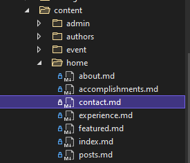{ #fig:001 width=70% }

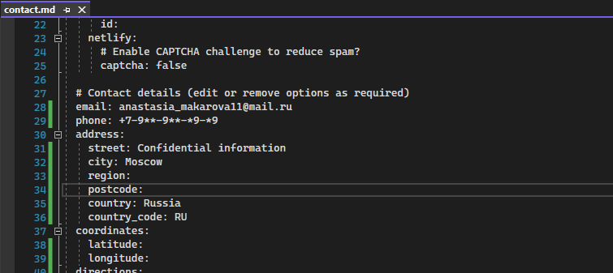{ #fig:001 width=70% }

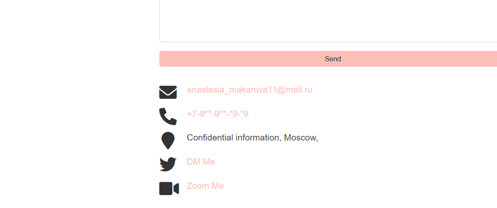{ #fig:001 width=70% }

5. Сделаем пост по прошедшей неделе. Для этого создаем новую с помощью командной строки: hugo new post/post7.md (Рис. 29). Открываем созданный нами файл и редактируем его, изменяем название, подзаголовок, автора, добавляем тэг и категорию (Рис. 30). Вносим информацию о себе, а именно: о проведенном нами времени на прошедшей неделе (Рис. 31):

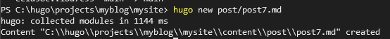{ #fig:001 width=70% }

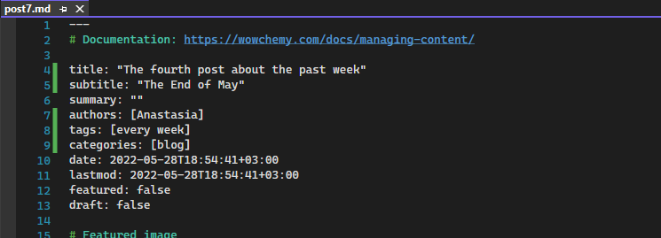{ #fig:001 width=70% }

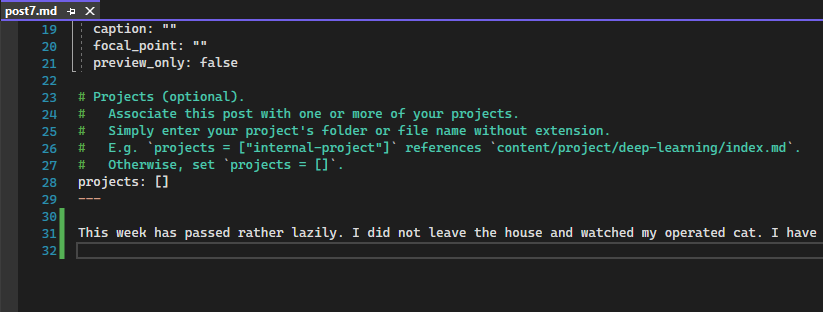{ #fig:001 width=70% }

6. Добавим пост на тему "Языки научного программирования". Как и в предыдущем пункте, создаем с помощью командной строки и команды hugo new post/post8.md новую папку для поста и открываем файл post8.md (Рис. 32, 33). Редактируем его (Рис. 34, 35). Отправляем изменения на сайт (Рис. 36-38).

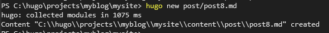{ #fig:001 width=70% }

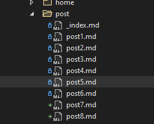{ #fig:001 width=70% }

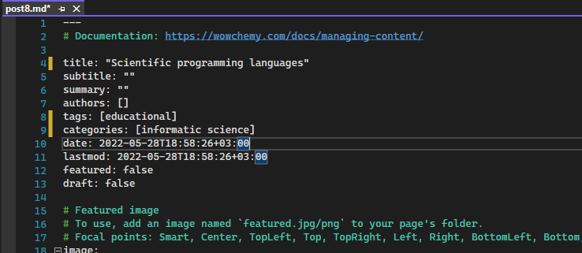{ #fig:001 width=70% }

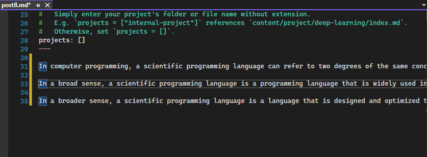{ #fig:001 width=70% }

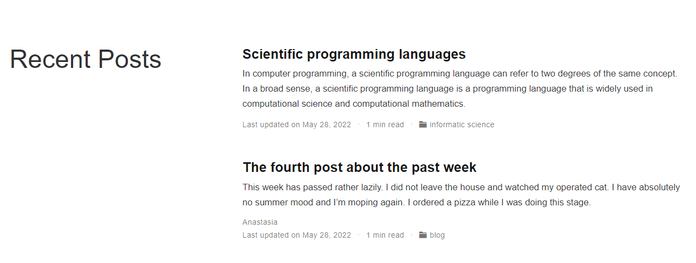{ #fig:001 width=70% }

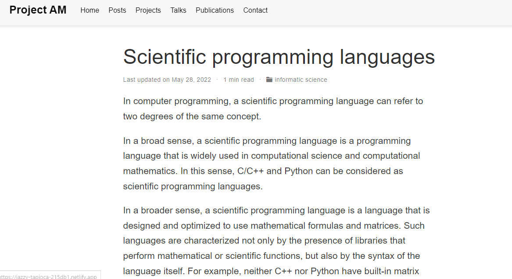{ #fig:001 width=70% }

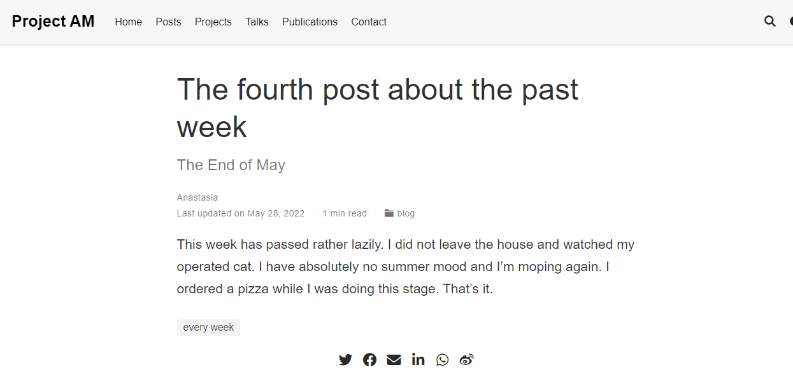{ #fig:001 width=70% }

# Выводы

В ходе выполнения второго этапа по созданию сайта я научилась редактировать информацию, создавать посты и проекты, менять изображения.

