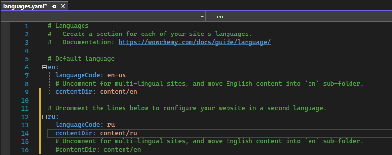
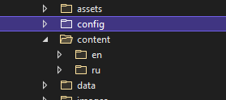
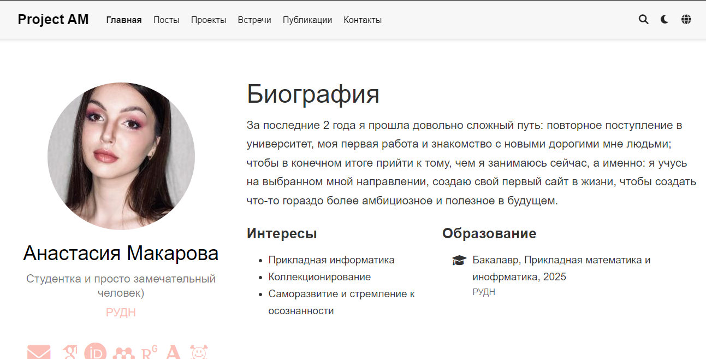

---
## Front matter
lang: ru-RU
title: Индивидуальный проект (Этап 6)
author: Макарова Анастасия Михайловна
institute: РУДН, Москва, Россия
date: 04.06.2022

## Formatting
toc: false
slide_level: 2
theme: metropolis
header-includes: 
 - \metroset{progressbar=frametitle,sectionpage=progressbar,numbering=fraction}
 - '\makeatletter'
 - '\beamer@ignorenonframefalse'
 - '\makeatother'
aspectratio: 43
section-titles: true
---

## Размещещение двуязычного сайта на Github

Сделаем поддержку английского и русского языков.

{ #fig:001 width=70% }

Разместим элементы сайта на обоих языках.

{ #fig:001 width=70% }

{ #fig:001 width=70% }

# Спасибо за внимание!

