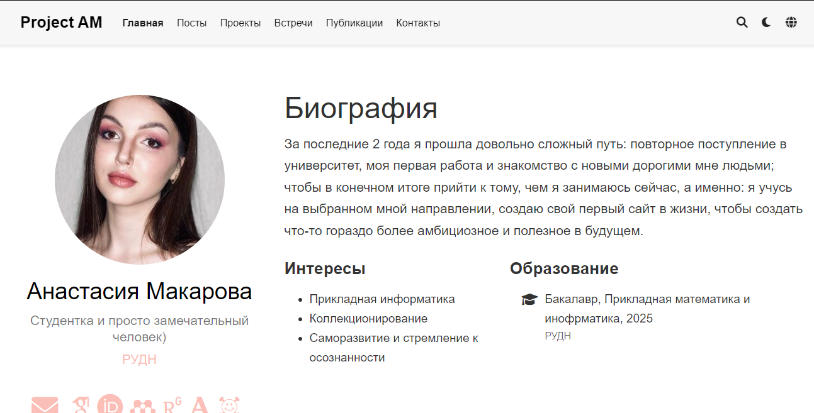
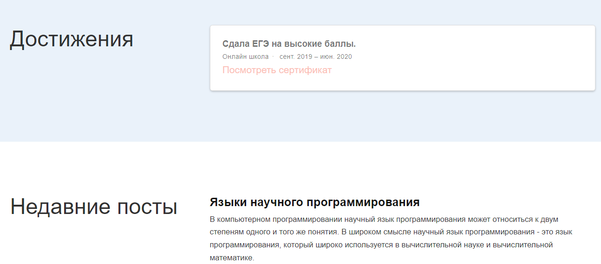

---
## Front matter
title: "Отчёт по шестому этапу индивидуального проекта"
subtitle: "Операционные системы"
author: "Макарова Анастасия Михайловна"

## Generic otions
lang: ru-RU
toc-title: "Содержание"

## Bibliography
bibliography: bib/cite.bib
csl: pandoc/csl/gost-r-7-0-5-2008-numeric.csl

## Pdf output format
toc: true # Table of contents
toc-depth: 2
lof: true # List of figures
lot: true # List of tables
fontsize: 12pt
linestretch: 1.5
papersize: a4
documentclass: scrreprt
## I18n polyglossia
polyglossia-lang:
  name: russian
  options:
	- spelling=modern
	- babelshorthands=true
polyglossia-otherlangs:
  name: english
## I18n babel
babel-lang: russian
babel-otherlangs: english
## Fonts
mainfont: PT Serif
romanfont: PT Serif
sansfont: PT Sans
monofont: PT Mono
mainfontoptions: Ligatures=TeX
romanfontoptions: Ligatures=TeX
sansfontoptions: Ligatures=TeX,Scale=MatchLowercase
monofontoptions: Scale=MatchLowercase,Scale=0.9
## Biblatex
biblatex: true
biblio-style: "gost-numeric"
biblatexoptions:
  - parentracker=true
  - backend=biber
  - hyperref=auto
  - language=auto
  - autolang=other*
  - citestyle=gost-numeric
## Pandoc-crossref LaTeX customization
figureTitle: "Рис."
tableTitle: "Таблица"
listingTitle: "Листинг"
lofTitle: "Список иллюстраций"
lotTitle: "Список таблиц"
lolTitle: "Листинги"
## Misc options
indent: true
header-includes:
  - \usepackage{indentfirst}
  - \usepackage{float} # keep figures where there are in the text
  - \floatplacement{figure}{H} # keep figures where there are in the text
---

# Цель работы

Размещещение двуязычного сайта на Github.

1) Сделать поддержку английского и русского языков.
2) Разместить элементы сайта на обоих языках.
3) Разместить контент на обоих языках.
4) Сделать пост по прошедшей неделе.
5) Добавить пост на тему по выбору (на двух языках).

# Выполнение лабораторной работы

1. Для поддержки двух языков, необходимо в каталоге mysite/config/_default в файле languages.yaml добавить второй язык, в мрем случае - русский (Рис. 1, 2).

{ #fig:001 width=70% }

{ #fig:001 width=70% }

2. Дублирую файл menus.yaml всё в той же папке. Один файл называю menus.en.yaml, а другой menus.ru.yaml (Рис. 3). Меняю ифнормацию в файле menus.ru.yaml на русский язык (Рис. 4).

{ #fig:001 width=70% }

{ #fig:001 width=70% }

3. Создаю в папке content два каталога: en и ru. Дублирую все файлы из каталога content в эти два каталога (Рис. 5).

{ #fig:001 width=70% }

4. В папке сайта создаю каталог i18n, в нем создаю 2 файла: en.yaml и ru.yaml (Рис. 6). Содержимое файлов беру из официальной документации к сайту Academic. С помощью этого интрефейс будет поддерживать два языка (Рис. 7, 8).

{ #fig:001 width=70% }

{ #fig:001 width=70% }

{ #fig:001 width=70% }

5. Редактирую информацию: меняю содержимое файлов на русский язык (Рис. 9).

{ #fig:001 width=70% }

6. Отправляю изменения на свой сайт (Рис. 10-13).

{ #fig:001 width=70% }

{ #fig:001 width=70% }

{ #fig:001 width=70% }

{ #fig:001 width=70% }

# Выводы

В ходе выполнения шестого этапа индивидуального проекта я научилась создавать несколькоязычные сайты.

